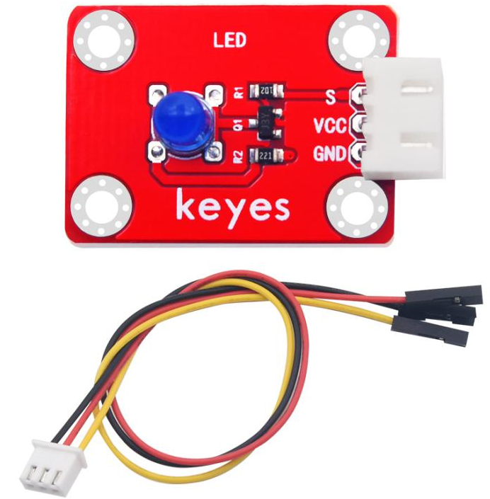
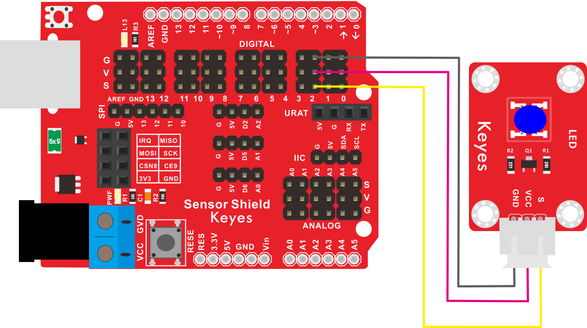
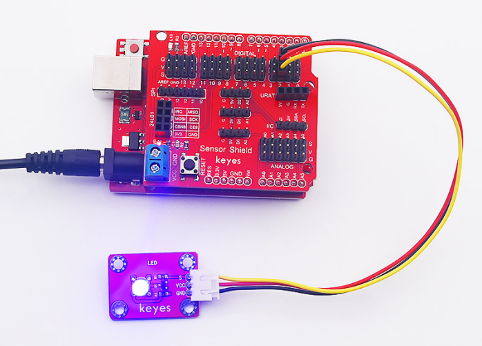

# KE2003 Keyes Brick LED 蓝发蓝模块综合指南



---

## 1. 概述
KE2003 Keyes Brick LED 蓝发蓝模块是一款高亮度蓝色LED模块，采用焊盘孔设计，方便用户进行焊接和连接。该模块具有防反插白色端子，确保连接的可靠性和安全性。蓝色LED广泛应用于指示灯、装饰灯和各种电子项目中，能够提供清晰的视觉反馈。

模块上自带一个间距为2.54mm的防反插白色端子，方便与其他设备连接。为了方便接线，模块还配送了一根200mm长的3pin线，线的一端为白色防反插接口（与模块上的防反插白色端子匹配），另一端为3pin杜邦线母头接口。控制时，模块的GND和VCC供电后，当信号端S为高电平时，模块上的LED将亮起。

该模块兼容各种单片机控制板，如Arduino系列单片机。使用时，可以在单片机上堆叠一个传感器扩展板，将模块和自带导线连接，然后连接到传感器扩展板上，简单方便。同时，模块自带4个直径为3mm的定位孔，方便将模块固定在其他设备上。

---

## 2. 规格参数
- **导线长度**：200mm  
- **工作电压**：DC 3.3-5V  
- **接口**：间距为2.54mm 3pin防反插接口  
- **定位孔大小**：直径为3mm  
- **控制信号**：数字信号  
- **尺寸**：34mm x 22mm
- **重量**：2.6g  

---

## 3. 特点
- **高亮度**：采用高亮度蓝色LED，适合在各种环境下使用，尤其是在光线较暗的环境中。
- **防反插设计**：防反插白色端子设计，避免因接反导致的损坏，确保模块的长期稳定性。
- **模块化设计**：焊盘孔设计，方便用户进行焊接和连接，适合DIY项目和快速原型开发。
- **兼容性强**：可与Arduino、树莓派等开发板兼容使用，适合各种项目，易于集成。
- **低功耗**：在正常工作条件下，LED模块的功耗较低，适合长时间使用。
- **耐用性**：LED模块具有较长的使用寿命，通常可达数万小时，减少了更换频率。

---

## 4. 工作原理
蓝发蓝模块通过电流流过LED时发光。当模块的正极连接到电源正极，负极连接到控制引脚时，LED将点亮。用户可以通过控制引脚的高低电平来控制LED的开关状态。LED的发光原理基于半导体材料的电致发光效应。

---

## 5. 接口
- **VCC**：连接到电源正极（3.3V或5V）。
- **GND**：连接到电源负极（GND）。
- **S**：控制信号引脚，当为高电平时，LED点亮。

### 引脚定义
| 引脚名称 | 功能描述                     |
|----------|------------------------------|
| VCC      | 连接到 Arduino 的 5V 或 3.3V 引脚   |
| GND      | 连接到 Arduino 的 GND 引脚  |
| S        | 控制信号引脚                |

---

## 6. 连接图


### 连接示例
1. 将模块的 VCC 引脚连接到 Arduino 的 5V 或 3.3V 引脚。
2. 将模块的 GND 引脚连接到 Arduino 的 GND 引脚。
3. 将模块的 S 引脚连接到 Arduino 的数字引脚（例如 D2）。

---

## 7. 示例代码
以下是一个简单的示例代码，用于控制蓝色LED的开关：
```cpp
const int ledPin = 2; // 连接到数字引脚 D2

void setup() {
  pinMode(ledPin, OUTPUT); // 设置LED引脚为输出
}

void loop() {
  digitalWrite(ledPin, HIGH); // 点亮LED
  delay(1000); // 延时 1 秒
  digitalWrite(ledPin, LOW); // 熄灭LED
  delay(1000); // 延时 1 秒
}
```

### 代码说明
- **digitalWrite()**：用于控制LED的开关状态。
- **HIGH**：点亮LED。
- **LOW**：熄灭LED。

---

## 8. 实验现象
上传程序后，蓝色LED将每隔1秒闪烁一次，表示模块正常工作。用户可以通过观察LED的闪烁频率来验证模块的功能。



---

## 9. 应用示例
- **指示灯**：用于状态指示或警告灯，常见于家电和电子设备中。
- **装饰灯**：用于各种装饰项目，如节日灯饰和创意灯具。
- **电子项目**：用于DIY电子项目中的视觉反馈，帮助用户了解设备状态。
- **信号灯**：在交通信号灯或其他指示系统中作为蓝灯使用。

---

## 10. 注意事项
- 确保模块连接正确，避免短路。
- 在使用过程中，注意电源电压在 3.3V - 5V 范围内，避免过载。
- 避免将模块暴露在极端环境中，以免损坏。
- 长时间使用时，注意LED的发热情况，避免过热。

---

## 11. 参考链接
- [Keyes官网](http://www.keyes-robot.com/)
- [Arduino 官方网站](https://www.arduino.cc)  

如有更多疑问，请联系 Keyes 官方客服或加入相关创客社区交流。祝使用愉快！