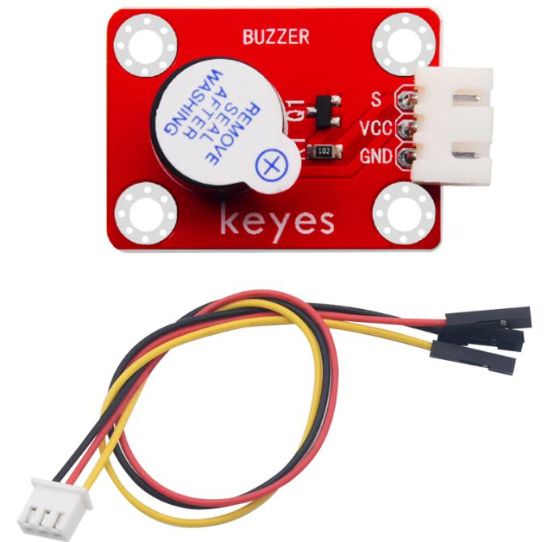
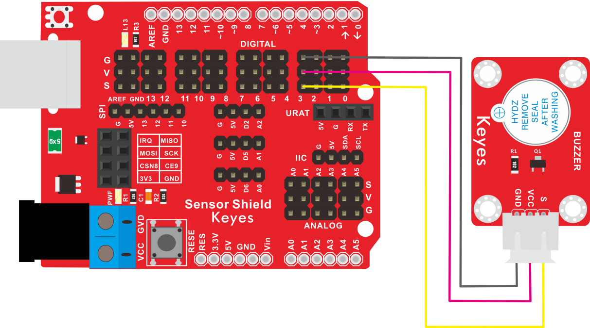
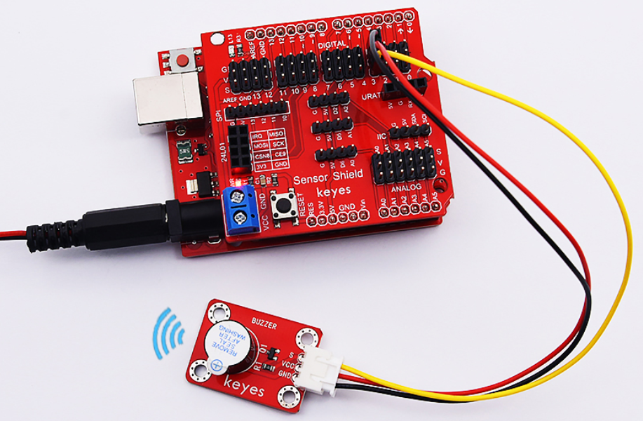

# KE2006 Keyes Brick 有源蜂鸣器模块综合指南



---

## 1. 概述
KE2006 Keyes Brick 有源蜂鸣器模块是一款常用的声音输出模块，采用有源蜂鸣器元件。该模块设计简洁，功能强大，适合各种电子项目和DIY应用。模块上自带一个间距为2.54mm的防反插白色端子，确保连接的可靠性和安全性。

为了方便接线，模块还配送了一根200mm长的3pin线，线的一端为白色防反插接口（与模块上的防反插白色端子匹配），另一端为3pin杜邦线母头接口，便于与其他设备连接。控制时，模块的GND和VCC供电后，当信号端S为高电平时，蜂鸣器将发出声音。

该模块兼容各种单片机控制板，如Arduino系列单片机。使用时，可以在单片机上堆叠一个传感器扩展板，将模块和自带导线连接，然后连接到传感器扩展板上，简单方便。同时，模块自带4个直径为3mm的定位孔，方便将模块固定在其他设备上，增强了模块的适用性和灵活性。

---

## 2. 规格参数
- **导线长度**：200mm  
- **工作电压**：DC 3.3-5V  
- **接口**：间距为2.54mm 3pin防反插接口  
- **定位孔大小**：直径为3mm  
- **控制信号**：数字信号  
- **尺寸**：34mm x 22mm 
- **重量**：2.6g  

---

## 3. 特点
- **声音输出**：采用有源蜂鸣器，能够发出清晰的声音，适合用于报警、提示等场合。
- **防反插设计**：防反插白色端子设计，避免因接反导致的损坏，确保模块的长期稳定性。
- **模块化设计**：焊盘孔设计，方便用户进行焊接和连接，适合DIY项目和快速原型开发。
- **兼容性强**：可与Arduino、树莓派等开发板兼容使用，适合各种项目，易于集成。
- **低功耗**：在正常工作条件下，蜂鸣器模块的功耗较低，适合长时间使用。
- **耐用性**：蜂鸣器模块具有较长的使用寿命，通常可达数万小时，减少了更换频率。

---

## 4. 工作原理
有源蜂鸣器模块通过电流流过蜂鸣器时发声。当模块的正极连接到电源正极，负极连接到控制引脚时，蜂鸣器将发出声音。用户可以通过控制引脚的高低电平来控制蜂鸣器的开关状态。

---

## 5. 接口
- **VCC**：连接到电源正极（3.3V或5V）。
- **GND**：连接到电源负极（GND）。
- **S**：控制信号引脚，当为高电平时，蜂鸣器发声。

### 引脚定义
| 引脚名称 | 功能描述                     |
|----------|------------------------------|
| VCC      | 连接到 Arduino 的 5V 或 3.3V 引脚   |
| GND      | 连接到 Arduino 的 GND 引脚  |
| S        | 控制信号引脚                |

---

## 6. 连接图


### 连接示例
1. 将模块的 VCC 引脚连接到 Arduino 的 5V 或 3.3V 引脚。
2. 将模块的 GND 引脚连接到 Arduino 的 GND 引脚。
3. 将模块的 S 引脚连接到 Arduino 的数字引脚（例如 D3）。

---

## 7. 示例代码
以下是一个简单的示例代码，用于控制有源蜂鸣器的发声：
```cpp
const int buzzerPin = 3; // 连接到数字引脚 D3

void setup() {
  pinMode(buzzerPin, OUTPUT); // 设置蜂鸣器引脚为输出
}

void loop() {
  digitalWrite(buzzerPin, HIGH); // 发声
  delay(1000); // 延时 1 秒
  digitalWrite(buzzerPin, LOW); // 停止发声
  delay(1000); // 延时 1 秒
}
```

### 代码说明
- **digitalWrite()**：用于控制蜂鸣器的开关状态。
- **HIGH**：蜂鸣器发声。
- **LOW**：停止发声。

---

## 8. 实验现象
上传程序后，有源蜂鸣器将每隔1秒发声一次，表示模块正常工作。用户可以通过观察蜂鸣器的发声频率来验证模块的功能。



---

## 9. 应用示例
- **报警器**：用于安全报警系统，发出警报声。
- **提示音**：用于设备状态提示，如开机、关机等。
- **电子玩具**：用于玩具中的声音效果，增加趣味性。

---

## 10. 注意事项
- 确保模块连接正确，避免短路。
- 在使用过程中，注意电源电压在 3.3V - 5V 范围内，避免过载。
- 避免将模块暴露在极端环境中，以免损坏。
- 长时间使用时，注意蜂鸣器的发热情况，避免过热。

