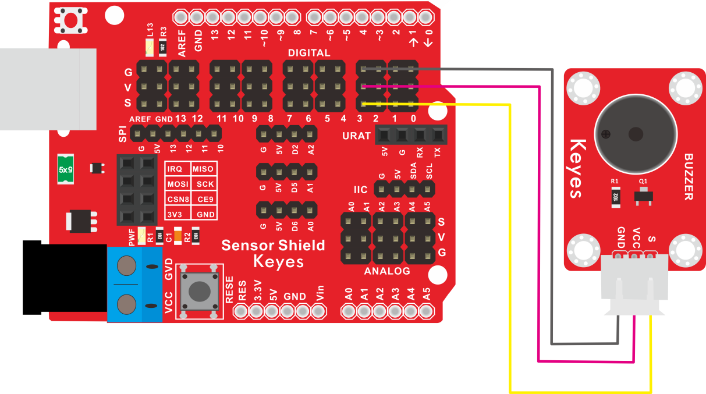

# KE2007 Keyes Brick 无源蜂鸣器模块综合指南


---

## 1. 概述
KE2007 Keyes Brick 无源蜂鸣器模块是一款常用的音频输出模块，适用于各种电子项目和DIY应用。该模块采用无源蜂鸣器设计，能够通过控制信号产生不同频率的声音，适合用于发出警报声、提示音或播放简单的音乐。

模块上自带一个间距为2.54mm的防反插白色端子，确保连接的可靠性和安全性。为了方便接线，模块还配送了一根200mm长的3pin线，线的一端为白色防反插接口（与模块上的防反插白色端子匹配），另一端为3pin杜邦线母头接口，便于与其他设备连接。

该模块兼容各种单片机控制板，如Arduino系列单片机。使用时，可以在单片机上堆叠一个传感器扩展板，将模块和自带导线连接，然后连接到传感器扩展板上，简单方便。

---

## 2. 规格参数
- **导线长度**：200mm  
- **工作电压**：DC 3.3-5V  
- **接口**：间距为2.54mm 3pin防反插接口  
- **控制信号**：数字信号  
- **尺寸**：34mm x 22mm 
- **重量**：2.6g  

---

## 3. 特点
- **音频输出**：能够产生不同频率的声音，适合用于发出警报声、提示音或播放简单的音乐。
- **防反插设计**：防反插白色端子设计，避免因接反导致的损坏，确保模块的长期稳定性。
- **模块化设计**：焊盘孔设计，方便用户进行焊接和连接，适合DIY项目和快速原型开发。
- **兼容性强**：可与Arduino、树莓派等开发板兼容使用，适合各种项目，易于集成。
- **低功耗**：在正常工作条件下，模块的功耗较低，适合长时间使用。

---

## 4. 工作原理
无源蜂鸣器模块通过控制信号的频率来产生声音。当模块的正极连接到电源正极，负极连接到控制引脚时，用户可以通过改变控制引脚的高低电平频率来控制蜂鸣器发出的音调。蜂鸣器的发声原理基于电声效应。

---

## 5. 接口
- **VCC**：连接到电源正极（3.3V或5V）。
- **GND**：连接到电源负极（GND）。
- **S**：控制信号引脚，用于控制蜂鸣器发声。

### 引脚定义
| 引脚名称 | 功能描述                     |
|----------|------------------------------|
| VCC      | 连接到 Arduino 的 5V 或 3.3V 引脚   |
| GND      | 连接到 Arduino 的 GND 引脚  |
| S        | 控制信号引脚                |

---

## 6. 连接图


### 连接示例
1. 将模块的 VCC 引脚连接到 Arduino 的 5V 或 3.3V 引脚。
2. 将模块的 GND 引脚连接到 Arduino 的 GND 引脚。
3. 将模块的 S 引脚连接到 Arduino 的数字引脚（例如 D3）。

---

## 7. 示例代码
以下是一个简单的示例代码，用于控制无源蜂鸣器播放简单的音乐：
```cpp
const int buzzerPin = 3; // 连接到数字引脚 D3

// 音符频率（Hz）
#define NOTE_B0 31
#define NOTE_C1 33
#define NOTE_CS1 35
#define NOTE_D1 37
#define NOTE_DS1 39
#define NOTE_E1 41
#define NOTE_F1 44
#define NOTE_FS1 46
#define NOTE_G1 49
#define NOTE_GS1 52
#define NOTE_A1 55
#define NOTE_AS1 58
#define NOTE_B1 62
#define NOTE_C2 65
#define NOTE_CS2 69
#define NOTE_D2 73
#define NOTE_DS2 78
#define NOTE_E2 82
#define NOTE_F2 87
#define NOTE_FS2 93
#define NOTE_G2 98
#define NOTE_GS2 104
#define NOTE_A2 110
#define NOTE_AS2 117
#define NOTE_B2 123
#define NOTE_C3 131
#define NOTE_CS3 139
#define NOTE_D3 147
#define NOTE_DS3 156
#define NOTE_E3 165
#define NOTE_F3 175
#define NOTE_FS3 185
#define NOTE_G3 196
#define NOTE_GS3 208
#define NOTE_A3 220
#define NOTE_AS3 233
#define NOTE_B3 247
#define NOTE_C4 262
#define NOTE_CS4 277
#define NOTE_D4 294
#define NOTE_DS4 311
#define NOTE_E4 330
#define NOTE_F4 349
#define NOTE_FS4 370
#define NOTE_G4 392
#define NOTE_GS4 415
#define NOTE_A4 440
#define NOTE_AS4 466
#define NOTE_B4 494
#define NOTE_C5 523
#define NOTE_CS5 554
#define NOTE_D5 587
#define NOTE_DS5 622
#define NOTE_E5 659
#define NOTE_F5 698
#define NOTE_FS5 740
#define NOTE_G5 784
#define NOTE_GS5 831
#define NOTE_A5 880
#define NOTE_AS5 932
#define NOTE_B5 988
#define NOTE_C6 1047
#define NOTE_CS6 1109
#define NOTE_D6 1175
#define NOTE_DS6 1245
#define NOTE_E6 1319
#define NOTE_F6 1397
#define NOTE_FS6 1480
#define NOTE_G6 1568
#define NOTE_GS6 1661
#define NOTE_A6 1760
#define NOTE_AS6 1865
#define NOTE_B6 1976
#define NOTE_C7 2093
#define NOTE_CS7 2217
#define NOTE_D7 2349
#define NOTE_DS7 2489
#define NOTE_E7 2637
#define NOTE_F7 2794
#define NOTE_FS7 2960
#define NOTE_G7 3136
#define NOTE_GS7 3322
#define NOTE_A7 3520
#define NOTE_AS7 3729
#define NOTE_B7 3951
#define NOTE_C8 4186
#define NOTE_CS8 4435
#define NOTE_D8 4699
#define NOTE_DS8 4978

void setup() {
  pinMode(buzzerPin, OUTPUT); // 设置蜂鸣器引脚为输出
}

void loop() {
  // 播放简单的旋律
  tone(buzzerPin, NOTE_E5, 500); // E5 音符，持续 500 毫秒
  delay(500);
  tone(buzzerPin, NOTE_G5, 500); // G5 音符，持续 500 毫秒
  delay(500);
  tone(buzzerPin, NOTE_A5, 500); // A5 音符，持续 500 毫秒
  delay(500);
  tone(buzzerPin, NOTE_B5, 500); // B5 音符，持续 500 毫秒
  delay(500);
  noTone(buzzerPin); // 停止发声
  delay(1000); // 延时 1 秒
}
```

### 代码说明
- **tone()**：用于在指定引脚上产生特定频率的声音。
- **noTone()**：用于停止在指定引脚上产生声音。
- **delay()**：用于设置音符之间的延迟时间。

---

## 8. 实验现象
上传程序后，无源蜂鸣器将依次播放E5、G5、A5和B5音符，每个音符持续500毫秒，之间有500毫秒的间隔。用户可以通过观察蜂鸣器的声音变化来验证模块的功能。

---

## 9. 应用示例
- **警报声**：用于发出警报声或提示音，常见于安全系统和家电中。
- **音乐播放**：用于播放简单的旋律或音效，适合DIY音乐项目。
- **游戏音效**：用于游戏项目中的音效反馈，增强用户体验。

---

## 10. 注意事项
- 确保模块连接正确，避免短路。
- 在使用过程中，注意电源电压在 3.3V - 5V 范围内，避免过载。
- 避免将模块暴露在极端环境中，以免损坏。
- 长时间使用时，注意蜂鸣器的发热情况，避免过热。

