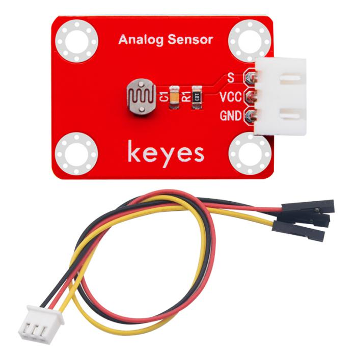
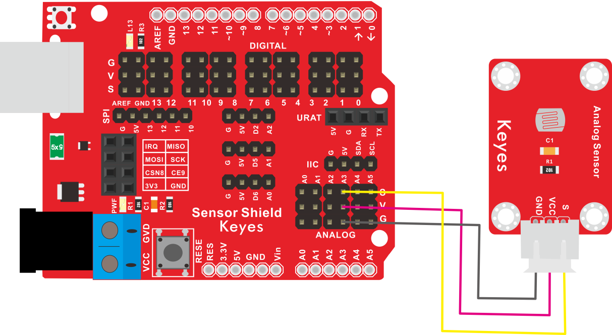
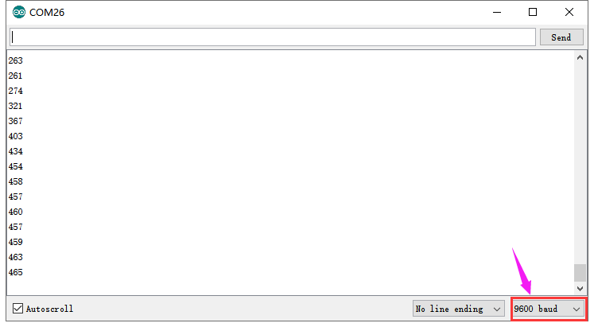

# KE2009 Keyes Brick 光敏电阻传感器综合指南



---

## 1. 概述
KE2009 Keyes Brick 光敏电阻传感器是一款用于光照强度测量的传感器模块，采用光敏电阻（LDR）元件。该模块设计简洁，功能强大，适合各种电子项目和DIY应用。模块上自带一个间距为2.54mm的防反插白色端子，确保连接的可靠性和安全性。

该模块能够根据环境光照强度的变化，输出相应的电压信号，用户可以通过单片机读取该信号来获取光照信息。模块兼容各种单片机控制板，如Arduino系列单片机，使用时可以方便地与其他设备连接。

---

## 2. 规格参数
- **工作电压**：DC 3.3-5V  
- **接口**：间距为2.54mm 3pin防反插接口  
- **输出信号**：模拟信号  
- **测量范围**：0-1000 Lux  
- **尺寸**：34mm x 22mm  
- **重量**：2.6g  

---

## 3. 特点
- **高灵敏度**：能够准确测量环境光照强度，适合各种光照监测应用。
- **防反插设计**：防反插白色端子设计，避免因接反导致的损坏，确保模块的长期稳定性。
- **模块化设计**：焊盘孔设计，方便用户进行焊接和连接，适合DIY项目和快速原型开发。
- **兼容性强**：可与Arduino、树莓派等开发板兼容使用，适合各种项目，易于集成。
- **低功耗**：在正常工作条件下，模块的功耗较低，适合长时间使用。

---

## 4. 工作原理
光敏电阻传感器通过测量环境光照强度引起的电阻变化来输出相应的电压信号。用户可以通过单片机的模拟输入引脚读取该信号，并根据电压值计算出对应的光照强度。

---

## 5. 接口
- **VCC**：连接到电源正极（3.3V或5V）。
- **GND**：连接到电源负极（GND）。
- **S**：模拟输出引脚，输出与光照强度成正比的电压信号。

### 引脚定义
| 引脚名称 | 功能描述                     |
|----------|------------------------------|
| VCC      | 连接到 Arduino 的 5V 或 3.3V 引脚   |
| GND      | 连接到 Arduino 的 GND 引脚  |
| S     | 模拟输出引脚                |

---

## 6. 连接图


### 连接示例
1. 将模块的 VCC 引脚连接到 Arduino 的 5V 或 3.3V 引脚。
2. 将模块的 GND 引脚连接到 Arduino 的 GND 引脚。
3. 将模块的 S 引脚连接到 Arduino 的模拟引脚（例如 A3）。

---

## 7. 示例代码
以下是一个简单的示例代码，用于读取光敏电阻传感器的光照值：
```cpp
const int photoresistorPin = A3; // 连接到模拟引脚 A3

void setup() {
  Serial.begin(9600); // 初始化串口通信
}

void loop() {
  int sensorValue = analogRead(photoresistorPin); // 读取模拟值
  float voltage = sensorValue * (5.0 / 1023.0); // 将模拟值转换为电压
  float lux = voltage * 100; // 将电压转换为光照强度（假设线性关系）
  
  Serial.print("Light Intensity: ");
  Serial.print(lux);
  Serial.println(" Lux");
  
  delay(1000); // 延时 1 秒
}
```

### 代码说明
- **analogRead()**：用于读取模拟引脚的值。
- **Serial.print()**：用于在串口监视器上输出光照值。

---

## 8. 实验现象
上传程序后，串口监视器将每秒输出一次当前光照强度值，用户可以通过观察光照变化来验证模块的功能。



---

## 9. 应用示例
- **光照监测**：用于环境光照监测，适合智能家居、自动灯光控制等应用。
- **光控系统**：用于光控系统中的光照反馈，帮助实现自动调节。
- **电子项目**：用于DIY电子项目中的光照测量，帮助用户了解环境变化。

---

## 10. 注意事项
- 确保模块连接正确，避免短路。
- 在使用过程中，注意电源电压在 3.3V - 5V 范围内，避免过载。
- 避免将模块暴露在极端环境中，以免损坏。
- 长时间使用时，注意传感器的稳定性，避免漂移。

