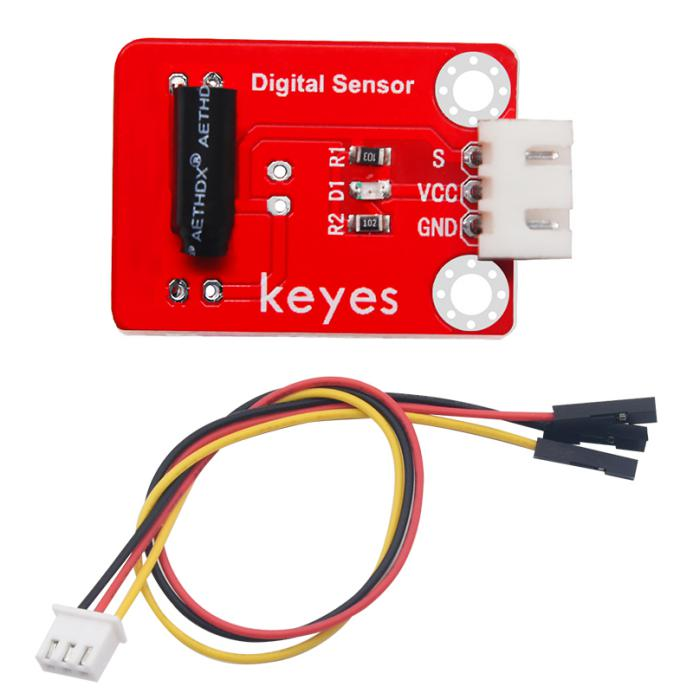
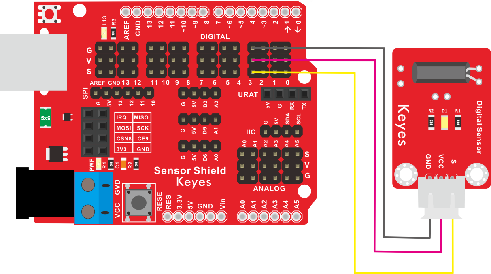

# KE2012 Keyes Brick 震动模块传感器综合指南



---

## 1. 概述
KE2012 Keyes Brick 震动模块传感器是一款用于检测震动或运动的传感器模块。该模块采用高灵敏度的震动传感器，能够感知到轻微的震动，适合各种电子项目和DIY应用。模块上自带一个间距为2.54mm的防反插白色端子，确保连接的可靠性和安全性。

该模块可以通过单片机读取输出信号，用户可以根据传感器的状态来触发相应的操作。模块兼容各种单片机控制板，如Arduino系列单片机，使用时可以方便地与其他设备连接。

---

## 2. 规格参数
- **工作电压**：DC 3.3-5V  
- **接口**：间距为2.54mm 3pin防反插接口  
- **输出信号**：数字信号  
- **灵敏度**：不可调  
- **尺寸**：34mm x 22mm   
- **重量**：2.6g  

---

## 3. 特点
- **高灵敏度**：能够准确检测到轻微的震动或运动，适合各种应用。
- **防反插设计**：防反插白色端子设计，避免因接反导致的损坏，确保模块的长期稳定性。
- **模块化设计**：焊盘孔设计，方便用户进行焊接和连接，适合DIY项目和快速原型开发。
- **兼容性强**：可与Arduino、树莓派等开发板兼容使用，适合各种项目，易于集成。
- **低功耗**：在正常工作条件下，模块的功耗较低，适合长时间使用。

---

## 4. 工作原理
震动模块通过检测传感器内部的振动来输出相应的数字信号。当传感器感知到震动时，输出引脚将变为高电平，用户可以通过单片机读取该信号并进行相应的处理。

---

## 5. 接口
- **VCC**：连接到电源正极（3.3V或5V）。
- **GND**：连接到电源负极（GND）。
- **S**：数字输出引脚，输出高电平表示检测到震动。

### 引脚定义
| 引脚名称 | 功能描述                     |
|----------|------------------------------|
| VCC      | 连接到 Arduino 的 5V 或 3.3V 引脚   |
| GND      | 连接到 Arduino 的 GND 引脚  |
| S     | 数字输出引脚                |

---

## 6. 连接图


### 连接示例
1. 将模块的 VCC 引脚连接到 Arduino 的 5V 或 3.3V 引脚。
2. 将模块的 GND 引脚连接到 Arduino 的 GND 引脚。
3. 将模块的 S 引脚连接到 Arduino 的数字引脚（例如 D3）。

---

## 7. 示例代码
以下是一个简单的示例代码，用于检测震动模块的状态：
```cpp
const int vibrationSensorPin = 3; // 连接到数字引脚 D3
int sensorValue = 0; // 储存传感器值

void setup() {
  pinMode(vibrationSensorPin, INPUT); // 设置震动传感器引脚为输入
  Serial.begin(9600); // 初始化串口通信
}

void loop() {
  sensorValue = digitalRead(vibrationSensorPin); // 读取传感器值
  if (sensorValue == HIGH) {
    Serial.println("Vibration detected!"); // 检测到震动
    delay(1000); // 延时 1 秒，避免重复检测
  }
}
```

### 代码说明
- **digitalRead()**：用于读取数字引脚的值。
- **Serial.println()**：用于在串口监视器上输出检测到的震动信息。

---

## 8. 实验现象
上传程序后，当检测到震动时，串口监视器将输出“Vibration detected!”的信息，用户可以通过震动传感器来验证模块的功能。

---

## 9. 应用示例
- **震动报警**：用于监测设备的震动状态，适合安全报警系统。
- **运动检测**：用于检测物体的运动状态，适合智能家居和自动化项目。
- **游戏控制**：用于游戏项目中的震动反馈，增强用户体验。

---

## 10. 注意事项
- 确保模块连接正确，避免短路。
- 在使用过程中，注意电源电压在 3.3V - 5V 范围内，避免过载。
- 避免将模块暴露在极端环境中，以免损坏。
- 长时间使用时，注意传感器的稳定性，避免漂移。

