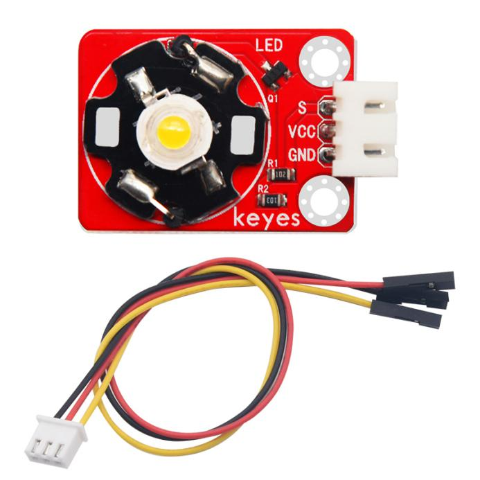
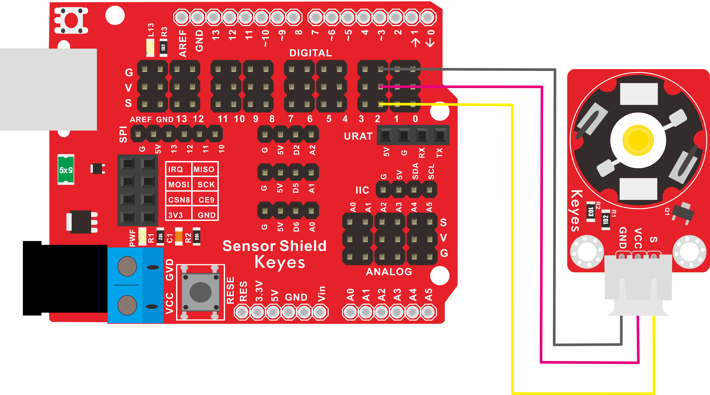
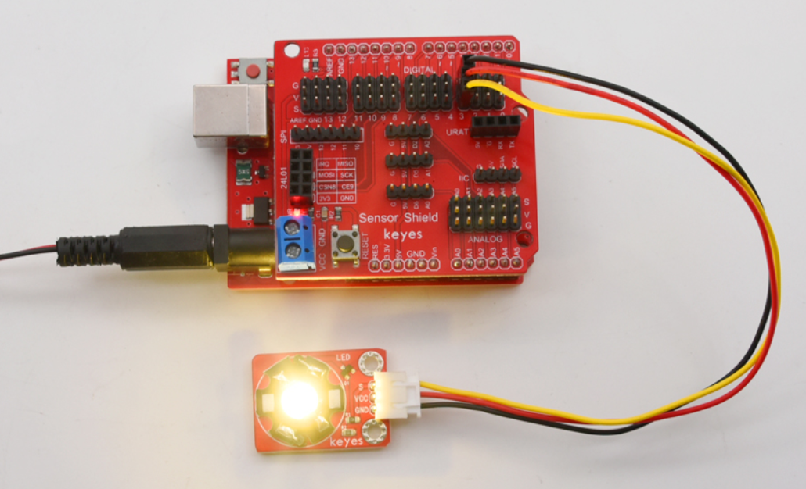

# KE2014 Keyes Brick 3W LED模块综合指南



---

## 1. 概述
KE2014 Keyes Brick 3W LED模块是一款高亮度LED模块，适用于各种照明和指示应用。该模块采用3W功率的LED，能够提供强烈的光输出，适合用于DIY项目、灯光效果和其他电子应用。模块上自带一个间距为2.54mm的防反插白色端子，确保连接的可靠性和安全性。

该模块可以通过单片机控制LED的开关和亮度，用户可以根据需要进行调节。模块兼容各种单片机控制板，如Arduino系列单片机，使用时可以方便地与其他设备连接。

---

## 2. 规格参数
- **工作电压**：DC 5V  
- **功率**：3W  
- **接口**：间距为2.54mm 3pin防反插接口  
- **光通量**：约 300-400 流明  
- **重量**：10g  

---

## 3. 特点
- **高亮度**：3W LED提供强烈的光输出，适合各种照明应用。
- **防反插设计**：防反插白色端子设计，避免因接反导致的损坏，确保模块的长期稳定性。
- **模块化设计**：焊盘孔设计，方便用户进行焊接和连接，适合DIY项目和快速原型开发。
- **兼容性强**：可与Arduino、树莓派等开发板兼容使用，适合各种项目，易于集成。
- **低功耗**：在正常工作条件下，模块的功耗较低，适合长时间使用。

---

## 4. 工作原理
3W LED模块通过电流控制LED的亮度。用户可以通过单片机的PWM输出引脚调节电流，从而实现对LED亮度的控制。

---

## 5. 接口
- **VCC**：连接到电源正极（5V）。
- **GND**：连接到电源负极（GND）。
- **PWM**：控制引脚，用于调节LED亮度。

### 引脚定义
| 引脚名称 | 功能描述                     |
|----------|------------------------------|
| VCC      | 连接到 Arduino 的 5V 引脚   |
| GND      | 连接到 Arduino 的 GND 引脚  |
| PWM      | 控制引脚，用于调节亮度      |

---

## 6. 连接图


### 连接示例
1. 将模块的 VCC 引脚连接到 Arduino 的 5V 引脚。
2. 将模块的 GND 引脚连接到 Arduino 的 GND 引脚。
3. 将模块的 PWM 引脚连接到 Arduino 的数字引脚（例如 D2）。

---

## 7. 示例代码
以下是一个简单的示例代码，用于控制3W LED模块的亮度：
```cpp
const int ledPin = 2; // 连接到数字引脚 D2

void setup() {
  pinMode(ledPin, OUTPUT); // 设置LED引脚为输出
}

void loop() {
  // 渐变亮度
  for (int brightness = 0; brightness <= 255; brightness++) {
    analogWrite(ledPin, brightness); // 设置LED亮度
    delay(10); // 延时
  }
  // 渐变熄灭
  for (int brightness = 255; brightness >= 0; brightness--) {
    analogWrite(ledPin, brightness); // 设置LED亮度
    delay(10); // 延时
  }
}
```

### 代码说明
- **analogWrite()**：用于设置PWM引脚的输出值，从而调节LED的亮度。

---

## 8. 实验现象
上传程序后，LED模块将逐渐亮起并逐渐熄灭，用户可以通过观察LED的亮度变化来验证模块的功能。



---

## 9. 应用示例
- **照明**：用于室内或室外照明，适合DIY灯具项目。
- **指示灯**：用于状态指示，适合各种电子设备。
- **灯光效果**：用于舞台灯光或装饰灯光，增强视觉效果。

---

## 10. 注意事项
- 确保模块连接正确，避免短路。
- 在使用过程中，注意电源电压在 5V 范围内，避免过载。
- 避免将模块暴露在极端环境中，以免损坏。
- 长时间使用时，注意LED的发热情况，避免过热。

---

## 11. 参考链接
- [Keyes官网](http://www.keyes-robot.com/)
- [Arduino 官方网站](https://www.arduino.cc)  

如有更多疑问，请联系 Keyes 官方客服或加入相关创客社区交流。祝使用愉快！