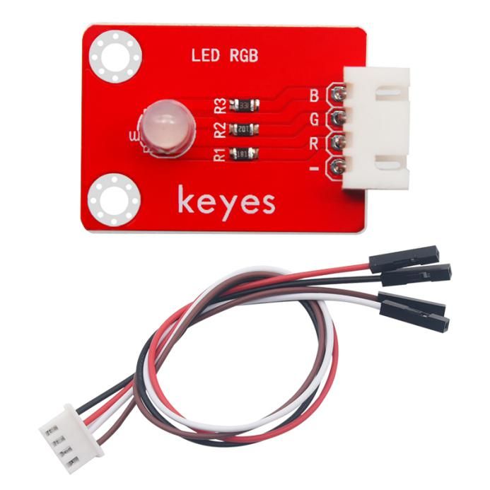
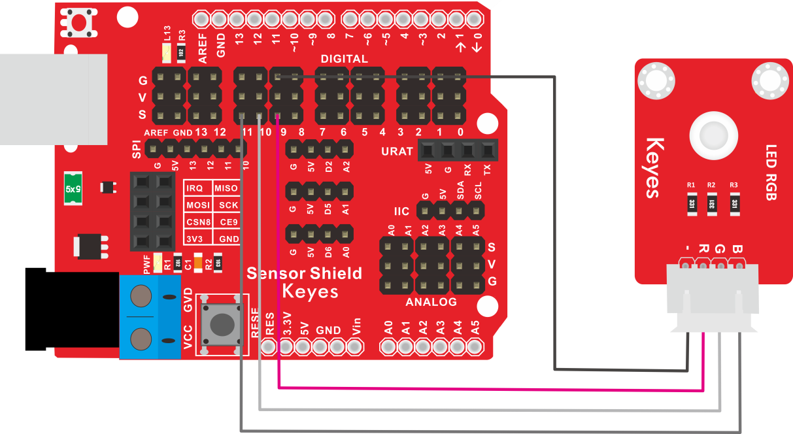
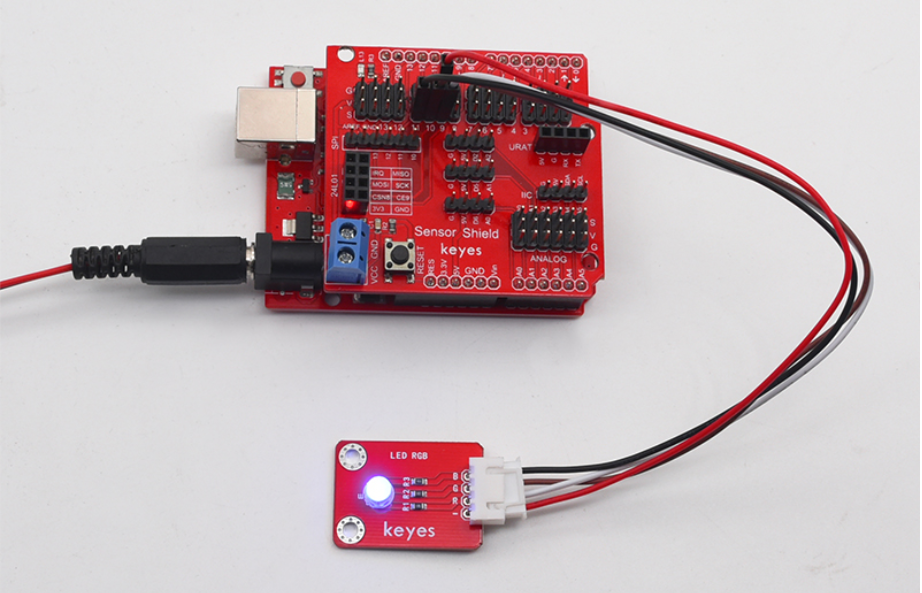

# KE2017 Keyes Brick 插件RGB模块综合指南



---

## 1. 概述
KE2017 Keyes Brick 插件RGB模块是一款集成了红、绿、蓝三种LED的模块，适用于各种照明和指示应用。该模块采用插件设计，方便用户在电路中进行插拔，适合各种电子项目。模块上自带一个间距为2.54mm的防反插白色端子，确保连接的可靠性和安全性。

该模块可以通过单片机控制RGB LED的颜色和亮度，用户可以根据需要进行调节。模块兼容各种单片机控制板，如Arduino系列单片机，使用时可以方便地与其他设备连接。

---

## 2. 规格参数
- **工作电压**：DC 5V  
- **接口**：间距为2.54mm 3pin防反插接口  
- **LED类型**：红色、绿色、蓝色  
- **尺寸**：34mm x 22mm
- **重量**：5g  

---

## 3. 特点
- **插件设计**：方便用户在电路中进行插拔，适合各种项目。
- **防反插设计**：防反插白色端子设计，避免因接反导致的损坏，确保模块的长期稳定性。
- **模块化设计**：焊盘孔设计，方便用户进行焊接和连接，适合DIY项目和快速原型开发。
- **兼容性强**：可与Arduino、树莓派等开发板兼容使用，适合各种项目，易于集成。
- **低功耗**：在正常工作条件下，模块的功耗较低，适合长时间使用。

---

## 4. 工作原理
插件RGB模块通过控制红、绿、蓝三种LED的亮度来实现不同的颜色输出。用户可以通过单片机的PWM输出引脚调节LED的亮度，从而实现对颜色的控制。

---

## 5. 接口
- **GND**：连接到电源负极（GND）。
- **R**：红色LED控制引脚。
- **G**：绿色LED控制引脚。
- **B**：蓝色LED控制引脚。

### 引脚定义
| 引脚名称 | 功能描述                     |
|----------|------------------------------|
| VCC      | 连接到 Arduino 的 5V 引脚   |
| GND      | 连接到 Arduino 的 GND 引脚  |
| R        | 红色LED控制引脚             |
| G        | 绿色LED控制引脚             |
| B        | 蓝色LED控制引脚             |

---

## 6. 连接图


### 连接示例
2. 将模块的 GND 引脚连接到 Arduino 的 GND 引脚。
3. 将模块的 R 引脚连接到 Arduino 的数字引脚（例如 D9）。
4. 将模块的 G 引脚连接到 Arduino 的数字引脚（例如 D10）。
5. 将模块的 B 引脚连接到 Arduino 的数字引脚（例如 D11）。

---

## 7. 示例代码
以下是一个简单的示例代码，用于控制插件RGB模块的颜色：
```cpp
const int redPin = 9; // 连接到数字引脚 D9
const int greenPin = 10; // 连接到数字引脚 D10
const int bluePin = 11; // 连接到数字引脚 D11

void setup() {
  pinMode(redPin, OUTPUT); // 设置红色LED引脚为输出
  pinMode(greenPin, OUTPUT); // 设置绿色LED引脚为输出
  pinMode(bluePin, OUTPUT); // 设置蓝色LED引脚为输出
}

void loop() {
  // 红色
  analogWrite(redPin, 255);
  analogWrite(greenPin, 0);
  analogWrite(bluePin, 0);
  delay(1000);

  // 绿色
  analogWrite(redPin, 0);
  analogWrite(greenPin, 255);
  analogWrite(bluePin, 0);
  delay(1000);

  // 蓝色
  analogWrite(redPin, 0);
  analogWrite(greenPin, 0);
  analogWrite(bluePin, 255);
  delay(1000);

  // 混合颜色
  for (int brightness = 0; brightness <= 255; brightness++) {
    analogWrite(redPin, brightness);
    analogWrite(greenPin, 255 - brightness);
    analogWrite(bluePin, 128); // 固定蓝色
    delay(10);
  }
}
```

### 代码说明
- **analogWrite()**：用于设置PWM引脚的输出值，从而调节LED的亮度和颜色。

---

## 8. 实验现象
上传程序后，插件RGB模块将依次显示红色、绿色和蓝色，并在红色和绿色之间渐变，用户可以通过观察LED的颜色变化来验证模块的功能。



---

## 9. 应用示例
- **状态指示**：用于设备状态指示，适合各种电子设备。
- **装饰灯光**：用于装饰灯光效果，适合节日或活动装饰。
- **信号灯**：用于交通信号或警示灯，增强可视性。

---

## 10. 注意事项
- 确保模块连接正确，避免短路。
- 在使用过程中，注意电源电压在 5V 范围内，避免过载。
- 避免将模块暴露在极端环境中，以免损坏。
- 长时间使用时，注意LED的发热情况，避免过热。

