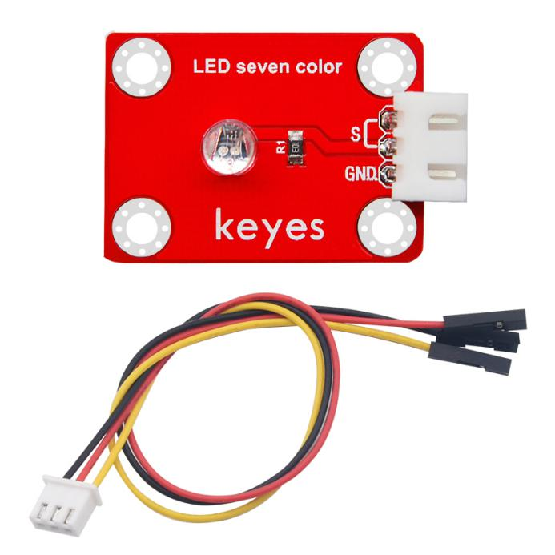
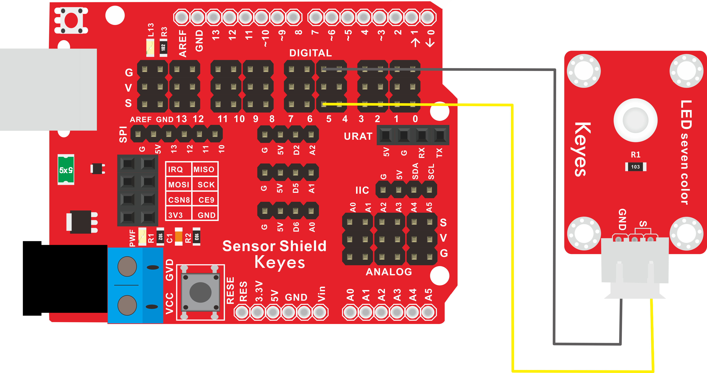
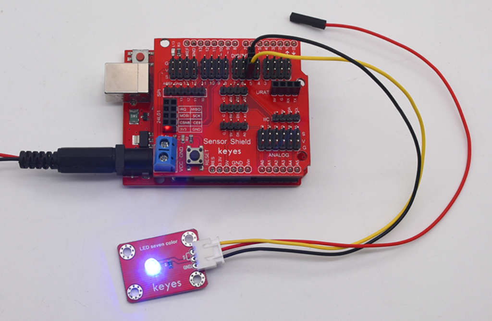

# KE2018 Keyes Brick 7彩自动闪烁模块综合指南



---

## 1. 简介
KE2018 Keyes Brick 7彩自动闪烁模块是一款能够自动切换多种颜色的LED模块，采用焊盘孔设计，方便用户进行焊接和连接。该模块具有防反插白色端子，确保连接的可靠性和安全性。此模块广泛应用于装饰照明、指示灯、创意项目以及各种电子艺术作品中。

---

## 2. 特点
- **七彩闪烁**：模块内置控制电路，能够自动切换红、绿、蓝、黄、青、洋红和白色等多种颜色，提供丰富的视觉效果，适合用于节日装饰和创意展示。
- **防反插设计**：采用防反插白色端子，避免因接反导致的损坏，确保模块的长期稳定性和安全性。
- **模块化设计**：焊盘孔设计，方便用户进行焊接和连接，适合DIY项目和快速原型开发，用户可以根据需要进行定制。
- **兼容性强**：可与 Arduino、树莓派等开发板兼容使用，适合各种项目，易于集成，用户可以轻松实现多种功能。

---

## 3. 规格参数
- **工作电压**：DC 5V  
- **引脚数量**：3  
- **尺寸**：34mm x 22mm
- **LED类型**：多彩LED  
- **最大电流**：20mA（每个颜色通道）  
- **闪烁频率**：约 1Hz（可根据设计调整）

---

## 4. 工作原理
7彩自动闪烁模块通过内置的控制电路自动切换不同颜色的LED灯光。模块内部集成了PWM（脉宽调制）控制技术，能够根据设定的时间间隔自动改变LED的颜色。用户只需将模块连接到电源，模块将自动开始闪烁，提供多种颜色的视觉效果。

---

## 5. 接口
- **GND**：连接到电源负极（GND）。
- **S**：连接到数字引脚，用于输出闪烁信号。

### 引脚定义
| 引脚名称 | 功能描述                     |
|----------|------------------------------|
| GND      | 连接到 Arduino 的 GND 引脚  |
| S      | 连接到 Arduino 的数字引脚（如 D5） |

---

## 6. 连接图


### 连接示例
2. 将模块的 GND 引脚连接到 Arduino 的 GND 引脚。
3. 将模块的 OUT 引脚连接到 Arduino 的数字引脚（如 D5）。

---

## 7. 示例代码
以下是一个简单的示例代码，用于控制7彩自动闪烁模块的工作：
```cpp
const int ledPin = 5; // 连接到数字引脚D5

void setup() {
  pinMode(ledPin, OUTPUT); // 设置引脚为输出
}

void loop() {
  // 模块自动闪烁，无需额外编程
  // 只需连接电源，模块将自动开始闪烁
}
```

### 代码说明
- **pinMode()**：设置引脚模式为输出。
- **loop()**：由于模块内置控制电路，用户无需在代码中添加额外的控制逻辑，模块将自动切换颜色。

---

## 8. 实验现象
上传程序后，7彩自动闪烁模块将自动切换多种颜色，提供丰富的视觉效果，表示模块正常工作。用户可以观察到LED灯光在不同颜色之间平滑过渡，适合用于装饰和展示。



---

## 9. 应用示例

- **节日装饰**：在节日庆典中使用，营造热烈的氛围。
- **创意项目**：结合其他传感器和模块，制作互动艺术装置。
- **指示灯**：用于设备状态指示，提供视觉反馈。

---

## 10. 注意事项
- 确保模块连接正确，避免短路。
- 在使用过程中，注意电源电压在 5V 范围内，避免过载。
- 模块内置控制电路，用户无需额外编程即可实现自动闪烁效果。
- 在高温或潮湿环境中使用时，请确保模块的防护措施。

