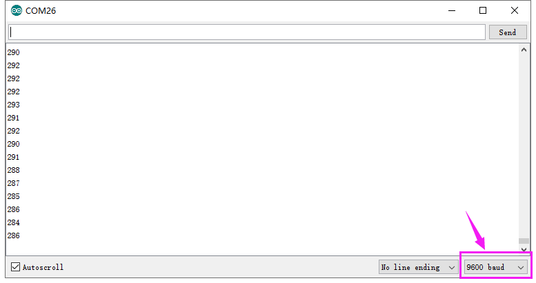

# KE2020 Keyes Brick 水滴水蒸气传感器综合指南


---

## 1. 简介
KE2020 Keyes Brick 水滴水蒸气传感器是一款用于检测水滴和水蒸气的模块，采用焊盘孔设计，方便用户进行焊接和连接。该模块具有防反插白色端子，确保连接的可靠性和安全性。它广泛应用于湿度监测、自动灌溉系统和环境监测等领域。

---

## 2. 特点
- **水滴检测**：能够检测到水滴和水蒸气，适合用于湿度监测和水位检测。
- **防反插设计**：采用防反插白色端子，避免因接反导致的损坏，确保模块的长期稳定性。
- **模块化设计**：焊盘孔设计，方便用户进行焊接和连接，适合DIY项目和快速原型开发。
- **兼容性强**：可与 Arduino、树莓派等开发板兼容使用，适合各种项目，易于集成。

---

## 3. 规格参数
- **工作电压**：DC 5V  
- **引脚数量**：3  
- **尺寸**：34mm x 22mm 
- **输出类型**：模拟输出  
- **灵敏度调节**：内置可调电位器  

---

## 4. 工作原理
水滴水蒸气传感器用于检测空气中的水滴和水蒸气。当传感器接触到水分时，内部材料会吸收水分，导致其电阻或电容发生变化。这个变化会产生一个电信号，微控制器（比如 Arduino）可以读取这个信号并判断湿度水平。这种传感器广泛应用于气象监测、农业和智能家居等领域。

## 5. 接口

- **VCC**：连接到电源正极（5V）。
- **GND**：连接到电源负极（GND）。
- **S**：连接到模拟引脚（模拟输出）。

### 引脚定义
| 引脚名称 | 功能描述                     |
|----------|------------------------------|
| VCC      | 连接到 Arduino 的 5V 引脚   |
| GND      | 连接到 Arduino 的 GND 引脚  |
| S      | 连接到 Arduino 的模拟引脚（如 A3） |

---

## 6. 连接图


### 连接示例
1. 将模块的 VCC 引脚连接到 Arduino 的 5V 引脚。
2. 将模块的 GND 引脚连接到 Arduino 的 GND 引脚。
3. 将模块的 S 引脚连接到 Arduino 的模拟引脚（如 A3）。

---

## 7. 示例代码
以下是一个简单的示例代码，用于读取水滴水蒸气传感器的输出：
```cpp
const int sensorPin = A3; // 连接到模拟引脚 A3
const int ledPin = 13;    // 连接到内置LED引脚

void setup() {
  Serial.begin(9600); // 初始化串口
  pinMode(ledPin, OUTPUT); // 设置LED引脚为输出
}

void loop() {
  int sensorValue = analogRead(sensorPin); // 读取传感器值
  Serial.println(sensorValue); // 输出传感器值

  // 根据传感器值控制LED
  if (sensorValue > 512) { // 阈值可以根据需要调整
    digitalWrite(ledPin, HIGH); // 点亮LED
  } else {
    digitalWrite(ledPin, LOW); // 熄灭LED
  }
  delay(100); // 延时 100 毫秒
}
```

### 代码说明
- **analogRead()**：读取模拟引脚的值，返回范围为 0 到 1023。
- **Serial.println()**：将读取的传感器值输出到串口监视器。
- **digitalWrite()**：根据传感器值控制LED的开关状态。

---

## 8. 实验现象
上传程序后，水滴水蒸气传感器将实时输出传感器值，内置LED会根据传感器值的变化进行闪烁，表示模块正常工作。用户可以通过调节模块上的电位器来改变灵敏度。



---

## 9. 应用示例
- **湿度监测**：用于监测环境湿度，适合农业和温室应用。
- **自动灌溉系统**：检测土壤湿度，自动控制灌溉。
- **环境监测**：监测水蒸气含量，适用于气象站和环境监测设备。

---

## 10. 注意事项
- 确保模块连接正确，避免短路。
- 在使用过程中，注意电源电压在 5V 范围内，避免过载。
- 调节灵敏度时，请注意环境湿度的影响，确保传感器正常工作。

