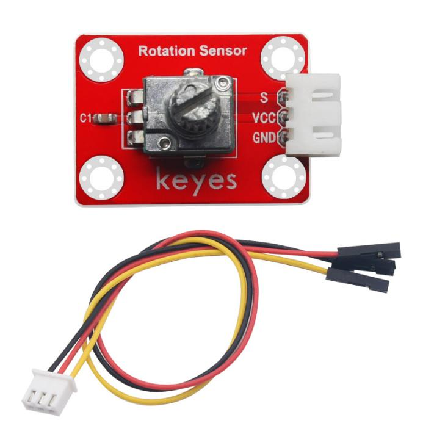
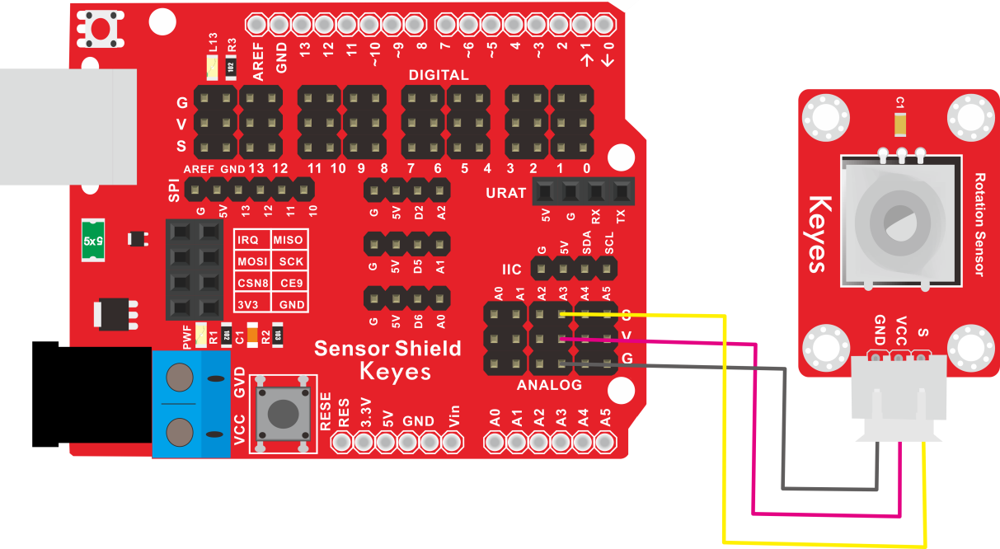
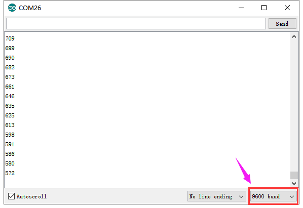

# KE2021 Keyes Brick 可调电位器模块综合指南



---

## 1. 简介
KE2021 Keyes Brick 可调电位器模块是一款用于调节电压的模块，采用焊盘孔设计，方便用户进行焊接和连接。该模块具有防反插白色端子，确保连接的可靠性和安全性。它广泛应用于音量控制、亮度调节和其他需要调节电压的项目中。

---

## 2. 特点
- **可调电压**：通过旋转电位器，可以调节输出电压，适合用于各种需要调节的应用。
- **防反插设计**：采用防反插白色端子，避免因接反导致的损坏，确保模块的长期稳定性。
- **模块化设计**：焊盘孔设计，方便用户进行焊接和连接，适合DIY项目和快速原型开发。
- **兼容性强**：可与 Arduino、树莓派等开发板兼容使用，适合各种项目，易于集成。

---

## 3. 规格参数
- **工作电压**：DC 5V  
- **引脚数量**：3  
- **尺寸**：34mm x 22mm
- **输出类型**：模拟输出  
- **电位器阻值**：10kΩ  

---

## 4. 工作原理
可调电位器模块由一个旋转的旋钮和一个电阻元素组成。当旋钮旋转时，可以改变电位器的电阻值。这个变化会导致输出电压的改变。电位器的三个引脚中，两个引脚连接到电源和地，第三个引脚输出可变的电压信号。微控制器（如 Arduino）可以读取这个输出信号，进而根据旋钮的位置执行相应的操作，如调节亮度或音量。

---

## 5. 接口
- **VCC**：连接到电源正极（5V）。
- **GND**：连接到电源负极（GND）。
- **OUT**：连接到模拟引脚，用于输出调节后的电压。

### 引脚定义
| 引脚名称 | 功能描述                     |
|----------|------------------------------|
| VCC      | 连接到 Arduino 的 5V 引脚   |
| GND      | 连接到 Arduino 的 GND 引脚  |
| OUT      | 连接到 Arduino 的模拟引脚（如 A3） |

---

## 6. 连接图


### 连接示例
1. 将模块的 VCC 引脚连接到 Arduino 的 5V 引脚。
2. 将模块的 GND 引脚连接到 Arduino 的 GND 引脚。
3. 将模块的 OUT 引脚连接到 Arduino 的模拟引脚（如 A3）。

---

## 7. 示例代码
以下是一个简单的示例代码，用于读取可调电位器模块的输出：
```cpp
const int potPin = A3; // 连接到模拟引脚 A3
const int ledPin = 9;  // 连接到 PWM 引脚 9

void setup() {
  Serial.begin(9600); // 初始化串口
  pinMode(ledPin, OUTPUT); // 设置LED引脚为输出
}

void loop() {
  int potValue = analogRead(potPin); // 读取电位器值
  Serial.println(potValue); // 输出电位器值

  // 根据电位器值调节LED亮度
  int brightness = map(potValue, 0, 1023, 0, 255);
  analogWrite(ledPin, brightness); // 设置LED亮度
  delay(100); // 延时 100 毫秒
}
```

### 代码说明
- **analogRead()**：读取模拟引脚的值，返回范围为 0 到 1023。
- **Serial.println()**：将读取的电位器值输出到串口监视器。
- **analogWrite()**：根据电位器值调节LED的亮度。

---

## 8. 实验现象
上传程序后，可调电位器模块将实时输出电位器值，LED的亮度将根据电位器的旋转而变化，表示模块正常工作。



---

## 9. 应用示例
- **音量控制**：用于音频设备的音量调节。
- **亮度调节**：用于LED灯的亮度调节。
- **参数设置**：用于各种设备的参数设置和调节。

---

## 10. 注意事项
- 确保模块连接正确，避免短路。
- 在使用过程中，注意电源电压在 5V 范围内，避免过载。
- 调节电位器时，请注意旋转的幅度，避免过度旋转导致损坏。

---

## 11. 参考链接
- [Keyes官网](http://www.keyes-robot.com/)
- [Arduino 官方网站](https://www.arduino.cc)  

如有更多疑问，请联系 Keyes 官方客服或加入相关创客社区交流。祝使用愉快！