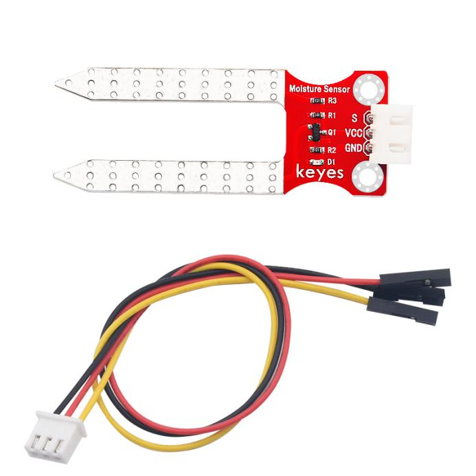
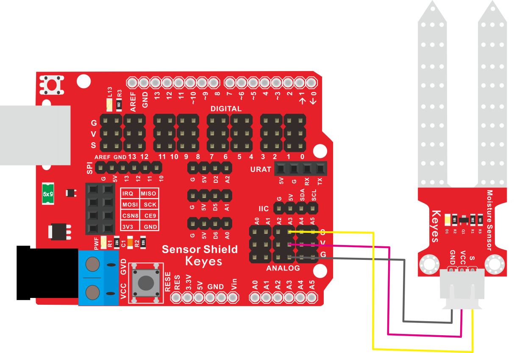
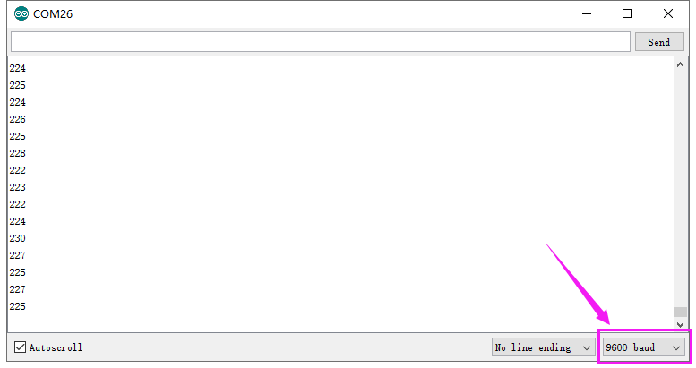

# KE2023 Keyes Brick 土壤传感器综合指南



---

## 1. 简介
KE2023 Keyes Brick 土壤传感器是一款用于检测土壤湿度的模块，采用焊盘孔设计，方便用户进行焊接和连接。该模块具有防反插白色端子，确保连接的可靠性和安全性。它广泛应用于植物养护、自动灌溉系统和环境监测等领域。

---

## 2. 特点
- **土壤湿度检测**：能够检测土壤中的水分含量，适合用于植物养护和农业监测。
- **防反插设计**：采用防反插白色端子，避免因接反导致的损坏，确保模块的长期稳定性。
- **模块化设计**：焊盘孔设计，方便用户进行焊接和连接，适合DIY项目和快速原型开发。
- **兼容性强**：可与 Arduino、树莓派等开发板兼容使用，适合各种项目，易于集成。

---

## 3. 规格参数
- **工作电压**：DC 5V  
- **引脚数量**：3  
- **输出类型**：模拟输出  
- **检测范围**：0-100%（相对湿度）  

---

## 4. 工作原理
土壤湿度传感器用于检测土壤中的水分含量。它可以帮助农民和园艺爱好者了解土壤湿度状态，以便更好地进行灌溉管理。

该传感器通常由两个电极组成，当插入土壤中时，通过测量土壤的电导率来判断湿度水平。湿度越高，土壤的电导率越高，传感器输出的电压信号也越大。用户可以根据这个模拟信号读取土壤的湿度具体值，从而决定是否需要浇水。这种传感器在农业、园艺和环境监测中应用广泛，以实现更精准的水分管理。

---

## 5. 接口
- **VCC**：连接到电源正极（5V）。
- **GND**：连接到电源负极（GND）。
- **OUT**：连接到模拟引脚（模拟输出）。

### 引脚定义
| 引脚名称 | 功能描述                     |
|----------|------------------------------|
| VCC      | 连接到 Arduino 的 5V 引脚   |
| GND      | 连接到 Arduino 的 GND 引脚  |
| OUT      | 连接到 Arduino 的模拟引脚（如 A3） |

---

## 6. 连接图


### 连接示例
1. 将模块的 VCC 引脚连接到 Arduino 的 5V 引脚。
2. 将模块的 GND 引脚连接到 Arduino 的 GND 引脚。
3. 将模块的 OUT 引脚连接到 Arduino 的模拟引脚（如 A3）。

---

## 7. 示例代码
以下是一个简单的示例代码，用于读取土壤传感器的输出：
```cpp
const int sensorPin = A3; // 连接到模拟引脚 A3
const int ledPin = 13;    // 连接到内置LED引脚

void setup() {
  Serial.begin(9600); // 初始化串口
  pinMode(ledPin, OUTPUT); // 设置LED引脚为输出
}

void loop() {
  int sensorValue = analogRead(sensorPin); // 读取传感器值
  Serial.println(sensorValue); // 输出传感器值

  // 根据传感器值控制LED
  if (sensorValue < 512) { // 阈值可以根据需要调整
    digitalWrite(ledPin, HIGH); // 点亮LED
  } else {
    digitalWrite(ledPin, LOW); // 熄灭LED
  }
  delay(100); // 延时 100 毫秒
}
```

### 代码说明
- **analogRead()**：读取模拟引脚的值，返回范围为 0 到 1023。
- **Serial.println()**：将读取的传感器值输出到串口监视器。
- **digitalWrite()**：根据传感器值控制LED的开关状态。

---

## 8. 实验现象
上传程序后，土壤传感器将实时输出传感器值，内置LED会根据传感器值的变化进行闪烁，表示模块正常工作。用户可以通过调节模块上的电位器来改变灵敏度。



---

## 9. 应用示例
- **植物养护**：用于监测植物的土壤湿度，帮助用户合理浇水。
- **自动灌溉系统**：检测土壤湿度，自动控制灌溉系统的开启和关闭。
- **环境监测**：监测土壤湿度，适用于农业和园艺应用。

---

## 10. 注意事项
- 确保模块连接正确，避免短路。
- 在使用过程中，注意电源电压在 5V 范围内，避免过载。
- 调节灵敏度时，请注意土壤湿度的影响，确保传感器正常工作。

---

## 11. 参考链接
- [Keyes官网](http://www.keyes-robot.com/)
- [Arduino 官方网站](https://www.arduino.cc)  

如有更多疑问，请联系 Keyes 官方客服或加入相关创客社区交流。祝使用愉快！