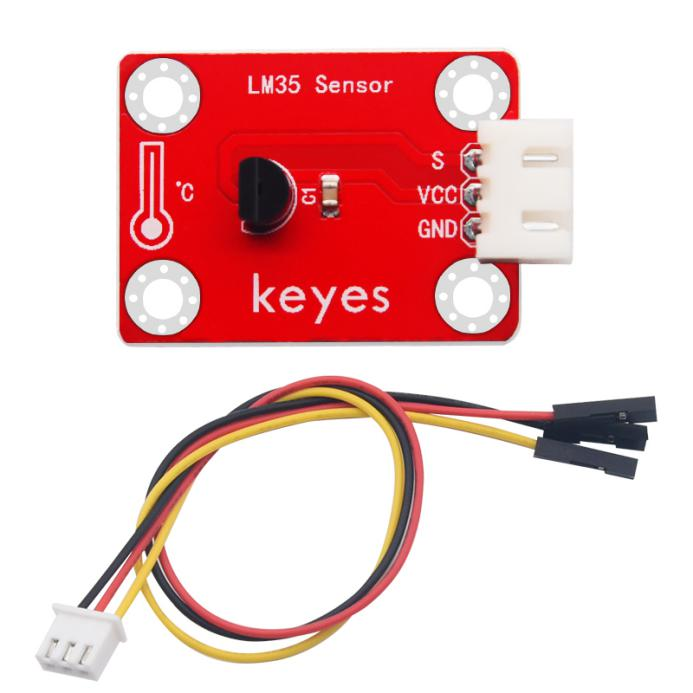
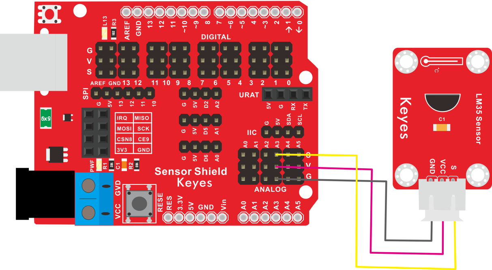
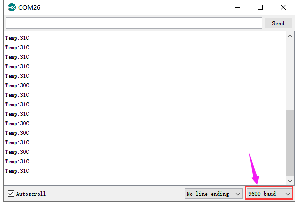

# KE2024 Keyes Brick LM35温度传感器综合指南



---

## 1. 简介
KE2024 Keyes Brick LM35温度传感器是一款高精度的温度传感器，采用焊盘孔设计，方便用户进行焊接和连接。该模块具有防反插白色端子，确保连接的可靠性和安全性。LM35传感器能够提供线性温度输出，广泛应用于温度监测、环境监测和自动控制系统等领域。

---

## 2. 特点
- **高精度**：LM35传感器具有较高的温度测量精度，适合用于精确的温度监测。
- **线性输出**：输出电压与温度成线性关系，便于读取和处理。
- **防反插设计**：采用防反插白色端子，避免因接反导致的损坏，确保模块的长期稳定性。
- **模块化设计**：焊盘孔设计，方便用户进行焊接和连接，适合DIY项目和快速原型开发。
- **兼容性强**：可与 Arduino、树莓派等开发板兼容使用，适合各种项目，易于集成。

---

## 3. 规格参数
- **工作电压**：DC 5V  
- **引脚数量**：3  
- **输出类型**：模拟输出  
- **测量范围**：-55°C 到 +150°C  
- **输出灵敏度**：10mV/°C  

---

## 4. 工作原理
LM35温度传感器是一种模拟传感器，用于测量环境温度。它的输出电压与温度成线性关系：0°C时输出0V，每升高1°C，输出电压增加10mV。LM35可以测量-55°C到150°C的温度范围，功耗低，安装简单，适合与微控制器（如Arduino）配合使用，广泛应用于温度监测和自动控制系统。

---

## 5. 接口
- **VCC**：连接到电源正极（5V）。
- **GND**：连接到电源负极（GND）。
- **S**：连接到模拟引脚，用于输出温度信号。

### 引脚定义
| 引脚名称 | 功能描述                     |
|----------|------------------------------|
| VCC      | 连接到 Arduino 的 5V 引脚   |
| GND      | 连接到 Arduino 的 GND 引脚  |
| S      | 连接到 Arduino 的模拟引脚（如 A3） |

---

## 6. 连接图


### 连接示例
1. 将模块的 VCC 引脚连接到 Arduino 的 5V 引脚。
2. 将模块的 GND 引脚连接到 Arduino 的 GND 引脚。
3. 将模块的 S 引脚连接到 Arduino 的模拟引脚（如 A3）。

---

## 7. 示例代码
以下是一个简单的示例代码，用于读取LM35温度传感器的输出：
```cpp
const int sensorPin = A3; // 连接到模拟引脚 A3

void setup() {
  Serial.begin(9600); // 初始化串口
}

void loop() {
  int sensorValue = analogRead(sensorPin); // 读取传感器值
  float voltage = sensorValue * (5.0 / 1023.0); // 将值转换为电压
  float temperature = voltage * 100; // 将电压转换为温度（°C）

  Serial.print("Temperature: ");
  Serial.print(temperature);
  Serial.println(" °C"); // 输出温度值
  delay(1000); // 延时 1 秒
}
```

### 代码说明
- **analogRead()**：读取模拟引脚的值，返回范围为 0 到 1023。
- **电压转换**：将读取的值转换为电压。
- **温度计算**：根据LM35的输出特性，将电压转换为温度值。

---

## 8. 实验现象
上传程序后，LM35温度传感器将实时输出温度值，用户可以在串口监视器中看到当前的温度读数，表示模块正常工作。



---

## 9. 应用示例
- **环境监测**：用于监测室内外环境温度。
- **温度控制系统**：用于自动控制加热或冷却设备。
- **气象站**：用于气象数据采集和分析。

---

## 10. 注意事项
- 确保模块连接正确，避免短路。
- 在使用过程中，注意电源电压在 5V 范围内，避免过载。
- 避免将传感器暴露在极端温度环境中，以免损坏。

