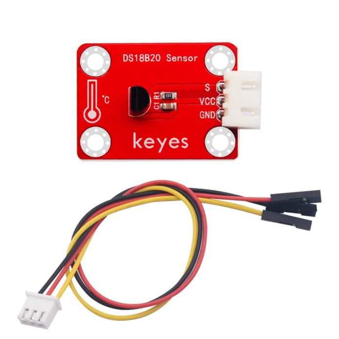
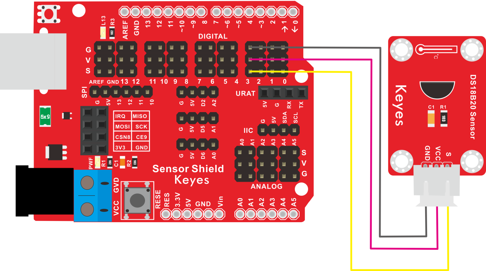
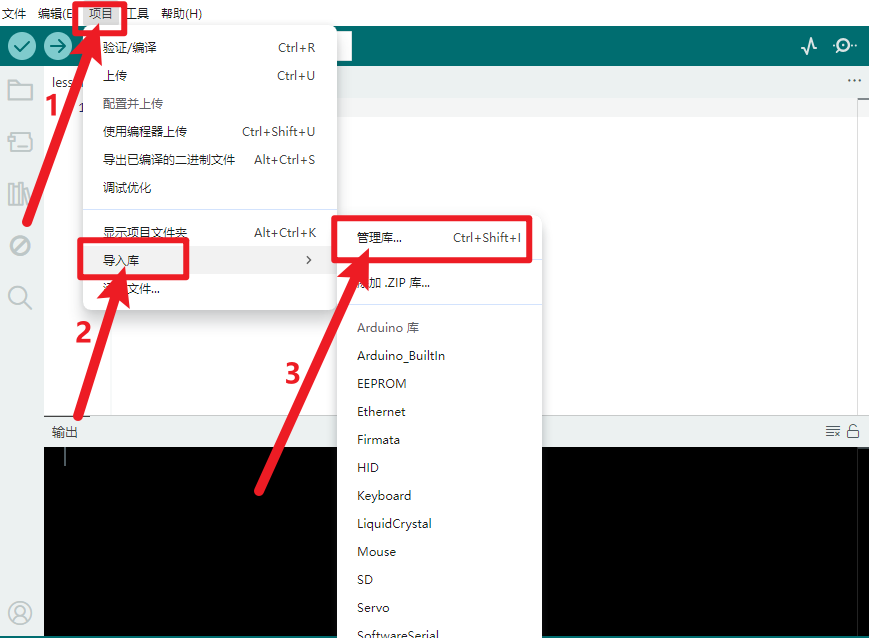
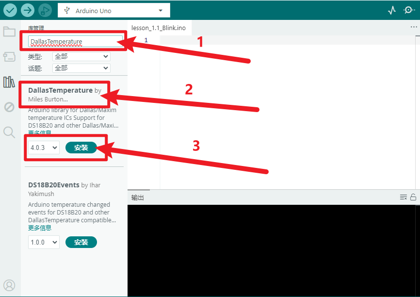
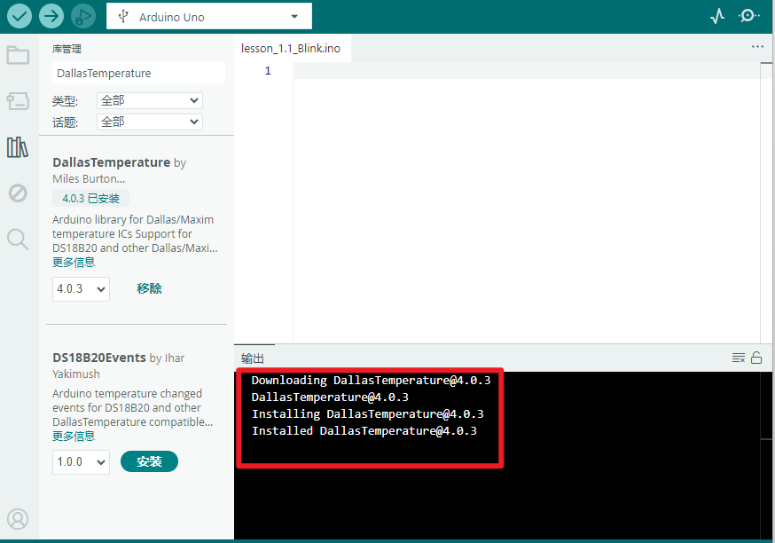
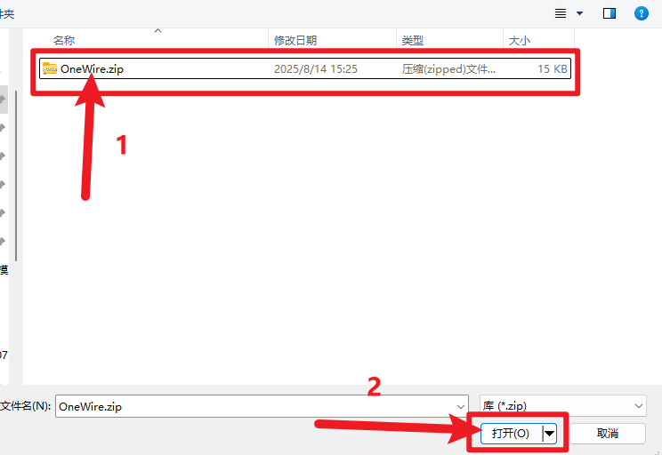
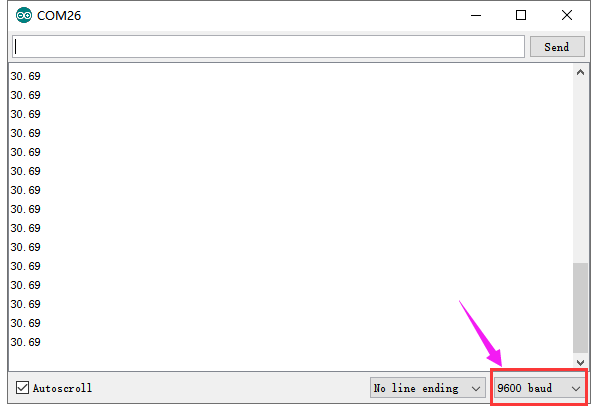

# KE2025 Keyes Brick 18B20温度传感器综合指南



---

## 1. 简介
KE2025 Keyes Brick 18B20温度传感器是一款数字温度传感器，采用焊盘孔设计，方便用户进行焊接和连接。该模块具有防反插白色端子，确保连接的可靠性和安全性。DS18B20传感器能够提供高精度的数字温度输出，广泛应用于温度监测、环境监测和自动控制系统等领域。

---

## 2. 特点
- **高精度**：DS18B20传感器具有较高的温度测量精度，适合用于精确的温度监测。
- **数字输出**：通过单总线接口输出数字信号，便于读取和处理。
- **防反插设计**：采用防反插白色端子，避免因接反导致的损坏，确保模块的长期稳定性。
- **模块化设计**：焊盘孔设计，方便用户进行焊接和连接，适合DIY项目和快速原型开发。
- **兼容性强**：可与 Arduino、树莓派等开发板兼容使用，适合各种项目，易于集成。

---

## 3. 规格参数
- **工作电压**：DC 3.0V - 5.5V  
- **引脚数量**：3  
- **输出类型**：数字输出  
- **测量范围**：-55°C 到 +125°C  
- **精度**：±0.5°C（在 -10°C 到 +85°C 范围内）  

---

## 4. 工作原理
数字输出：DS18B20提供数字信号，直接读取温度值，无需模拟转换。
单总线通信：通过一根数据线进行通信，可以连接多个传感器在同一总线上。
温度测量：传感器内部有一个温度传感器和一个数字转换器，测量温度并将其转换为数字格式，输出温度数据。
电源选项：可以通过数据线供电或独立供电，灵活性高。

DS18B20适用于温度监测和控制系统，广泛应用于项目和产品中。

## 5. 接口
- **VCC**：连接到电源正极（3.0V - 5.5V）。
- **GND**：连接到电源负极（GND）。
- **S**：连接到数字引脚，用于数据传输。

### 引脚定义
| 引脚名称 | 功能描述                     |
|----------|------------------------------|
| VCC      | 连接到 Arduino 的 5V 引脚   |
| GND      | 连接到 Arduino 的 GND 引脚  |
| S       | 连接到 Arduino 的数字引脚（如 D3） |

---

## 6. 连接图


### 连接示例
1. 将模块的 VCC 引脚连接到 Arduino 的 5V 引脚。
2. 将模块的 GND 引脚连接到 Arduino 的 GND 引脚。
3. 将模块的 S 引脚连接到 Arduino 的数字引脚（如 D3）。

---

## 7. 示例代码
**安装库**

1.安装DallasTemperature库

- 打开Arduino IDE，点击“项目”，选择“管理库”。

  

- 方框输入“DallasTemperature”，选择“DallasTemperature”，点击“安装”。

  

- 安装成功界面。

  

2.安装OneWire库

- 下载库文件：[OneWire](./资料/KE2025.7z)

- 打开Arduino IDE，选择“项目”，选择“导入库”，再选择“添加.ZIP库”。

  

- 找到下载资料的存放位置，打开文件夹找到库文件，选择要导入的库，点击“打开”。

  

- 安装成功出现的界面。

  

以下是一个简单的示例代码，用于读取DS18B20温度传感器的输出：

```cpp
#include <OneWire.h>
#include <DallasTemperature.h>

const int oneWireBus = 3; // 连接到数字引脚 D3
OneWire oneWire(oneWireBus);
DallasTemperature sensors(&oneWire);

void setup() {
  Serial.begin(9600); // 初始化串口
  sensors.begin(); // 初始化温度传感器
}

void loop() {
  sensors.requestTemperatures(); // 请求温度数据
  float temperature = sensors.getTempCByIndex(0); // 获取温度值
  Serial.print("Temperature: ");
  Serial.print(temperature);
  Serial.println(" °C"); // 输出温度值
  delay(1000); // 延时 1 秒
}
```

### 代码说明
- **OneWire库**：用于与DS18B20传感器进行通信。
- **DallasTemperature库**：用于处理温度传感器的数据。
- **requestTemperatures()**：请求温度数据。
- **getTempCByIndex(0)**：获取第一个传感器的温度值。

---

## 8. 实验现象
上传程序后，DS18B20温度传感器将实时输出温度值，用户可以在串口监视器中看到当前的温度读数，表示模块正常工作。



---

## 9. 应用示例
- **环境监测**：用于监测室内外环境温度。
- **温度控制系统**：用于自动控制加热或冷却设备。
- **气象站**：用于气象数据采集和分析。

---

## 10. 注意事项
- 确保模块连接正确，避免短路。
- 在使用过程中，注意电源电压在 3.0V - 5.5V 范围内，避免过载。
- 避免将传感器暴露在极端温度环境中，以免损坏。

