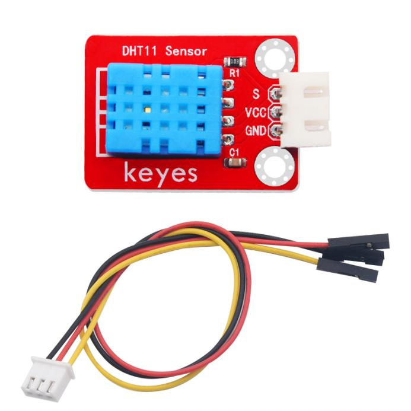
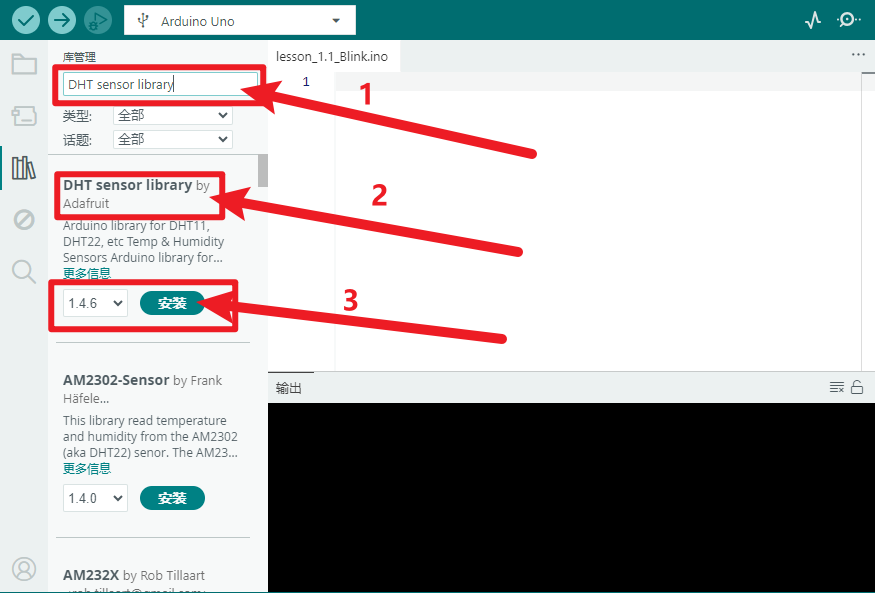
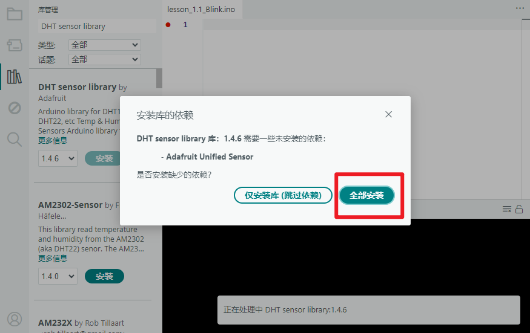
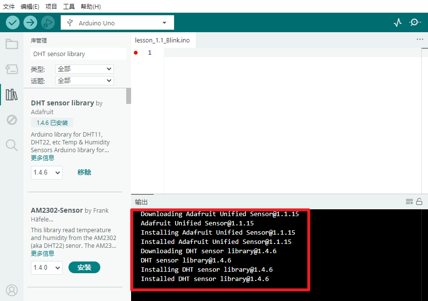
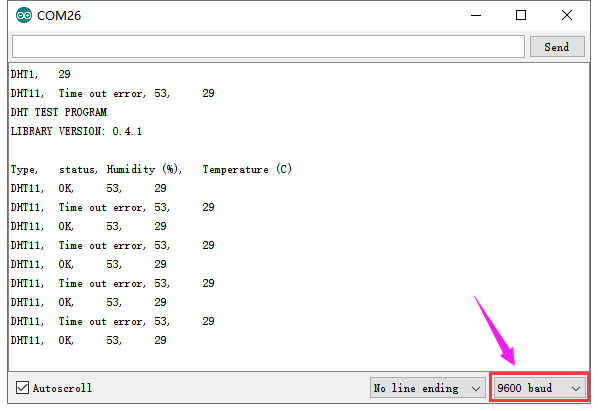

# KE2026 Keyes Brick DHT11温湿度传感器综合指南



---

## 1. 简介
KE2026 Keyes Brick DHT11温湿度传感器是一款用于测量环境温度和湿度的模块，采用焊盘孔设计，方便用户进行焊接和连接。该模块具有防反插白色端子，确保连接的可靠性和安全性。DHT11传感器广泛应用于气象监测、环境监测和智能家居等领域。

---

## 2. 特点
- **温湿度测量**：能够同时测量环境的温度和湿度，适合用于多种应用场景。
- **数字输出**：通过单总线接口输出数字信号，便于读取和处理。
- **防反插设计**：采用防反插白色端子，避免因接反导致的损坏，确保模块的长期稳定性。
- **模块化设计**：焊盘孔设计，方便用户进行焊接和连接，适合DIY项目和快速原型开发。
- **兼容性强**：可与 Arduino、树莓派等开发板兼容使用，适合各种项目，易于集成。

---

## 3. 规格参数
- **工作电压**：DC 3.5V - 5.5V  
- **引脚数量**：3  
- **输出类型**：数字输出  
- **测量范围**：温度：0°C 到 50°C；湿度：20% 到 90%  
- **精度**：温度 ±2°C；湿度 ±5%  

---

## 4. 工作原理
温度传感器：DHT11内部有一个负温度系数（NTC）热敏电阻，能够根据环境温度变化而改变电阻值，通过内置的电路将温度信号转换为数字信号。

湿度传感器：湿度测量基于电容原理，传感器内部的电容器对湿度变化敏感，湿度的变化会影响其电容量，内部电路将其转化为数字信号。

数字输出：DHT11通过单总线接口与微控制器（如Arduino）进行通讯，传输的信号是经过处理后的数字数据，简化了读取过程。

---

## 5. 接口
- **VCC**：连接到电源正极（3.5V - 5.5V）。
- **GND**：连接到电源负极（GND）。
- **S**：连接到数字引脚，用于数据传输。

### 引脚定义
| 引脚名称 | 功能描述                     |
|----------|------------------------------|
| VCC      | 连接到 Arduino 的 5V 引脚   |
| GND      | 连接到 Arduino 的 GND 引脚  |
| S       | 连接到 Arduino 的数字引脚（如 D3） |

---

## 6. 连接图


### 连接示例
1. 将模块的 VCC 引脚连接到 Arduino 的 5V 引脚。
2. 将模块的 GND 引脚连接到 Arduino 的 GND 引脚。
3. 将模块的 S 引脚连接到 Arduino 的数字引脚（如 D3）。

---

## 7. 示例代码
### **安装库**

- 打开Arduino IDE，点击“项目”，选择“管理库”。

  

- 方框输入“DHT sensor library”，选择“DHT sensor library”，点击“安装”。

  

- 如果出现以下界面，选择“全部安装”。

  

- 安装成功出现的界面。

  

以下是一个简单的示例代码，用于读取DHT11温湿度传感器的输出：

```cpp
#include <DHT.h>

#define DHTPIN 3     // 连接到数字引脚 D3
#define DHTTYPE DHT11   // DHT 11

DHT dht(DHTPIN, DHTTYPE);

void setup() {
  Serial.begin(9600); // 初始化串口
  dht.begin(); // 初始化DHT传感器
}

void loop() {
  delay(2000); // 等待2秒以获取新的数据

  float h = dht.readHumidity(); // 读取湿度
  float t = dht.readTemperature(); // 读取温度（摄氏度）

  // 检查读取是否成功
  if (isnan(h) || isnan(t)) {
    Serial.println("读取失败！");
    return;
  }

  Serial.print("湿度: ");
  Serial.print(h);
  Serial.print(" %\t");
  Serial.print("温度: ");
  Serial.print(t);
  Serial.println(" °C");
}
```

### 代码说明
- **DHT库**：用于与DHT11传感器进行通信。
- **readHumidity()**：读取湿度值。
- **readTemperature()**：读取温度值。

---

## 8. 实验现象
上传程序后，DHT11温湿度传感器将实时输出温度和湿度值，用户可以在串口监视器中看到当前的温湿度读数，表示模块正常工作。



---

## 9. 应用示例
- **气象监测**：用于监测环境的温度和湿度。
- **智能家居**：用于环境监测和自动控制空调、加湿器等设备。
- **农业监测**：用于监测温室或农田的环境条件。

---

## 10. 注意事项
- 确保模块连接正确，避免短路。
- 在使用过程中，注意电源电压在 3.5V - 5.5V 范围内，避免过载。
- 避免将传感器暴露在极端环境中，以免损坏。

