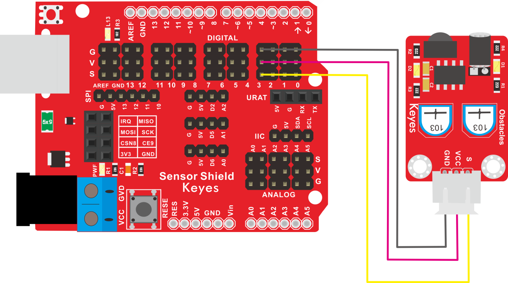

# KE2027 Keyes Brick 避障传感器综合指南


---

## 1. 简介
KE2027 Keyes Brick 避障传感器是一款用于检测障碍物的模块，采用焊盘孔设计，方便用户进行焊接和连接。该模块具有防反插白色端子，确保连接的可靠性和安全性。避障传感器广泛应用于机器人、自动驾驶和智能设备等领域。

---

## 2. 特点
- **障碍物检测**：能够检测前方的障碍物，适合用于机器人避障和导航。
- **数字输出**：通过数字信号输出障碍物检测结果，便于读取和处理。
- **防反插设计**：采用防反插白色端子，避免因接反导致的损坏，确保模块的长期稳定性。
- **模块化设计**：焊盘孔设计，方便用户进行焊接和连接，适合DIY项目和快速原型开发。
- **兼容性强**：可与 Arduino、树莓派等开发板兼容使用，适合各种项目，易于集成。

---

## 3. 规格参数
- **工作电压**：DC 5V  
- **引脚数量**：3  
- **输出类型**：数字输出  
- **检测范围**：2cm 到 30cm  

---

## 4. 工作原理
避障传感器通过发射超声波并接收反射波来检测前方的障碍物。当传感器检测到障碍物时，会通过数字输出引脚发送信号，用户可以根据该信号进行相应的处理。

---

## 5. 接口
- **VCC**：连接到电源正极（5V）。
- **GND**：连接到电源负极（GND）。
- **OUT**：连接到数字引脚，用于输出检测结果。

### 引脚定义
| 引脚名称 | 功能描述                     |
|----------|------------------------------|
| VCC      | 连接到 Arduino 的 5V 引脚   |
| GND      | 连接到 Arduino 的 GND 引脚  |
| OUT      | 连接到 Arduino 的数字引脚（如 D3） |

---

## 6. 连接图


### 连接示例
1. 将模块的 VCC 引脚连接到 Arduino 的 5V 引脚。
2. 将模块的 GND 引脚连接到 Arduino 的 GND 引脚。
3. 将模块的 OUT 引脚连接到 Arduino 的数字引脚（如 D3）。

---

## 7. 示例代码
以下是一个简单的示例代码，用于读取避障传感器的输出：
```cpp
const int sensorPin = 3; // 连接到数字引脚 D3
const int ledPin = 13;   // 连接到内置LED引脚

void setup() {
  pinMode(sensorPin, INPUT); // 设置传感器引脚为输入
  pinMode(ledPin, OUTPUT);    // 设置LED引脚为输出
  Serial.begin(9600); // 初始化串口
}

void loop() {
  int sensorValue = digitalRead(sensorPin); // 读取传感器值
  Serial.println(sensorValue); // 输出传感器值

  // 根据传感器值控制LED
  if (sensorValue == LOW) { // 检测到障碍物
    digitalWrite(ledPin, HIGH); // 点亮LED
  } else {
    digitalWrite(ledPin, LOW); // 熄灭LED
  }
  delay(100); // 延时 100 毫秒
}
```

### 代码说明
- **digitalRead()**：读取数字引脚的值。
- **digitalWrite()**：根据传感器值控制LED的开关状态。

---

## 8. 实验现象


上传程序后，避障传感器将实时输出检测结果，内置LED会根据传感器值的变化进行闪烁，表示模块正常工作。


---

## 9. 应用示例
- **机器人避障**：用于机器人在行驶过程中检测前方障碍物并进行避让。
- **自动驾驶**：用于自动驾驶系统中的障碍物检测。
- **智能设备**：用于智能设备的环境感知和导航。

---

## 10. 注意事项
- 确保模块连接正确，避免短路。
- 在使用过程中，注意电源电压在 5V 范围内，避免过载。
- 避免将传感器暴露在极端环境中，以免损坏。

---

## 11. 参考链接
- [Keyes官网](http://www.keyes-robot.com/)
- [Arduino 官方网站](https://www.arduino.cc)  

