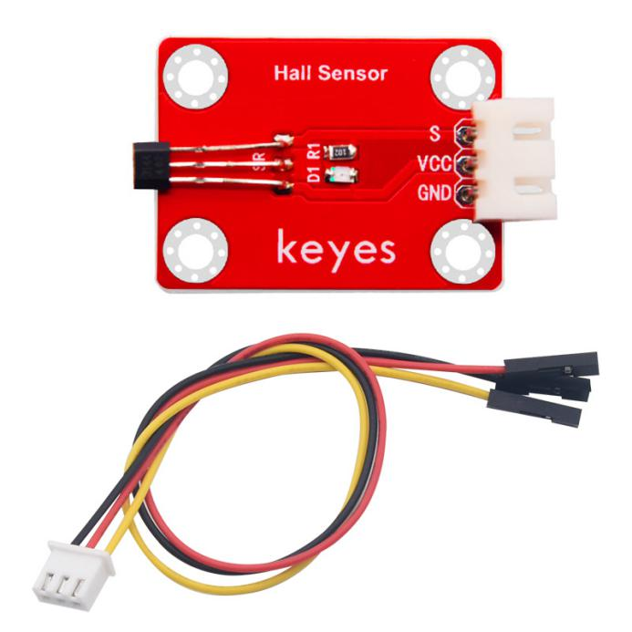

# KE2028 Keyes Brick 霍尔传感器综合指南



---

## 1. 简介
KE2028 Keyes Brick 霍尔传感器是一款用于检测磁场的模块，采用焊盘孔设计，方便用户进行焊接和连接。该模块具有防反插白色端子，确保连接的可靠性和安全性。霍尔传感器广泛应用于位置检测、速度测量和磁场监测等领域。

---

## 2. 特点
- **磁场检测**：能够检测周围的磁场变化，适合用于各种磁场相关的应用。
- **数字输出**：通过数字信号输出检测结果，便于读取和处理。
- **防反插设计**：采用防反插白色端子，避免因接反导致的损坏，确保模块的长期稳定性。
- **模块化设计**：焊盘孔设计，方便用户进行焊接和连接，适合DIY项目和快速原型开发。
- **兼容性强**：可与 Arduino、树莓派等开发板兼容使用，适合各种项目，易于集成。

---

## 3. 规格参数
- **工作电压**：DC 5V  
- **引脚数量**：3  
- **输出类型**：数字输出  
- **检测范围**：适用于常见的磁场强度  

---

## 4. 工作原理
霍尔传感器通过检测磁场的变化来输出数字信号。当有磁场靠近时，传感器会改变输出状态，用户可以根据该信号进行相应的处理。

---

## 5. 接口
- **VCC**：连接到电源正极（5V）。
- **GND**：连接到电源负极（GND）。
- **S**：连接到数字引脚，用于输出检测结果。

### 引脚定义
| 引脚名称 | 功能描述                     |
|----------|------------------------------|
| VCC      | 连接到 Arduino 的 5V 引脚   |
| GND      | 连接到 Arduino 的 GND 引脚  |
| S      | 连接到 Arduino 的数字引脚（如 D3） |

---

## 6. 连接图


### 连接示例
1. 将模块的 VCC 引脚连接到 Arduino 的 5V 引脚。
2. 将模块的 GND 引脚连接到 Arduino 的 GND 引脚。
3. 将模块的 S 引脚连接到 Arduino 的数字引脚（如 D3）。

---

## 7. 示例代码
以下是一个简单的示例代码，用于读取霍尔传感器的输出：
```cpp
const int sensorPin = 3; // 连接到数字引脚 D3
const int ledPin = 13;   // 连接到内置LED引脚

void setup() {
  pinMode(sensorPin, INPUT); // 设置传感器引脚为输入
  pinMode(ledPin, OUTPUT);    // 设置LED引脚为输出
  Serial.begin(9600); // 初始化串口
}

void loop() {
  int sensorValue = digitalRead(sensorPin); // 读取传感器值
  Serial.println(sensorValue); // 输出传感器值

  // 根据传感器值控制LED
  if (sensorValue == HIGH) { // 检测到磁场
    digitalWrite(ledPin, HIGH); // 点亮LED
  } else {
    digitalWrite(ledPin, LOW); // 熄灭LED
  }
  delay(100); // 延时 100 毫秒
}
```

### 代码说明
- **digitalRead()**：读取数字引脚的值。
- **digitalWrite()**：根据传感器值控制LED的开关状态。

---

## 8. 实验现象
上传程序后，霍尔传感器将实时输出检测结果，内置LED会根据传感器值的变化进行闪烁，表示模块正常工作。


---

## 9. 应用示例
- **位置检测**：用于检测物体的位置或运动状态。
- **速度测量**：用于测量旋转物体的速度。
- **磁场监测**：用于监测周围的磁场变化。

---

## 10. 注意事项
- 确保模块连接正确，避免短路。
- 在使用过程中，注意电源电压在 5V 范围内，避免过载。
- 避免将传感器暴露在极端环境中，以免损坏。

