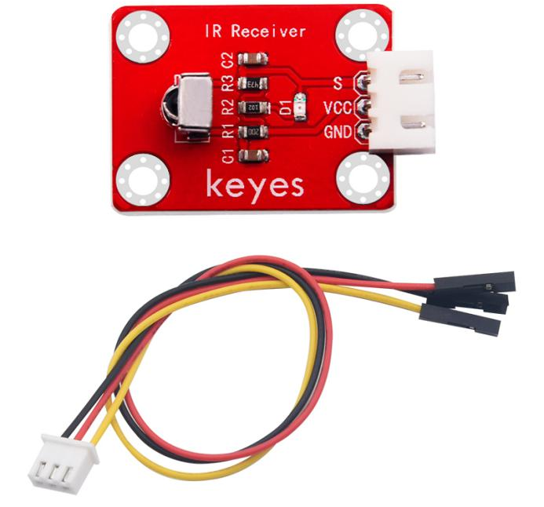
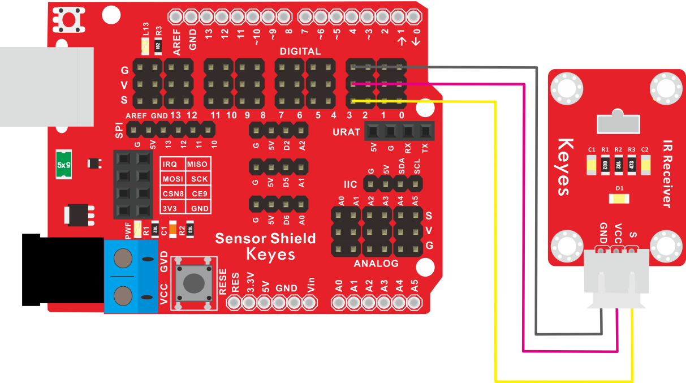
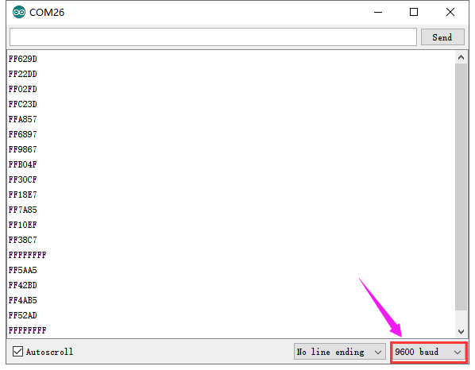

# KE2033 Keyes Brick 红外接收传感器综合指南



---

## 1. 简介
KE2033 Keyes Brick 红外接收传感器是一款用于接收红外信号的模块，采用焊盘孔设计，方便用户进行焊接和连接。该模块具有防反插白色端子，确保连接的可靠性和安全性。红外接收传感器广泛应用于遥控设备、智能家居和安全监测等领域。

---

## 2. 特点
- **红外信号接收**：能够接收红外遥控信号，适合用于各种遥控应用。
- **数字输出**：通过数字信号输出接收到的红外信号，便于读取和处理。
- **防反插设计**：采用防反插白色端子，避免因接反导致的损坏，确保模块的长期稳定性。
- **模块化设计**：焊盘孔设计，方便用户进行焊接和连接，适合DIY项目和快速原型开发。
- **兼容性强**：可与 Arduino、树莓派等开发板兼容使用，适合各种项目，易于集成。

---

## 3. 规格参数
- **工作电压**：DC 5V  
- **引脚数量**：3  
- **尺寸**：约 20mm x 20mm  
- **输出类型**：数字输出  

---

## 4. 工作原理
红外接收传感器通过接收红外光信号来输出数字信号。当传感器接收到红外信号时，会改变输出状态，用户可以根据该信号进行相应的处理。

---

## 5. 接口
- **VCC**：连接到电源正极（5V）。
- **GND**：连接到电源负极（GND）。
- **OUT**：连接到数字引脚，用于输出接收到的信号。

### 引脚定义
| 引脚名称 | 功能描述                     |
|----------|------------------------------|
| VCC      | 连接到 Arduino 的 5V 引脚   |
| GND      | 连接到 Arduino 的 GND 引脚  |
| OUT      | 连接到 Arduino 的数字引脚（如 D3） |

---

## 6. 连接图


### 连接示例
1. 将模块的 VCC 引脚连接到 Arduino 的 5V 引脚。
2. 将模块的 GND 引脚连接到 Arduino 的 GND 引脚。
3. 将模块的 OUT 引脚连接到 Arduino 的数字引脚（如 D3）。

---

## 7. 示例代码
以下是一个简单的示例代码，用于读取红外接收传感器的输出：
```cpp
#include <IRremote.h>

const int receiverPin = 3; // 连接到数字引脚 D3
IRrecv irrecv(receiverPin);
decode_results results;

void setup() {
  Serial.begin(9600); // 初始化串口
  irrecv.enableIRIn(); // 启用红外接收
}

void loop() {
  if (irrecv.decode(&results)) {
    Serial.print("接收到的红外信号：");
    Serial.println(results.value, HEX); // 输出接收到的红外信号
    irrecv.resume(); // 接收下一个信号
  }
}
```

### 代码说明
- **IRremote库**：用于处理红外信号的接收。
- **decode()**：检测是否接收到红外信号。
- **results.value**：获取接收到的红外信号值。

---

## 8. 实验现象
上传程序后，红外接收传感器将实时输出接收到的红外信号，用户可以在串口监视器中看到接收到的信号值，表示模块正常工作。



---

## 9. 应用示例
- **遥控设备**：用于接收遥控器发出的信号。
- **智能家居**：用于智能家居设备的遥控控制。
- **安全监测**：用于安全设备的红外信号监测。

---

## 10. 注意事项
- 确保模块连接正确，避免短路。
- 在使用过程中，注意电源电压在 5V 范围内，避免过载。
- 避免将传感器暴露在极端环境中，以免损坏。

---

## 11. 参考链接
- [Keyes官网](http://www.keyes-robot.com/)
- [Arduino 官方网站](https://www.arduino.cc)  

如有更多疑问，请联系 Keyes 官方客服或加入相关创客社区交流。祝使用愉快！