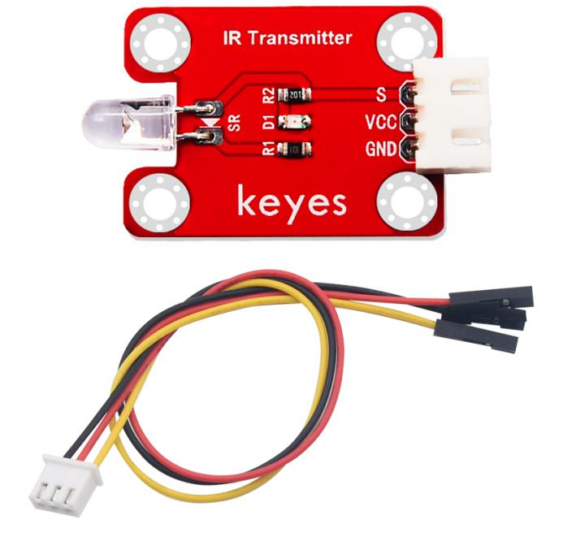
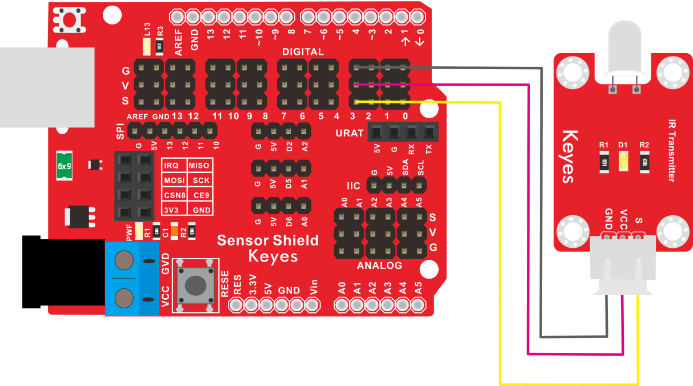

# KE2034 Keyes Brick 红外发射传感器综合指南



---

## 1. 简介
KE2034 Keyes Brick 红外发射传感器是一款用于发射红外光信号的模块，采用焊盘孔设计，方便用户进行焊接和连接。该模块具有防反插白色端子，确保连接的可靠性和安全性。红外发射传感器广泛应用于遥控设备、红外通信和安全监测等领域。

---

## 2. 特点
- **红外信号发射**：能够发射红外光信号，适合用于各种遥控和通信应用。
- **简单易用**：通过简单的电路连接即可使用，便于集成。
- **防反插设计**：采用防反插白色端子，避免因接反导致的损坏，确保模块的长期稳定性。
- **模块化设计**：焊盘孔设计，方便用户进行焊接和连接，适合DIY项目和快速原型开发。
- **兼容性强**：可与 Arduino、树莓派等开发板兼容使用，适合各种项目，易于集成。

---

## 3. 规格参数
- **工作电压**：DC 5V  
- **引脚数量**：3  
- **尺寸**：约 20mm x 20mm  
- **输出类型**：无输出，发射红外信号  

---

## 4. 工作原理
红外发射传感器通过发射红外光信号来进行通信或控制。当电流通过传感器时，它会发射红外光，用户可以通过接收器接收该信号。

---

## 5. 接口
- **VCC**：连接到电源正极（5V）。
- **GND**：连接到电源负极（GND）。
- **OUT**：无输出引脚，主要用于发射红外信号。

### 引脚定义
| 引脚名称 | 功能描述                     |
|----------|------------------------------|
| VCC      | 连接到 Arduino 的 5V 引脚   |
| GND      | 连接到 Arduino 的 GND 引脚  |
| S      | 连接到 Arduino 的引脚D3    |

---

## 6. 连接图


### 连接示例
1. 将模块的 VCC 引脚连接到 Arduino 的 5V 引脚。
2. 将模块的 GND 引脚连接到 Arduino 的 GND 引脚。

---

## 7. 示例代码
以下是一个简单的示例代码，用于控制红外发射传感器的发射：
```cpp
const int emitterPin = 3; // 连接到数字引脚 D3

void setup() {
  pinMode(emitterPin, OUTPUT); // 设置发射引脚为输出
}

void loop() {
  digitalWrite(emitterPin, HIGH); // 发射红外信号
  delay(1000); // 持续发射 1 秒
  digitalWrite(emitterPin, LOW); // 停止发射
  delay(1000); // 停止 1 秒
}
```

### 代码说明
- **digitalWrite()**：控制发射引脚的高低电平，从而发射红外信号。

---

## 8. 实验现象
上传程序后，红外发射传感器将周期性发射红外信号，用户可以使用红外接收器检测到该信号，表示模块正常工作。

---

## 9. 应用示例
- **遥控设备**：用于遥控器的红外信号发射。
- **红外通信**：用于设备之间的红外数据传输。
- **安全监测**：用于红外报警系统。

---

## 10. 注意事项
- 确保模块连接正确，避免短路。
- 在使用过程中，注意电源电压在 5V 范围内，避免过载。
- 避免将传感器暴露在极端环境中，以免损坏。

---

## 11. 参考链接
- [Keyes官网](http://www.keyes-robot.com/)
- [Arduino 官方网站](https://www.arduino.cc)  

如有更多疑问，请联系 Keyes 官方客服或加入相关创客社区交流。祝使用愉快！