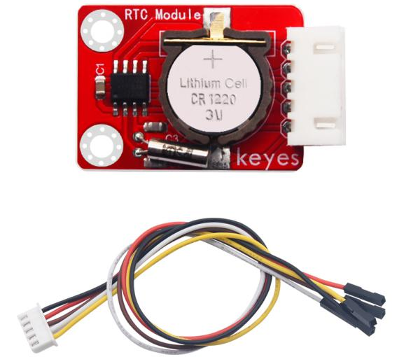
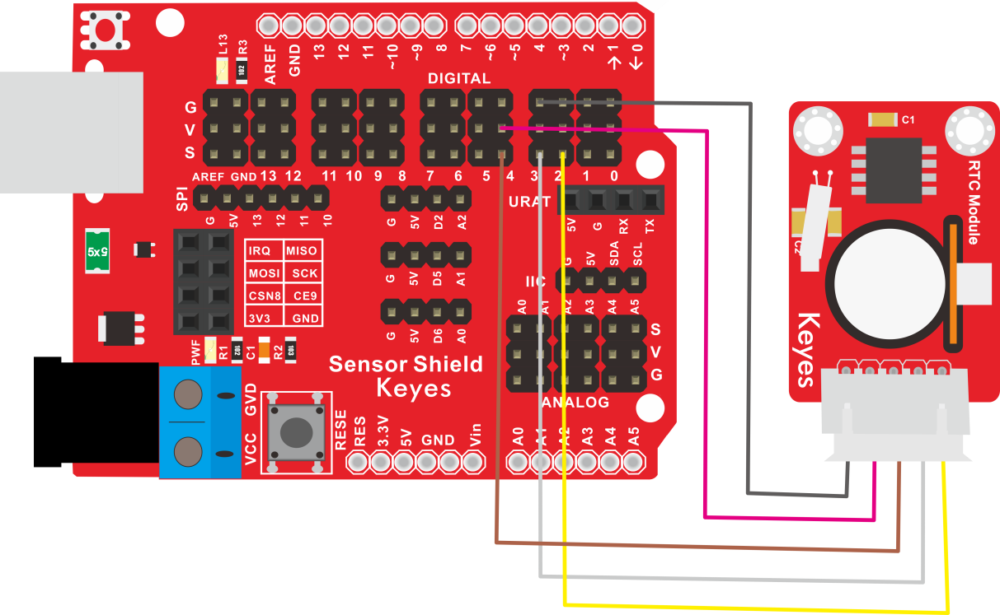
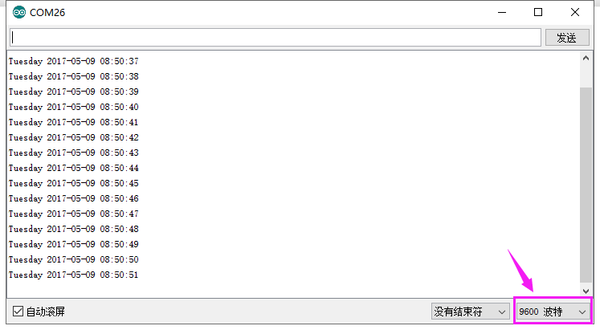

# KE2035 Keyes Brick 1302时钟传感器综合指南



---

## 1. 简介
KE2035 Keyes Brick 1302时钟传感器是一款用于获取时间信息的模块，采用焊盘孔设计，方便用户进行焊接和连接。该模块具有防反插白色端子，确保连接的可靠性和安全性。1302时钟传感器广泛应用于时钟、定时器和时间监测等领域。

---

## 2. 特点
- **时间获取**：能够获取当前的时间信息，适合用于各种时间相关的应用。
- **数字输出**：通过数字信号输出时间数据，便于读取和处理。
- **防反插设计**：采用防反插白色端子，避免因接反导致的损坏，确保模块的长期稳定性。
- **模块化设计**：焊盘孔设计，方便用户进行焊接和连接，适合DIY项目和快速原型开发。
- **兼容性强**：可与 Arduino、树莓派等开发板兼容使用，适合各种项目，易于集成。

---

## 3. 规格参数
- **工作电压**：DC 5V  
- **引脚数量**：4  
- **尺寸**：约 20mm x 20mm  
- **输出类型**：数字输出  

---

## 4. 工作原理
1302时钟传感器通过内部时钟电路获取当前时间，并通过数字信号输出。用户可以通过读取该信号获取当前的时间信息。

---

## 5. 接口
- **VCC**：连接到电源正极（5V）。
- **GND**：连接到电源负极（GND）。
- **SCL**：时钟信号引脚。
- **SDA**：数据引脚。

### 引脚定义
| 引脚名称 | 功能描述                     |
|----------|------------------------------|
| VCC      | 连接到 Arduino 的 5V 引脚   |
| GND      | 连接到 Arduino 的 GND 引脚  |
| SCL      | 连接到 Arduino 的 SCL 引脚  |
| SDA      | 连接到 Arduino 的 SDA 引脚  |

---

## 6. 连接图


### 连接示例
1. 将模块的 VCC 引脚连接到 Arduino 的 5V 引脚。
2. 将模块的 GND 引脚连接到 Arduino 的 GND 引脚。
3. 将模块的 SCL 引脚连接到 Arduino 的 SCL 引脚。
4. 将模块的 SDA 引脚连接到 Arduino 的 SDA 引脚。

---

## 7. 示例代码
以下是一个简单的示例代码，用于读取1302时钟传感器的时间信息：
```cpp
#include <Wire.h>
#include "RTClib.h"

RTC_DS1302 rtc;

void setup() {
  Serial.begin(9600); // 初始化串口
  rtc.begin(); // 初始化时钟
}

void loop() {
  DateTime now = rtc.now(); // 获取当前时间

  Serial.print(now.year(), DEC);
  Serial.print('/');
  Serial.print(now.month(), DEC);
  Serial.print('/');
  Serial.print(now.day(), DEC);
  Serial.print(" ");
  Serial.print(now.hour(), DEC);
  Serial.print(':');
  Serial.print(now.minute(), DEC);
  Serial.print(':');
  Serial.print(now.second(), DEC);
  Serial.println();

  delay(1000); // 每秒更新一次
}
```

### 代码说明
- **Wire库**：用于I2C通信。
- **RTClib库**：用于处理时钟数据。
- **rtc.now()**：获取当前时间。

---

## 8. 实验现象
上传程序后，1302时钟传感器将实时输出当前时间，用户可以在串口监视器中看到时间信息，表示模块正常工作。



---

## 9. 应用示例
- **时钟**：用于制作电子时钟。
- **定时器**：用于定时器和计时器应用。
- **时间监测**：用于时间相关的监测和记录。

---

## 10. 注意事项
- 确保模块连接正确，避免短路。
- 在使用过程中，注意电源电压在 5V 范围内，避免过载。
- 避免将传感器暴露在极端环境中，以免损坏。

