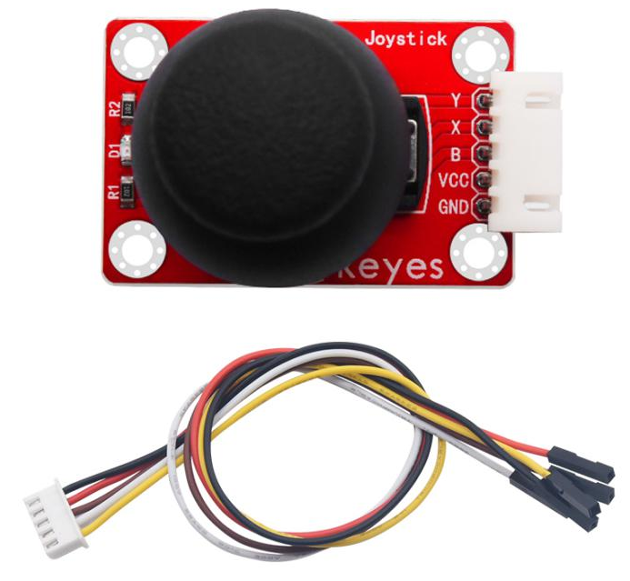
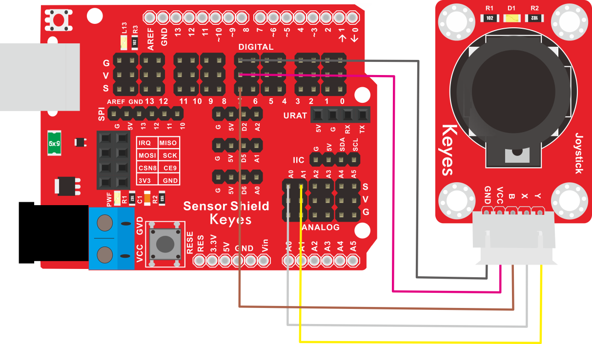
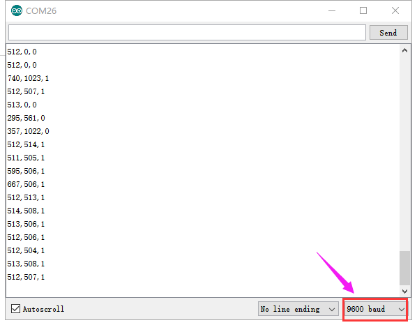

# KE2036 Keyes Brick 摇杆模块传感器综合指南



---

## 1. 简介
KE2036 Keyes Brick 摇杆模块传感器是一款用于检测摇杆位置的模块，采用焊盘孔设计，方便用户进行焊接和连接。该模块具有防反插白色端子，确保连接的可靠性和安全性。摇杆模块传感器广泛应用于游戏控制、机器人控制和各种交互式项目。

---

## 2. 特点
- **位置检测**：能够检测摇杆的水平和垂直位置，适合用于各种控制应用。
- **模拟输出**：通过模拟信号输出摇杆位置，便于读取和处理。
- **防反插设计**：采用防反插白色端子，避免因接反导致的损坏，确保模块的长期稳定性。
- **模块化设计**：焊盘孔设计，方便用户进行焊接和连接，适合DIY项目和快速原型开发。
- **兼容性强**：可与 Arduino、树莓派等开发板兼容使用，适合各种项目，易于集成。

---

## 3. 规格参数
- **工作电压**：DC 5V  
- **引脚数量**：5  
- **尺寸**：约 20mm x 20mm  
- **输出类型**：模拟输出  

---

## 4. 工作原理
摇杆模块传感器通过检测摇杆的位移来输出模拟信号。用户可以通过读取该信号获取摇杆的当前位置信息。

---

## 5. 接口
- **VCC**：连接到电源正极（5V）。
- **GND**：连接到电源负极（GND）。
- **X**：水平位置输出引脚。
- **Y**：垂直位置输出引脚。
- **SW**：按键输出引脚（可选）。

### 引脚定义
| 引脚名称 | 功能描述                     |
|----------|------------------------------|
| VCC      | 连接到 Arduino 的 5V 引脚   |
| GND      | 连接到 Arduino 的 GND 引脚  |
| X        | 水平位置输出引脚            |
| Y        | 垂直位置输出引脚            |
| SW       | 摇杆按键输出引脚（可选）    |

---

## 6. 连接图


### 连接示例
1. 将模块的 VCC 引脚连接到 Arduino 的 5V 引脚。
2. 将模块的 GND 引脚连接到 Arduino 的 GND 引脚。
3. 将模块的 X 引脚连接到 Arduino 的模拟引脚（如 A0）。
4. 将模块的 Y 引脚连接到 Arduino 的模拟引脚（如 A1）。

---

## 7. 示例代码
以下是一个简单的示例代码，用于读取摇杆模块传感器的输出：
```cpp
const int xPin = A0; // 连接到模拟引脚 A0
const int yPin = A1; // 连接到模拟引脚 A1

void setup() {
  Serial.begin(9600); // 初始化串口
}

void loop() {
  int xValue = analogRead(xPin); // 读取水平位置
  int yValue = analogRead(yPin); // 读取垂直位置

  Serial.print("X: ");
  Serial.print(xValue);
  Serial.print(" Y: ");
  Serial.println(yValue);

  delay(100); // 延时 100 毫秒
}
```

### 代码说明
- **analogRead()**：读取模拟引脚的值。
- **Serial.print()**：输出摇杆位置的值。

---

## 8. 实验现象
上传程序后，摇杆模块传感器将实时输出摇杆的水平和垂直位置，用户可以在串口监视器中看到位置值，表示模块正常工作。



---

## 9. 应用示例
- **游戏控制**：用于游戏手柄的控制。
- **机器人控制**：用于机器人运动的控制。
- **交互式项目**：用于各种创意项目的输入控制。

---

## 10. 注意事项
- 确保模块连接正确，避免短路。
- 在使用过程中，注意电源电压在 5V 范围内，避免过载。
- 避免将传感器暴露在极端环境中，以免损坏。

---

## 11. 参考链接
- [Keyes官网](http://www.keyes-robot.com/)
- [Arduino 官方网站](https://www.arduino.cc)  

如有更多疑问，请联系 Keyes 官方客服或加入相关创客社区交流。祝使用愉快！