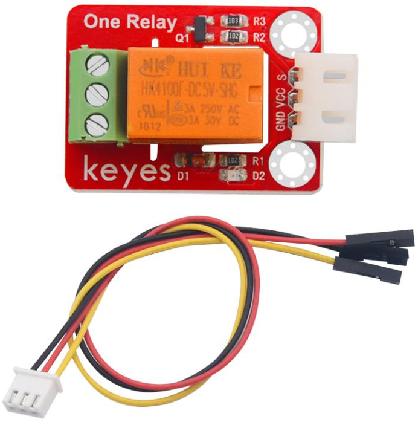

# KE2037 Keyes Brick 5V 单路继电器模块综合指南



---

## 1. 简介
KE2037 Keyes Brick 5V 单路继电器模块是一款用于控制高电压设备的模块，采用焊盘孔设计，方便用户进行焊接和连接。该模块具有防反插白色端子，确保连接的可靠性和安全性。单路继电器模块广泛应用于自动化控制、智能家居和设备开关等领域。

---

## 2. 特点
- **单路控制**：能够控制一个高电压设备，适合用于各种自动化控制应用。
- **防反插设计**：采用防反插白色端子，避免因接反导致的损坏，确保模块的长期稳定性。
- **模块化设计**：焊盘孔设计，方便用户进行焊接和连接，适合DIY项目和快速原型开发。
- **兼容性强**：可与 Arduino、树莓派等开发板兼容使用，适合各种项目，易于集成。
- **LED指示灯**：模块上配有LED指示灯，方便用户观察继电器的工作状态。

---

## 3. 规格参数
- **工作电压**：DC 5V  
- **引脚数量**：3  
- **继电器额定电流**：10A（AC 250V / DC 30V）  
- **尺寸**：约 40mm x 20mm  

---

## 4. 工作原理
单路继电器模块通过控制继电器的开关状态来实现对高电压设备的控制。当控制引脚接收到高电平信号时，继电器闭合，设备通电；当控制引脚接收到低电平信号时，继电器断开，设备断电。

---

## 5. 接口
- **VCC**：连接到电源正极（5V）。
- **GND**：连接到电源负极（GND）。
- **IN**：连接到数字引脚，用于控制继电器的开关状态。

### 引脚定义
| 引脚名称 | 功能描述                     |
|----------|------------------------------|
| VCC      | 连接到 Arduino 的 5V 引脚   |
| GND      | 连接到 Arduino 的 GND 引脚  |
| IN       | 连接到 Arduino 的数字引脚（如 D3） |

---

## 6. 连接图


### 连接示例
1. 将模块的 VCC 引脚连接到 Arduino 的 5V 引脚。
2. 将模块的 GND 引脚连接到 Arduino 的 GND 引脚。
3. 将模块的 IN 引脚连接到 Arduino 的数字引脚（如 D3）。

---

## 7. 示例代码
以下是一个简单的示例代码，用于控制单路继电器模块的开关：
```cpp
const int relayPin = 3; // 连接到数字引脚 D3

void setup() {
  pinMode(relayPin, OUTPUT); // 设置继电器引脚为输出
  Serial.begin(9600); // 初始化串口
}

void loop() {
  digitalWrite(relayPin, HIGH); // 继电器闭合，设备通电
  Serial.println("设备已通电");
  delay(5000); // 延时 5 秒

  digitalWrite(relayPin, LOW); // 继电器断开，设备断电
  Serial.println("设备已断电");
  delay(5000); // 延时 5 秒
}
```

### 代码说明
- **digitalWrite()**：用于控制继电器的开关状态。
- **HIGH**：继电器闭合，设备通电。
- **LOW**：继电器断开，设备断电。

---

## 8. 实验现象
上传程序后，继电器模块将每隔 5 秒切换一次开关状态，串口监视器将显示设备的通电和断电状态，表示模块正常工作。


---

## 9. 应用示例
- **自动化控制**：用于控制灯光、风扇等设备的开关。
- **智能家居**：用于智能家居系统中的设备控制。
- **设备开关**：用于各种电器设备的远程控制。

---

## 10. 注意事项
- 确保模块连接正确，避免短路。
- 在使用过程中，注意电源电压在 5V 范围内，避免过载。
- 继电器控制的设备电压应在额定范围内，避免损坏模块。
- 避免将模块暴露在极端环境中，以免损坏。

---

## 11. 参考链接
- [Keyes官网](http://www.keyes-robot.com/) 
- [Arduino 官方网站](https://www.arduino.cc)  
- [继电器模块数据手册](https://www.electronicwings.com/public/images/product/relay-module-datasheet.pdf)  

如有更多疑问，请联系 Keyes 官方客服或加入相关创客社区交流。祝使用愉快！