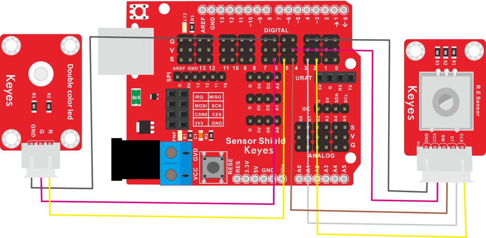

# KE2038 Keyes Brick 旋转编码器模块综合指南


---

## 1. 简介
KE2038 Keyes Brick 旋转编码器模块是一款用于检测旋转角度和方向的模块，采用焊盘孔设计，方便用户进行焊接和连接。该模块具有防反插白色端子，确保连接的可靠性和安全性。旋转编码器广泛应用于各种控制系统、机器人和电子设备中，如音量调节、菜单选择和位置控制等。

---

## 2. 特点
- **旋转检测**：能够检测旋转的角度和方向，适合用于各种控制应用。
- **高分辨率**：提供高分辨率的旋转检测，适合精确控制。
- **数字输出**：通过数字信号输出旋转状态，便于读取和处理。
- **防反插设计**：采用防反插白色端子，避免因接反导致的损坏，确保模块的长期稳定性。
- **模块化设计**：焊盘孔设计，方便用户进行焊接和连接，适合DIY项目和快速原型开发。
- **兼容性强**：可与 Arduino、树莓派等开发板兼容使用，适合各种项目，易于集成。

---

## 3. 规格参数
- **工作电压**：DC 5V  
- **引脚数量**：3  
- **尺寸**：约 20mm x 20mm  
- **旋转角度**：360°（无限旋转）  
- **输出脉冲**：每转输出脉冲数可根据编码器类型而定（通常为20-30脉冲/转）。

---

## 4. 工作原理
旋转编码器通过检测旋转的角度变化来输出数字信号。当旋转编码器旋转时，模块会输出相应的脉冲信号，用户可以根据这些信号计算旋转的角度和方向。旋转编码器通常由两个输出引脚（A和B）组成，通过检测这两个引脚的信号变化，可以确定旋转的方向和步数。

---

## 5. 接口
- **VCC**：连接到电源正极（5V）。
- **GND**：连接到电源负极（GND）。
- **S**：连接到数字引脚，用于输出旋转状态。

### 引脚定义
| 引脚名称 | 功能描述                     |
|----------|------------------------------|
| VCC      | 连接到 Arduino 的 5V 引脚   |
| GND      | 连接到 Arduino 的 GND 引脚  |
| S      | 连接到 Arduino 的数字引脚（如 D2） |

---

## 6. 连接图


### 连接示例
1. 将模块的 VCC 引脚连接到 Arduino 的 5V 引脚。
2. 将模块的 GND 引脚连接到 Arduino 的 GND 引脚。
3. 将模块的 S 引脚连接到 Arduino 的数字引脚（如 D2）。

---

## 7. 示例代码
以下是一个简单的示例代码，用于读取旋转编码器的输出：
```cpp
const int encoderPinA = 2; // 连接到数字引脚 D2
const int encoderPinB = 3; // 连接到数字引脚 D3
volatile int encoderValue = 0; // 旋转编码器值

void setup() {
  pinMode(encoderPinA, INPUT); // 设置编码器引脚为输入
  pinMode(encoderPinB, INPUT); // 设置编码器引脚为输入
  attachInterrupt(digitalPinToInterrupt(encoderPinA), countEncoder, RISING); // 设置中断
  Serial.begin(9600); // 初始化串口
}

void loop() {
  Serial.println(encoderValue); // 输出编码器值
  delay(100); // 延时 100 毫秒
}

void countEncoder() {
  if (digitalRead(encoderPinB) == HIGH) {
    encoderValue++; // 顺时针旋转
  } else {
    encoderValue--; // 逆时针旋转
  }
}
```

### 代码说明
- **attachInterrupt()**：用于设置中断，检测旋转编码器的状态变化。
- **RISING**：表示在信号上升沿触发中断。

---

## 8. 实验现象
上传程序后，旋转编码器将实时输出旋转值，串口监视器将显示编码器的当前值，表示模块正常工作。旋转编码器的旋转方向将影响输出值的增减。


---

## 9. 应用示例
- **控制系统**：用于音量调节、菜单选择等控制应用。
- **机器人**：用于机器人运动控制和导航。
- **电子设备**：用于各种电子设备的用户输入。

---

## 10. 注意事项
- 确保模块连接正确，避免短路。
- 在使用过程中，注意电源电压在 5V 范围内，避免过载。
- 避免将模块暴露在极端环境中，以免损坏。

