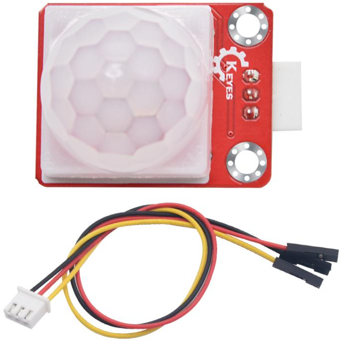
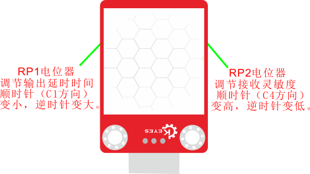
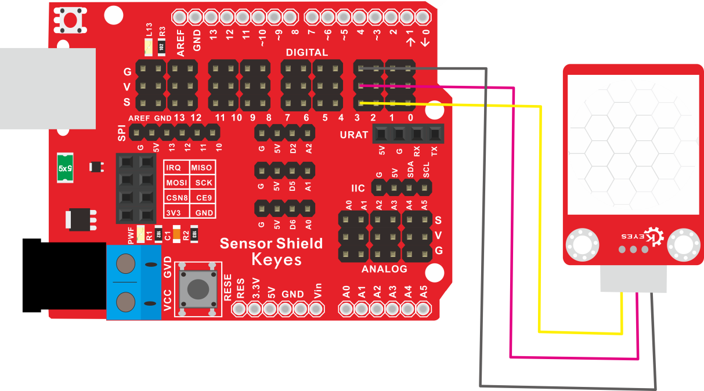
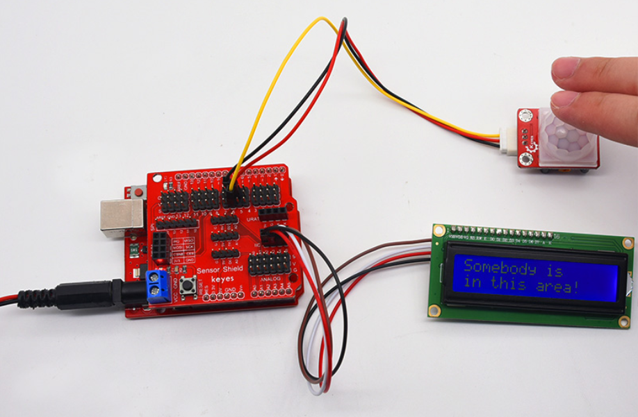

# KE2039 Keyes Brick 人体红外热释电传感器综合指南



---

## 1. 简介
KE2039 Keyes Brick 人体红外热释电传感器是一款用于检测人体运动的模块，采用焊盘孔设计，方便用户进行焊接和连接。该模块具有防反插白色端子，确保连接的可靠性和安全性。人体红外热释电传感器广泛应用于安防、自动照明和智能家居等领域。

---

## 2. 特点
- **运动检测**：能够检测人体的运动，适合用于各种安防和自动化应用。
- **高灵敏度**：具有较高的灵敏度和检测范围，能够在较远的距离内检测到人体运动。
- **数字输出**：通过数字信号输出检测结果，便于读取和处理。
- **防反插设计**：采用防反插白色端子，避免因接反导致的损坏，确保模块的长期稳定性。
- **模块化设计**：焊盘孔设计，方便用户进行焊接和连接，适合DIY项目和快速原型开发。
- **兼容性强**：可与 Arduino、树莓派等开发板兼容使用，适合各种项目，易于集成。

---

## 3. 规格参数
- **工作电压**：DC 5V  
- **引脚数量**：3  
- **检测范围**：约 6 米  
- **检测角度**：约 120°  
- **尺寸**：约 32mm x 24mm  



---

## 4. 工作原理
人体红外热释电传感器通过检测人体发出的红外辐射来输出数字信号。当传感器检测到人体运动时，会改变输出状态，用户可以根据该信号进行相应的处理。该传感器通常由两个热释电元件组成，能够检测到红外辐射的变化。

---

## 5. 接口
- **VCC**：连接到电源正极（5V）。
- **GND**：连接到电源负极（GND）。
- **OUT**：连接到数字引脚，用于输出检测结果。

### 引脚定义
| 引脚名称 | 功能描述                     |
|----------|------------------------------|
| VCC      | 连接到 Arduino 的 5V 引脚   |
| GND      | 连接到 Arduino 的 GND 引脚  |
| OUT      | 连接到 Arduino 的数字引脚（如 D3） |

---

## 6. 连接图


### 连接示例
1. 将模块的 VCC 引脚连接到 Arduino 的 5V 引脚。
2. 将模块的 GND 引脚连接到 Arduino 的 GND 引脚。
3. 将模块的 OUT 引脚连接到 Arduino 的数字引脚（如 D3）。

---

## 7. 示例代码
以下是一个简单的示例代码，用于读取人体红外热释电传感器的输出：
```cpp
const int pirPin = 3; // 连接到数字引脚 D3
const int ledPin = 13; // 连接到内置LED引脚

void setup() {
  pinMode(pirPin, INPUT); // 设置传感器引脚为输入
  pinMode(ledPin, OUTPUT); // 设置LED引脚为输出
  Serial.begin(9600); // 初始化串口
}

void loop() {
  int pirValue = digitalRead(pirPin); // 读取传感器值
  Serial.println(pirValue); // 输出传感器值

  // 根据传感器值控制LED
  if (pirValue == HIGH) { // 检测到运动
    digitalWrite(ledPin, HIGH); // 点亮LED
  } else {
    digitalWrite(ledPin, LOW); // 熄灭LED
  }
  delay(100); // 延时 100 毫秒
}
```

### 代码说明
- **digitalRead()**：读取数字引脚的值。
- **digitalWrite()**：根据传感器值控制LED的开关状态。

---

## 8. 实验现象
上传程序后，人体红外热释电传感器将实时输出检测结果，内置LED会根据传感器值的变化进行闪烁，表示模块正常工作。当检测到运动时，LED点亮；当没有运动时，LED熄灭。



---

## 9. 应用示例
- **安防监控**：用于家庭或办公室的安防监控。
- **自动照明**：用于自动控制灯光的开关。
- **智能家居**：用于智能家居系统中的运动检测。

---

## 10. 注意事项
- 确保模块连接正确，避免短路。
- 在使用过程中，注意电源电压在 5V 范围内，避免过载。
- 避免将传感器暴露在极端环境中，以免损坏。

---

## 11. 参考链接
- [Keyes官网](http://www.keyes-robot.com/)
- [Arduino 官方网站](https://www.arduino.cc)  

如有更多疑问，请联系 Keyes 官方客服或加入相关创客社区交流。祝使用愉快！