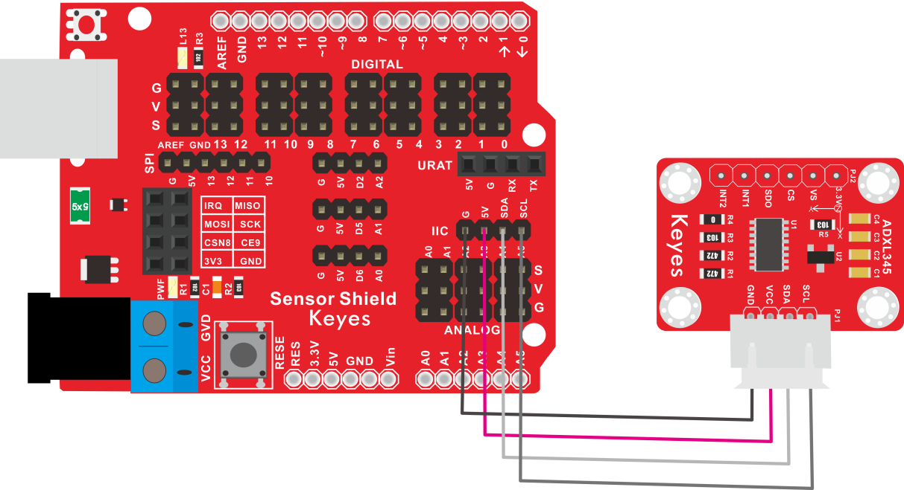

# KE2040 Keyes Brick ADXL345 加速度传感器综合指南


---

## 1. 简介
KE2040 Keyes Brick ADXL345 加速度传感器是一款高精度的三轴加速度传感器模块，采用焊盘孔设计，方便用户进行焊接和连接。该模块具有防反插白色端子，确保连接的可靠性和安全性。ADXL345 加速度传感器广泛应用于运动检测、倾斜监测和姿态识别等领域。

---

## 2. 特点
- **三轴加速度检测**：能够同时检测 X、Y、Z 三个方向的加速度，适合用于各种运动监测应用。
- **高精度**：提供高精度的加速度数据，适合精确控制和分析。
- **数字输出**：通过 I2C 接口输出加速度数据，便于读取和处理。
- **防反插设计**：采用防反插白色端子，避免因接反导致的损坏，确保模块的长期稳定性。
- **模块化设计**：焊盘孔设计，方便用户进行焊接和连接，适合DIY项目和快速原型开发。
- **兼容性强**：可与 Arduino、树莓派等开发板兼容使用，适合各种项目，易于集成。

---

## 3. 规格参数
- **工作电压**：DC 3.3V - 5V  
- **引脚数量**：4  
- **测量范围**：±2g、±4g、±8g、±16g  
- **分辨率**：10位  
- **尺寸**：约 20mm x 20mm  

---

## 4. 工作原理
ADXL345 加速度传感器通过检测加速度变化来输出数字信号。用户可以通过 I2C 接口读取加速度数据，并根据这些数据进行运动分析和处理。该传感器能够检测到静态和动态加速度，适合用于姿态识别和运动监测。

---

## 5. 接口
- **VCC**：连接到电源正极（3.3V - 5V）。
- **GND**：连接到电源负极（GND）。
- **SDA**：连接到 I2C 数据引脚。
- **SCL**：连接到 I2C 时钟引脚。

### 引脚定义
| 引脚名称 | 功能描述                     |
|----------|------------------------------|
| VCC      | 连接到 Arduino 的 3.3V 或 5V 引脚 |
| GND      | 连接到 Arduino 的 GND 引脚  |
| SDA      | 连接到 Arduino 的 I2C 数据引脚 |
| SCL      | 连接到 Arduino 的 I2C 时钟引脚 |

---

## 6. 连接图


### 连接示例
1. 将模块的 VCC 引脚连接到 Arduino 的 3.3V 或 5V 引脚。
2. 将模块的 GND 引脚连接到 Arduino 的 GND 引脚。
3. 将模块的 SDA 引脚连接到 Arduino 的 I2C 数据引脚（如 A4）。
4. 将模块的 SCL 引脚连接到 Arduino 的 I2C 时钟引脚（如 A5）。

---

## 7. 示例代码
以下是一个简单的示例代码，用于读取 ADXL345 加速度传感器的输出：
```cpp
#include <Wire.h>
#include <Adafruit_Sensor.h>
#include <Adafruit_ADXL345_U.h>

Adafruit_ADXL345_Unified accel = Adafruit_ADXL345_Unified();

void setup() {
  Serial.begin(9600); // 初始化串口
  if (!accel.begin()) {
    Serial.println("未找到 ADXL345 传感器");
    while (1);
  }
  accel.setRange(ADXL345_RANGE_16_G); // 设置测量范围
}

void loop() {
  sensors_event_t event; 
  accel.getEvent(&event); // 获取加速度数据

  Serial.print("X: "); Serial.print(event.acceleration.x); 
  Serial.print(" m/s^2, Y: "); Serial.print(event.acceleration.y); 
  Serial.print(" m/s^2, Z: "); Serial.print(event.acceleration.z); 
  Serial.println(" m/s^2");
  
  delay(500); // 延时 500 毫秒
}
```

### 代码说明
- **Wire.h**：用于 I2C 通信。
- **Adafruit_ADXL345_U.h**：用于与 ADXL345 传感器进行交互。
- **getEvent()**：获取当前的加速度数据。

---

## 8. 实验现象
上传程序后，ADXL345 加速度传感器将实时输出 X、Y、Z 三个方向的加速度值，串口监视器将显示当前加速度数据，表示模块正常工作。用户可以通过旋转或倾斜传感器来观察加速度值的变化。


---

## 9. 应用示例
- **运动检测**：用于运动监测和分析。
- **倾斜监测**：用于设备的倾斜状态监测。
- **姿态识别**：用于姿态识别和控制。

---

## 10. 注意事项
- 确保模块连接正确，避免短路。
- 在使用过程中，注意电源电压在 3.3V - 5V 范围内，避免过载。
- 避免将传感器暴露在极端环境中，以免损坏。

---

## 11. 参考链接
- [Keyes官网](http://www.keyes-robot.com/)
- [Arduino 官方网站](https://www.arduino.cc)  

如有更多疑问，请联系 Keyes 官方客服或加入相关创客社区交流。祝使用愉快！