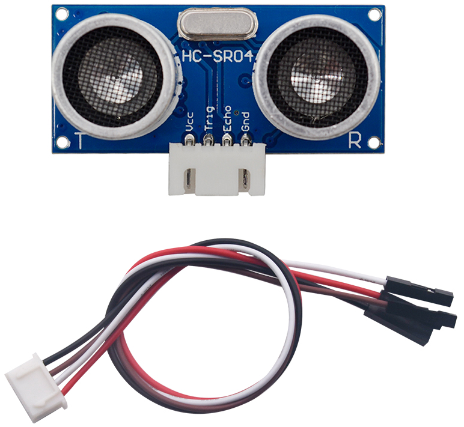
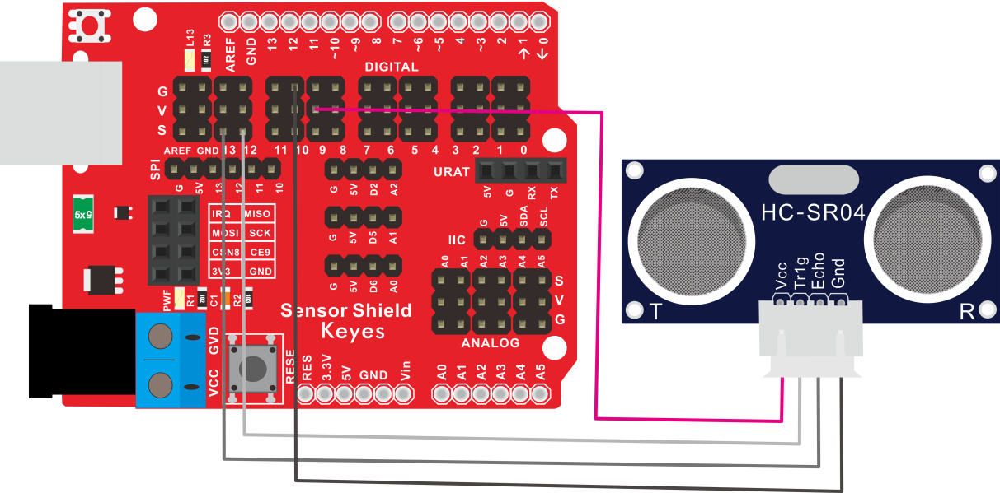
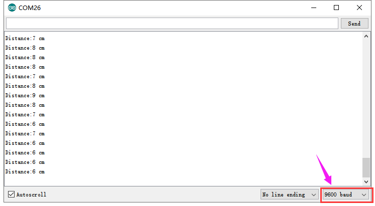

# KE2041 Keyes Brick HC-SR04超声波传感器综合指南



---

## 1. 概述
KE2041 Keyes Brick HC-SR04超声波传感器是一款用于测量距离的传感器模块。它通过发射超声波并测量返回信号的时间来计算与物体的距离，适合用于各种测距和避障应用。模块上自带一个间距为2.54mm的防反插白色端子，确保连接的可靠性和安全性。

该模块可以通过单片机读取距离数据，用户可以根据需要进行处理。模块兼容各种单片机控制板，如Arduino系列单片机，使用时可以方便地与其他设备连接。

---

## 2. 规格参数
- **工作电压**：DC 5V  
- **测量范围**：2cm - 400cm  
- **测量精度**：±3mm  
- **接口**：间距为2.54mm 4pin防反插接口  
- **尺寸**：45mm x 20mm x 15mm  
- **重量**：15g  

---

## 3. 特点
- **高精度**：能够准确测量距离，适合各种应用。
- **防反插设计**：防反插白色端子设计，避免因接反导致的损坏，确保模块的长期稳定性。
- **模块化设计**：焊盘孔设计，方便用户进行焊接和连接，适合DIY项目和快速原型开发。
- **兼容性强**：可与Arduino、树莓派等开发板兼容使用，适合各种项目，易于集成。
- **低功耗**：在正常工作条件下，模块的功耗较低，适合长时间使用。

---

## 4. 工作原理
HC-SR04超声波传感器通过发射超声波脉冲并接收返回信号来测量距离。传感器发出一个超声波脉冲，计算从发射到接收的时间，然后根据声速计算出距离。

---

## 5. 接口
- **VCC**：连接到电源正极（5V）。
- **GND**：连接到电源负极（GND）。
- **TRIG**：触发引脚，用于发射超声波。
- **ECHO**：回声引脚，用于接收返回信号。

### 引脚定义
| 引脚名称 | 功能描述                     |
|----------|------------------------------|
| VCC      | 连接到 Arduino 的 5V 引脚   |
| GND      | 连接到 Arduino 的 GND 引脚  |
| TRIG     | 触发引脚                     |
| ECHO     | 回声引脚                     |

---

## 6. 连接图


### 连接示例
1. 将模块的 VCC 引脚连接到 Arduino 的 5V 引脚。
2. 将模块的 GND 引脚连接到 Arduino 的 GND 引脚。
3. 将模块的 TRIG 引脚连接到 Arduino 的数字引脚（例如 D9）。
4. 将模块的 ECHO 引脚连接到 Arduino 的数字引脚（例如 D10）。

---

## 7. 示例代码
以下是一个简单的示例代码，用于测量距离：
```cpp
const int trigPin = 12; // 连接到数字引脚 D12
const int echoPin = 13; // 连接到数字引脚 D13

void setup() {
  Serial.begin(9600); // 初始化串口通信
  pinMode(trigPin, OUTPUT); // 设置TRIG引脚为输出
  pinMode(echoPin, INPUT); // 设置ECHO引脚为输入
}

void loop() {
  long duration, distance;
  
  // 发送超声波脉冲
  digitalWrite(trigPin, LOW);
  delayMicroseconds(2);
  digitalWrite(trigPin, HIGH);
  delayMicroseconds(10);
  digitalWrite(trigPin, LOW);
  
  // 读取返回信号的持续时间
  duration = pulseIn(echoPin, HIGH);
  
  // 计算距离（cm）
  distance = duration * 0.034 / 2;
  
  Serial.print("Distance: ");
  Serial.print(distance);
  Serial.println(" cm");
  
  delay(1000); // 延时 1 秒
}
```

### 代码说明
- **pulseIn()**：用于读取引脚的高电平持续时间。
- **Serial.print()**：用于在串口监视器上输出测量的距离。

---

## 8. 实验现象
上传程序后，串口监视器将每秒输出一次测量的距离，用户可以通过观察距离变化来验证模块的功能。



---

## 9. 应用示例
- **避障系统**：用于机器人避障，适合智能车和无人机。
- **距离测量**：用于测量物体与传感器之间的距离，适合各种测量应用。
- **液位监测**：用于液体高度监测，适合水箱和油箱监测。

---

## 10. 注意事项
- 确保模块连接正确，避免短路。
- 在使用过程中，注意电源电压在 5V 范围内，避免过载。
- 避免将模块暴露在极端环境中，以免损坏。
- 长时间使用时，注意传感器的稳定性，避免漂移。

---

## 11. 参考链接
- [Keyes官网](http://www.keyes-robot.com/)
- [Arduino 官方网站](https://www.arduino.cc)  

如有更多疑问，请联系 Keyes 官方客服或加入相关创客社区交流。祝使用愉快！