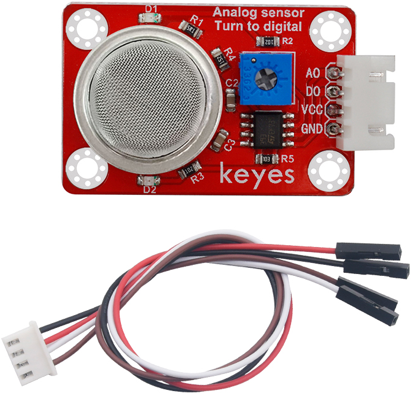
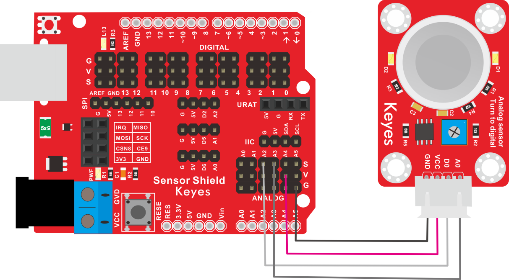
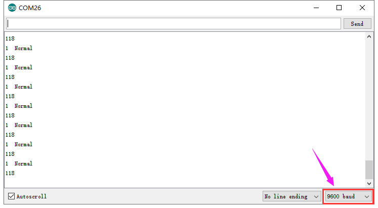

# KE2042 Keyes Brick MQ-2烟雾传感器综合指南



---

## 1. 概述
KE2042 Keyes Brick MQ-2烟雾传感器是一款用于检测烟雾和多种可燃气体的传感器模块。该模块采用MQ-2气敏元件，使用二氧化锡(SnO2)作为气敏材料，在清洁空气中电导率较低。当环境中存在可燃气体时，传感器的电导率随气体浓度的增加而增大。MQ-2传感器对液化气、丙烷、氢气的灵敏度高，对天然气和其他可燃蒸汽的检测也很理想，适合多种应用的低成本传感器。

该模块可以通过单片机读取气体浓度数据，用户可以根据需要进行处理。模块兼容各种单片机控制板，如Arduino系列单片机，使用时可以方便地与其他设备连接。

---

## 2. 规格参数
- **工作电压**：DC 5V  
- **输出信号**：模拟信号（AO）和数字信号（DO）  
- **检测气体**：烟雾、丙烷、氢气、甲烷等  
- **灵敏度**：可调  
- **尺寸**：32mm x 20mm x 25mm  
- **重量**：10g  

---

## 3. 特点
- **高灵敏度**：能够准确检测多种可燃气体，适合各种应用。
- **模拟与数字输出**：AO用于读取气体浓度的模拟值，DO通过LM393比较器输出数字信号。
- **可调报警阈值**：通过电位器调节测量气体报警临界点，便于用户设置。
- **焊盘孔设计**：方便用户进行焊接和连接，适合DIY项目和快速原型开发。
- **兼容性强**：可与Arduino、树莓派等开发板兼容使用，适合各种项目，易于集成。
- **低功耗**：在正常工作条件下，模块的功耗较低，适合长时间使用。
- **定位孔设计**：传感器自带4个直径为3mm的定位孔，方便固定在其他设备上。

---

## 4. 工作原理
MQ-2烟雾传感器通过检测气体浓度变化来输出相应的模拟信号。传感器内部的敏感元件在接触到气体时会发生电阻变化，用户可以通过读取模拟信号（AO）来判断气体浓度。同时，DOUT端连接LM393芯片（比较器），当测量气体含量超过设定的报警临界点时，DO输出低电平；未超过时，DOUT输出高电平。

---

## 5. 接口
- **VCC**：连接到电源正极（5V）。
- **GND**：连接到电源负极（GND）。
- **AO**：模拟输出引脚，用于输出气体浓度信号。
- **DO**：数字输出引脚，用于输出报警信号。

### 引脚定义
| 引脚名称 | 功能描述                     |
|----------|------------------------------|
| VCC      | 连接到 Arduino 的 5V 引脚   |
| GND      | 连接到 Arduino 的 GND 引脚  |
| AO     | 模拟输出引脚                |
| DO     | 数字输出引脚                |

---

## 6. 连接图


### 连接示例
1. 将模块的 VCC 引脚连接到 Arduino 的 5V 引脚。
2. 将模块的 GND 引脚连接到 Arduino 的 GND 引脚。
3. 将模块的 AO引脚连接到 Arduino 的模拟引脚（例如 A3）。
4. 将模块的 DO引脚连接到 Arduino 的数字引脚（例如 A2）。

---

## 7. 示例代码
以下是一个简单的示例代码，用于读取烟雾传感器的模拟值和数字值：
```cpp
const int mq2AnalogPin = A3; // 连接到模拟引脚 A3
const int mq2DigitalPin = 2; // 连接到数字引脚 A2

void setup() {
  Serial.begin(9600); // 初始化串口通信
  pinMode(mq2DigitalPin, INPUT); // 设置DOUT引脚为输入
}

void loop() {
  int analogValue = analogRead(mq2AnalogPin); // 读取模拟值
  int digitalValue = digitalRead(mq2DigitalPin); // 读取数字值
  
  Serial.print("MQ-2 Analog Value: ");
  Serial.print(analogValue); // 输出模拟值
  Serial.print(" | MQ-2 Digital Value: ");
  Serial.println(digitalValue); // 输出数字值
  
  delay(1000); // 延时 1 秒
}
```

### 代码说明
- **analogRead()**：用于读取模拟引脚的值。
- **digitalRead()**：用于读取数字引脚的值。
- **Serial.print()**：用于在串口监视器上输出读取的传感器值。

---

## 8. 实验现象
上传程序后，串口监视器将每秒输出一次MQ-2传感器的模拟值和数字值，用户可以通过观察值的变化来验证模块的功能。



---

## 9. 应用示例
- **烟雾报警**：用于烟雾检测，适合安全报警系统。
- **气体泄漏检测**：用于检测可燃气体泄漏，适合工业和家庭安全。
- **环境监测**：用于监测空气质量，适合环境保护项目。

---

## 10. 注意事项
- 确保模块连接正确，避免短路。
- 在使用过程中，注意电源电压在 5V 范围内，避免过载。
- 避免将模块暴露在极端环境中，以免损坏。
- 长时间使用时，注意传感器的稳定性，避免漂移。

