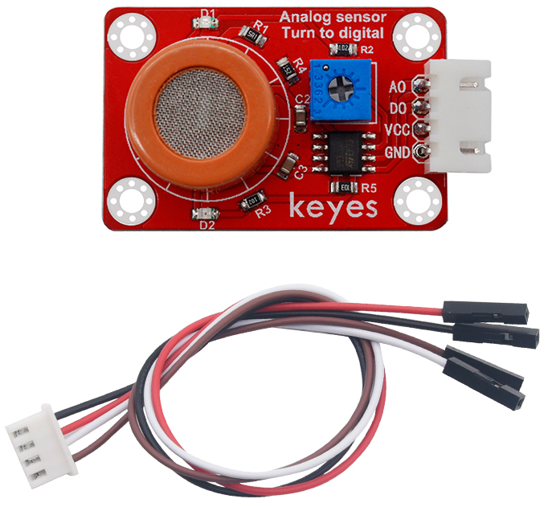
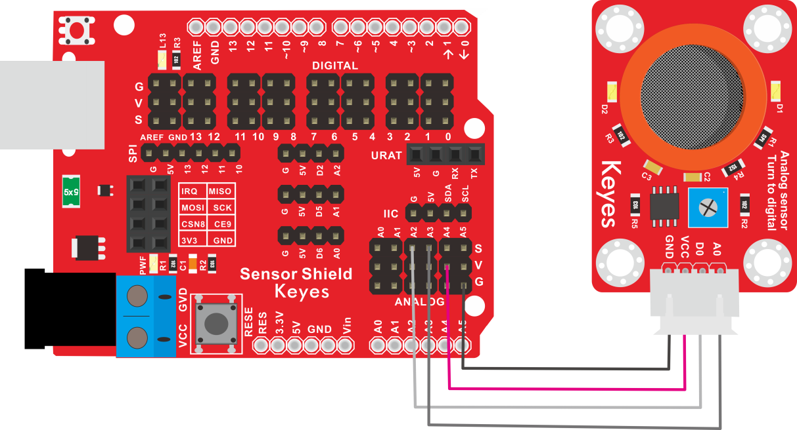
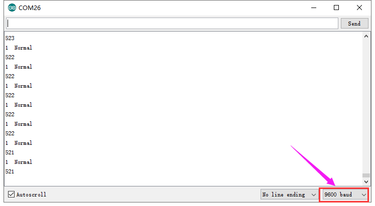

# KE2043 Keyes Brick MQ-3酒精传感器综合指南



---

## 1. 概述
KE2043 Keyes Brick MQ-3酒精传感器是一款常用的酒精和乙醇蒸汽检测传感器。该传感器采用MQ-3气敏元件，使用二氧化锡(SnO2)作为气敏材料，在清洁空气中电导率较低。当环境中存在酒精蒸汽时，传感器的电导率随酒精蒸汽浓度的增加而增大。

使用时，用户可以通过A0端读取对应酒精蒸汽的模拟值；D0端连接一个LM393芯片（比较器），用户可以通过电位器调节测量酒精蒸汽的报警临界点。当测量的酒精蒸汽含量超过临界点时，D0端输出低电平；未超过时，D0端输出高电平。为了方便接线，模块配备了一根200mm长的4pin线，一端为白色防反插接口（与传感器上的防反插白色端子匹配），另一端为4pin杜邦线母头接口。

该传感器兼容各种单片机控制板，如Arduino系列单片机。使用时，可以在单片机上堆叠一个传感器扩展板，将传感器和自带导线连接，然后连接在传感器扩展板上，简单方便。同时，传感器自带4个直径为3mm的定位孔，方便将传感器固定在其他设备上。

---

## 2. 规格参数
- **导线长度**：200mm  
- **工作电压**：DC 5V  
- **控制信号**：数字信号（D0）和模拟信号（A0）  
- **接口**：间距为2.54mm 4pin防反插接口  
- **定位孔大小**：直径为3mm  
- **尺寸**：44mm x 26mm x 13mm  
- **重量**：6.2g  

---

## 3. 特点
- **高灵敏度**：能够准确检测酒精蒸汽，适合各种应用。
- **模拟与数字输出**：A0用于输出酒精浓度的模拟信号，D0用于输出数字信号。
- **可调报警阈值**：通过电位器调节测量酒精蒸汽报警临界点，便于用户设置。
- **焊盘孔设计**：方便用户进行焊接和连接，适合DIY项目和快速原型开发。
- **兼容性强**：可与Arduino、树莓派等开发板兼容使用，适合各种项目，易于集成。
- **低功耗**：在正常工作条件下，模块的功耗较低，适合长时间使用。

---

## 4. 工作原理
MQ-3酒精传感器通过检测酒精蒸汽的浓度变化来输出相应的模拟信号。传感器内部的敏感元件在接触到酒精蒸汽时会发生电阻变化，用户可以通过读取模拟信号（A0）来判断酒精浓度。同时，D0端通过LM393比较器输出数字信号，便于实现报警功能。

---

## 5. 接口
- **VCC**：连接到电源正极（5V）。
- **GND**：连接到电源负极（GND）。
- **AOUT**：模拟输出引脚，用于输出酒精浓度信号。
- **DOUT**：数字输出引脚，用于输出报警信号。

### 引脚定义
| 引脚名称 | 功能描述                     |
|----------|------------------------------|
| VCC      | 连接到 Arduino 的 5V 引脚   |
| GND      | 连接到 Arduino 的 GND 引脚  |
| AOUT     | 模拟输出引脚                |
| DOUT     | 数字输出引脚                |

---

## 6. 连接图


### 连接示例
1. 将模块的 VCC 引脚连接到 Arduino 的 5V 引脚。
2. 将模块的 GND 引脚连接到 Arduino 的 GND 引脚。
3. 将模块的 AOUT 引脚连接到 Arduino 的模拟引脚（例如 A0）。
4. 将模块的 DOUT 引脚连接到 Arduino 的数字引脚（例如 D2）。

---

## 7. 示例代码
以下是一个简单的示例代码，用于读取酒精传感器的模拟值和数字值：
```cpp
const int mq3AnalogPin = A3; // 连接到模拟引脚 A3
const int mq3DigitalPin = 2; // 连接到数字引脚 D2

void setup() {
  Serial.begin(9600); // 初始化串口通信
  pinMode(mq3DigitalPin, INPUT); // 设置DOUT引脚为输入
}

void loop() {
  int analogValue = analogRead(mq3AnalogPin); // 读取模拟值
  int digitalValue = digitalRead(mq3DigitalPin); // 读取数字值
  
  Serial.print("MQ-3 Analog Value: ");
  Serial.print(analogValue); // 输出模拟值
  Serial.print(" | MQ-3 Digital Value: ");
  Serial.println(digitalValue); // 输出数字值
  
  delay(1000); // 延时 1 秒
}
```

### 代码说明
- **analogRead()**：用于读取模拟引脚的值。
- **digitalRead()**：用于读取数字引脚的值。
- **Serial.print()**：用于在串口监视器上输出读取的传感器值。

---

## 8. 实验现象
上传程序后，串口监视器将每秒输出一次MQ-3传感器的模拟值和数字值，用户可以通过观察值的变化来验证模块的功能。



---

## 9. 应用示例
- **酒精检测**：用于酒精浓度检测，适合醉驾检测和酒精测试。
- **环境监测**：用于监测空气中酒精蒸汽的浓度，适合环境保护项目。

---

## 10. 注意事项
- 确保模块连接正确，避免短路。
- 在使用过程中，注意电源电压在 5V 范围内，避免过载。
- 避免将模块暴露在极端环境中，以免损坏。
- 长时间使用时，注意传感器的稳定性，避免漂移。

---

## 11. 参考链接
- [Keyes官网](http://www.keyes-robot.com/)
- [Arduino 官方网站](https://www.arduino.cc)  

如有更多疑问，请联系 Keyes 官方客服或加入相关创客社区交流。祝使用愉快！