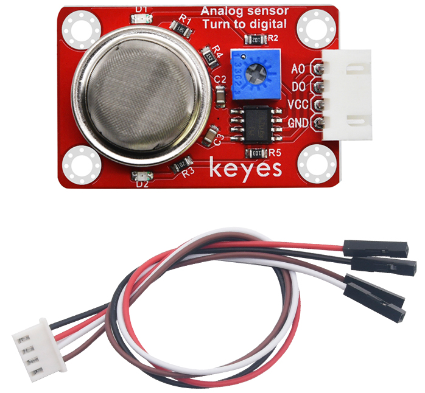
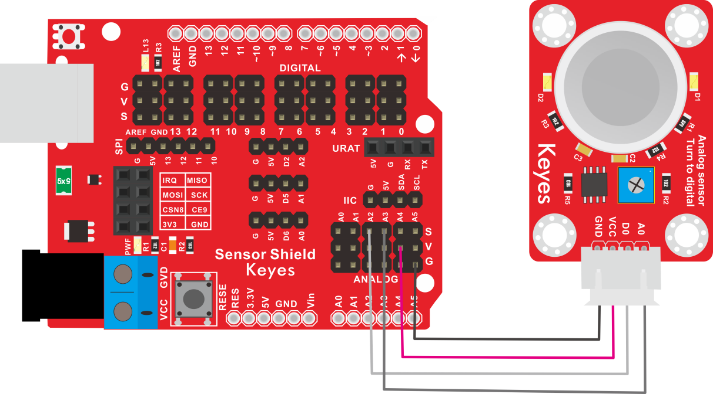
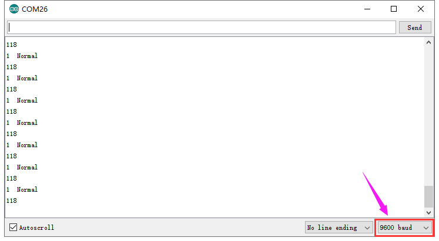

# KE2044 Keyes Brick MQ-135空气质量传感器综合指南



---

## 1. 概述
KE2044 Keyes Brick MQ-135空气质量传感器是一款常用的空气质量检测传感器。该传感器采用二氧化锡(SnO2)作为气敏材料，在清洁空气中电导率较低。当传感器所处环境中存在污染气体时，传感器的电导率随空气中污染气体浓度的增加而增大。MQ-135传感器对氨气、硫化物、苯系蒸汽的灵敏度高，对烟雾和其他有害气体的监测也很理想。这种传感器可检测多种有害气体，适合用于家庭和环境的有害气体检测装置。

使用时，用户可以通过A0端读取对应气体的模拟值；D0端连接一个LM393芯片（比较器），用户可以通过电位器调节测量气体报警临界点。当测量的气体含量超过临界点时，D0端输出低电平；未超过时，D0端输出高电平。为了方便接线，模块配备了一根200mm长的4pin线，一端为白色防反插接口（与传感器上的防反插白色端子匹配），另一端为4pin杜邦线母头接口。

该传感器兼容各种单片机控制板，如Arduino系列单片机。使用时，可以在单片机上堆叠一个传感器扩展板，将传感器和自带导线连接，然后连接在传感器扩展板上，简单方便。同时，传感器自带4个直径为3mm的定位孔，方便将传感器固定在其他设备上。

---

## 2. 规格参数
- **导线长度**：200mm  
- **工作电压**：DC 5V  
- **控制信号**：数字信号（D0）和模拟信号（A0）  
- **接口**：间距为2.54mm 4pin防反插接口  
- **定位孔大小**：直径为3mm  
- **尺寸**：45mm x 26mm x 18mm  
- **重量**：8.3g  

---

## 3. 特点
- **高灵敏度**：能够准确检测多种有害气体，适合各种应用。
- **模拟与数字输出**：A0用于输出气体浓度的模拟信号，D0用于输出数字信号。
- **可调报警阈值**：通过电位器调节测量气体报警临界点，便于用户设置。
- **焊盘孔设计**：方便用户进行焊接和连接，适合DIY项目和快速原型开发。
- **兼容性强**：可与Arduino、树莓派等开发板兼容使用，适合各种项目，易于集成。
- **低功耗**：在正常工作条件下，模块的功耗较低，适合长时间使用。

---

## 4. 工作原理
MQ-135空气质量传感器通过检测空气中多种气体的浓度变化来输出相应的模拟信号。传感器内部的敏感元件在接触到气体时会发生电阻变化，用户可以通过读取模拟信号（A0）来判断气体浓度。同时，D0端通过LM393比较器输出数字信号，便于实现报警功能。

---

## 5. 接口
- **VCC**：连接到电源正极（5V）。
- **GND**：连接到电源负极（GND）。
- **AOUT**：模拟输出引脚，用于输出气体浓度信号。
- **DOUT**：数字输出引脚，用于输出报警信号。

### 引脚定义
| 引脚名称 | 功能描述                     |
|----------|------------------------------|
| VCC      | 连接到 Arduino 的 5V 引脚   |
| GND      | 连接到 Arduino 的 GND 引脚  |
| AOUT     | 模拟输出引脚                |
| DOUT     | 数字输出引脚                |

---

## 6. 连接图


### 连接示例
1. 将模块的 VCC 引脚连接到 Arduino 的 5V 引脚。
2. 将模块的 GND 引脚连接到 Arduino 的 GND 引脚。
3. 将模块的 AOUT 引脚连接到 Arduino 的模拟引脚（例如 A0）。
4. 将模块的 DOUT 引脚连接到 Arduino 的数字引脚（例如 D2）。

---

## 7. 示例代码
以下是一个简单的示例代码，用于读取空气质量传感器的模拟值和数字值：
```cpp
const int mq135AnalogPin = A3; // 连接到模拟引脚 A3
const int mq135DigitalPin = 2; // 连接到数字引脚 D2

void setup() {
  Serial.begin(9600); // 初始化串口通信
  pinMode(mq135DigitalPin, INPUT); // 设置DOUT引脚为输入
}

void loop() {
  int analogValue = analogRead(mq135AnalogPin); // 读取模拟值
  int digitalValue = digitalRead(mq135DigitalPin); // 读取数字值
  
  Serial.print("MQ-135 Analog Value: ");
  Serial.print(analogValue); // 输出模拟值
  Serial.print(" | MQ-135 Digital Value: ");
  Serial.println(digitalValue); // 输出数字值
  
  delay(1000); // 延时 1 秒
}
```

### 代码说明
- **analogRead()**：用于读取模拟引脚的值。
- **digitalRead()**：用于读取数字引脚的值。
- **Serial.print()**：用于在串口监视器上输出读取的传感器值。

---

## 8. 实验现象
上传程序后，串口监视器将每秒输出一次MQ-135传感器的模拟值和数字值，用户可以通过观察值的变化来验证模块的功能。



---

## 9. 应用示例
- **空气质量监测**：用于监测室内外空气质量，适合环境保护项目。
- **工业安全**：用于检测工业环境中的有害气体，确保工作安全。

---

## 10. 注意事项
- 确保模块连接正确，避免短路。
- 在使用过程中，注意电源电压在 5V 范围内，避免过载。
- 避免将模块暴露在极端环境中，以免损坏。
- 长时间使用时，注意传感器的稳定性，避免漂移。

---

## 11. 参考链接
- [Keyes官网](http://www.keyes-robot.com/) 
- [Arduino 官方网站](https://www.arduino.cc)  

如有更多疑问，请联系 Keyes 官方客服或加入相关创客社区交流。祝使用愉快！