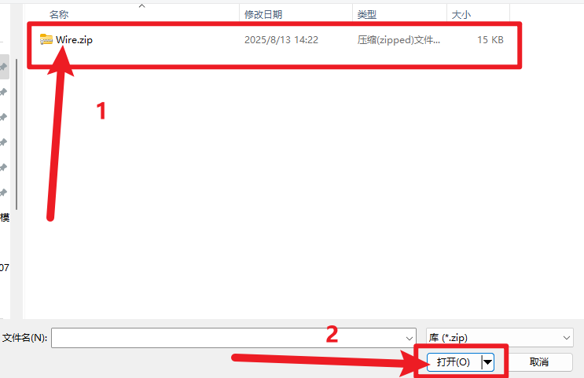
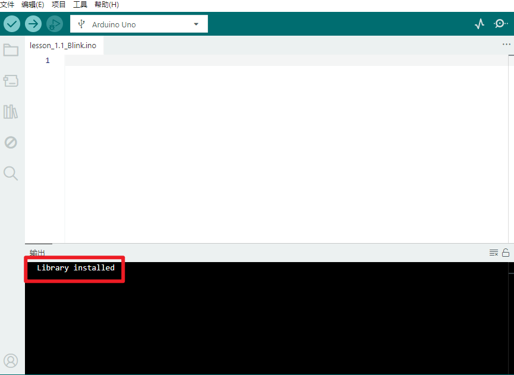

# KE2046 Keyes Brick SHT10传感器综合指南


---

## 1. 概述
KE2046 Keyes Brick SHT10传感器是一款用于测量环境温度和湿度的传感器模块。该传感器采用SHT10数字温湿度传感器，能够提供高精度的温度和湿度数据，适合用于气象监测、环境监测和智能家居等应用。模块上自带焊盘孔设计，方便用户进行焊接和连接，确保连接的可靠性和安全性。

该模块可以通过单片机读取温度和湿度数据，用户可以根据需要进行处理。模块兼容各种单片机控制板，如Arduino系列单片机，使用时可以方便地与其他设备连接。

---

## 2. 规格参数
- **工作电压**：DC 3.3V - 5V  
- **输出信号**：数字信号（I2C）  
- **接口**：间距为2.54mm 4pin防反插接口  
- **尺寸**：45mm x 26mm x 18mm  
- **重量**：8.3g  

---

## 3. 特点
- **高精度**：能够准确测量温度和湿度，适合各种应用。
- **数字输出**：通过I2C接口输出温度和湿度数据。
- **焊盘孔设计**：方便用户进行焊接和连接，适合DIY项目和快速原型开发。
- **兼容性强**：可与Arduino、树莓派等开发板兼容使用，适合各种项目，易于集成。
- **低功耗**：在正常工作条件下，模块的功耗较低，适合长时间使用。

---

## 4. 工作原理
SHT10传感器通过内部的数字信号处理器测量环境的温度和湿度，并通过I2C接口输出相应的数据。用户可以通过读取数字信号来获取温度和湿度的实时值。

---

## 5. 接口
- **VCC**：连接到电源正极（3.3V - 5V）。
- **GND**：连接到电源负极（GND）。
- **SDA**：数据线，用于I2C通信。
- **SCL**：时钟线，用于I2C通信。

### 引脚定义
| 引脚名称 | 功能描述                     |
|----------|------------------------------|
| VCC      | 连接到 Arduino 的 3.3V - 5V 引脚 |
| GND      | 连接到 Arduino 的 GND 引脚  |
| SDA      | I2C数据线                   |
| SCL      | I2C时钟线                   |

---

## 6. 连接图


### 连接示例
1. 将模块的 VCC 引脚连接到 Arduino 的 5V 引脚。
2. 将模块的 GND 引脚连接到 Arduino 的 GND 引脚。
3. 将模块的 SDA 引脚连接到 Arduino 的 SDA 引脚。
4. 将模块的 SCL 引脚连接到 Arduino 的 SCL 引脚。

---

## 7. 示例代码
以下是一个简单的示例代码，用于读取SHT10传感器的温度和湿度值：
```cpp
#include <Wire.h>

#define SHT10_ADDRESS 0x40

void setup() {
  Serial.begin(9600); // 初始化串口通信
  Wire.begin(); // 初始化I2C
}

void loop() {
  // 发送读取温度命令
  Wire.beginTransmission(SHT10_ADDRESS);
  Wire.write(0x03); // 读取温度
  Wire.endTransmission();
  delay(100); // 等待传感器响应

  // 读取温度数据
  Wire.requestFrom(SHT10_ADDRESS, 2);
  int temperature = (Wire.read() << 8) | Wire.read();

  // 发送读取湿度命令
  Wire.beginTransmission(SHT10_ADDRESS);
  Wire.write(0x05); // 读取湿度
  Wire.endTransmission();
  delay(100); // 等待传感器响应

  // 读取湿度数据
  Wire.requestFrom(SHT10_ADDRESS, 2);
  int humidity = (Wire.read() << 8) | Wire.read();

  Serial.print("Temperature: ");
  Serial.print(temperature / 100.0); // 转换为摄氏度
  Serial.print(" °C | Humidity: ");
  Serial.print(humidity / 100.0); // 转换为百分比
  Serial.println(" %");

  delay(2000); // 延时 2 秒
}
```

**如果上传代码后报错(代码上传成功不用安装)，请按如下安装Wire库**。

- 下载库文件：[Wire](./资料/Wire.7z)

- 打开Arduino IDE，选择“项目”，选择“导入库”，再选择“添加.ZIP库”。

  

- 找到下载资料的存放位置，打开文件夹找到库文件，选择要导入的库，点击“打开”。

  

- 安装成功出现的界面。
  

### 代码说明

- **Wire.begin()**：初始化I2C通信。
- **Wire.requestFrom()**：请求从传感器读取数据。
- **Serial.print()**：用于在串口监视器上输出读取的温度和湿度值。

---

## 8. 实验现象
上传程序后，串口监视器将每两秒输出一次SHT10传感器的温度和湿度值，用户可以通过观察值的变化来验证模块的功能。


---

## 9. 应用示例
- **气象监测**：用于环境温度和湿度的监测，适合气象站项目。
- **智能家居**：用于室内环境监测，自动调节空调和加湿器。

---

## 10. 注意事项
- 确保模块连接正确，避免短路。
- 在使用过程中，注意电源电压在 3.3V - 5V 范围内，避免过载。
- 避免将模块暴露在极端环境中，以免损坏。

