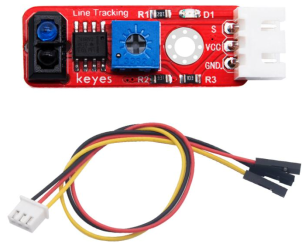
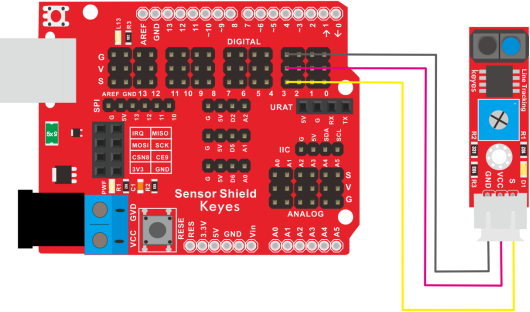

# KE2047 keyes brick巡线传感器（焊盘孔）防反插白色端子



## 1、概述

这是一个常用的巡线传感器，它主要采用1个TCRT5000反射型黑白线识别传感器元件。传感器的原理是利用红外线对颜色的反射率不一样，将反射信号的强弱转化成电流信号。传感器没有检测到物体或者检测到黑色物体时，信号端为高电平；检测到白色物体时，信号端为低电平；它的检测高度为0一3cm。我们可以通过旋转传感器上电位器，调节灵敏度，即调节检测高度。当旋转电位器，是传感器上D1LED介于不亮与亮之间的临界点时，灵敏度最好。
为了方面接线，我们还配送1根3pin线，线的一端为白色防反插接口（和传感器上防反插白色端子匹配），另一端为3pin杜邦线母头接口。
传感器兼容各种单片机控制板，如arduino系列单片机。使用时，我们可以在单片机上堆叠一个传感器扩展板。传感器和自带导线连接，然后连接在传感器扩展板上，简单方便。同时，传感器自带1个直径为3mm的定位孔，方便你将传感器固定在其他设备。

## 2、规格参数

- 导线长度：200mm
- 工作电压：DC5V
- 接口：间距为2.54mm3pin防反接口
- 定位孔大小：直径为3mm
- 控制信号：数字信号
- 检测高度：0-3cm
- 尺寸：38*12*9mm
- 重里：2.5g

## 3、连接图



```C
/*
颜色传感器测试代码
功能：检测到黑色时输出1，其他颜色输出0
接线：
- 传感器信号线连接数字引脚3
- VCC 连接 5V
- GND 连接 GND
*/

// 定义传感器连接的引脚
const int SENSOR_PIN = 3;

void setup() {
  // 初始化串口通信，波特率9600
  Serial.begin(9600);
  
  // 设置传感器引脚为输入模式
  pinMode(SENSOR_PIN, INPUT);
  
  // 等待串口监视器打开
  delay(1000);
  
  Serial.println("颜色传感器测试开始...");
  Serial.println("检测状态：");
  Serial.println("0 = 检测到其他颜色（D1灯亮）");
  Serial.println("1 = 检测到黑色（D1灯灭）");
  Serial.println("------------------------");
}

void loop() {
  // 读取传感器状态
  int sensorState = digitalRead(SENSOR_PIN);
  
  // 将检测结果发送到串口监视器
  Serial.println(sensorState);
  
  // 可以根据需要添加状态描述
  if (sensorState == HIGH) {
    Serial.println("状态：检测到黑色");
  } else {
    Serial.println("状态：检测到其他颜色");
  }
  
  // 等待一段时间再次检测
  delay(500); // 每0.5秒检测一次
  
  // 添加分隔线，使输出更清晰
  Serial.println("----");
}
```

## 4、测试结果

烧录好测试代码，按照接线图连接好线，利用USB线上电后，设置波特率为9600。传感器在检测到黑色时，信号端输出高电平，串口监视器显示1，传感器上D1指示灯熄灭；传感器在检测到其他颜色时，信号端输出低电平，串口监视器显示0，传感器上D1指示灯亮起。