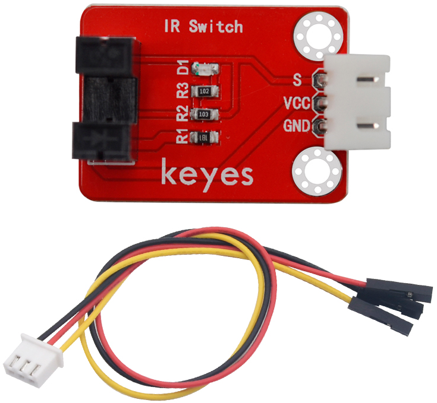
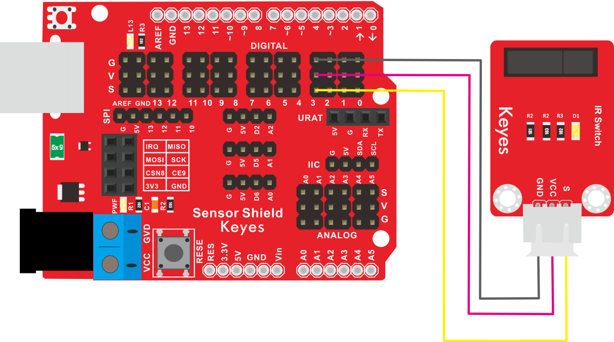
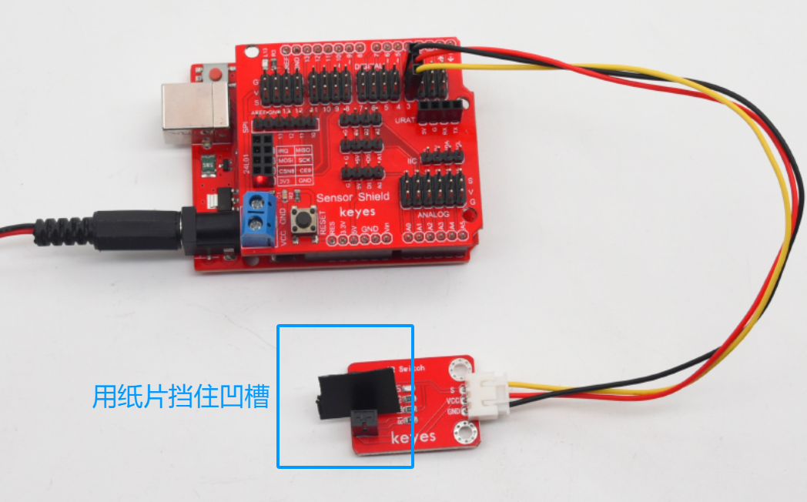

# KE2048 Keyes Brick 光折断传感器综合指南



---

## 1. 概述
KE2048 Keyes Brick 光折断传感器是一款用于检测光线折断的传感器模块，广泛应用于安全报警、自动化设备和机器人等领域。该传感器通过红外光发射和接收来判断光线是否被遮挡，能够有效识别物体的存在与否。模块上自带焊盘孔设计，方便用户进行焊接和连接，确保连接的可靠性和安全性。

该模块可以通过单片机读取传感器的状态，用户可以根据需要进行处理。模块兼容各种单片机控制板，如Arduino系列单片机，使用时可以方便地与其他设备连接。

---

## 2. 规格参数
- **工作电压**：DC 3.3V - 5V  
- **输出信号**：数字信号（D0）  
- **接口**：间距为2.54mm 4pin防反插接口  
- **尺寸**：45mm x 26mm x 18mm  
- **重量**：8.3g  

---

## 3. 特点
- **高灵敏度**：能够准确检测光线折断，适合各种应用。
- **数字输出**：D0用于输出光线折断的数字信号。
- **焊盘孔设计**：方便用户进行焊接和连接，适合DIY项目和快速原型开发。
- **兼容性强**：可与Arduino、树莓派等开发板兼容使用，适合各种项目，易于集成。
- **低功耗**：在正常工作条件下，模块的功耗较低，适合长时间使用。

---

## 4. 工作原理
光折断传感器通过发射红外光并接收反射光来判断光线是否被遮挡。当传感器检测到光线被遮挡时，输出信号会发生变化。用户可以通过读取数字信号（D3）来判断光线的状态。

---

## 5. 接口
- **VCC**：连接到电源正极（3.3V - 5V）。
- **GND**：连接到电源负极（GND）。
- **DOUT**：数字输出引脚，用于输出光线折断信号。

### 引脚定义
| 引脚名称 | 功能描述                     |
|----------|------------------------------|
| VCC      | 连接到 Arduino 的 3.3V - 5V 引脚 |
| GND      | 连接到 Arduino 的 GND 引脚  |
| DOUT     | 数字输出引脚                |

---

## 6. 连接图


### 连接示例
1. 将模块的 VCC 引脚连接到 Arduino 的 5V 引脚。
2. 将模块的 GND 引脚连接到 Arduino 的 GND 引脚。
3. 将模块的 DOUT 引脚连接到 Arduino 的数字引脚（例如 D3）。

---

## 7. 示例代码
以下是一个简单的示例代码，用于读取光折断传感器的状态：
```cpp
const int lightBreakSensorPin = 3; // 连接到数字引脚 D3

void setup() {
  Serial.begin(9600); // 初始化串口通信
  pinMode(lightBreakSensorPin, INPUT); // 设置DOUT引脚为输入
}

void loop() {
  int sensorValue = digitalRead(lightBreakSensorPin); // 读取数字值
  Serial.print("Light Break Sensor Value: ");
  Serial.println(sensorValue); // 输出传感器值
  delay(1000); // 延时 1 秒
}
```

### 代码说明
- **digitalRead()**：用于读取数字引脚的值。
- **Serial.print()**：用于在串口监视器上输出读取的传感器值。

---

## 8. 实验现象
上传程序后，串口监视器将每秒输出一次光折断传感器的状态，用户可以通过观察值的变化来验证模块的功能。



---

## 9. 应用示例
- **安全报警**：用于检测光线被遮挡，触发报警系统。
- **自动化设备**：用于物体检测，适合各种自动化控制项目。

---

## 10. 注意事项
- 确保模块连接正确，避免短路。
- 在使用过程中，注意电源电压在 3.3V - 5V 范围内，避免过载。
- 避免将模块暴露在极端环境中，以免损坏。

---

## 11. 参考链接
- [Keyes官网](http://www.keyes-robot.com/)
- [Arduino 官方网站](https://www.arduino.cc)  

如有更多疑问，请联系 Keyes 官方客服或加入相关创客社区交流。祝使用愉快！