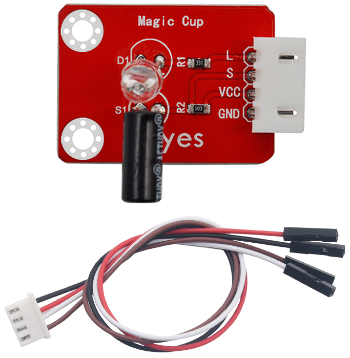
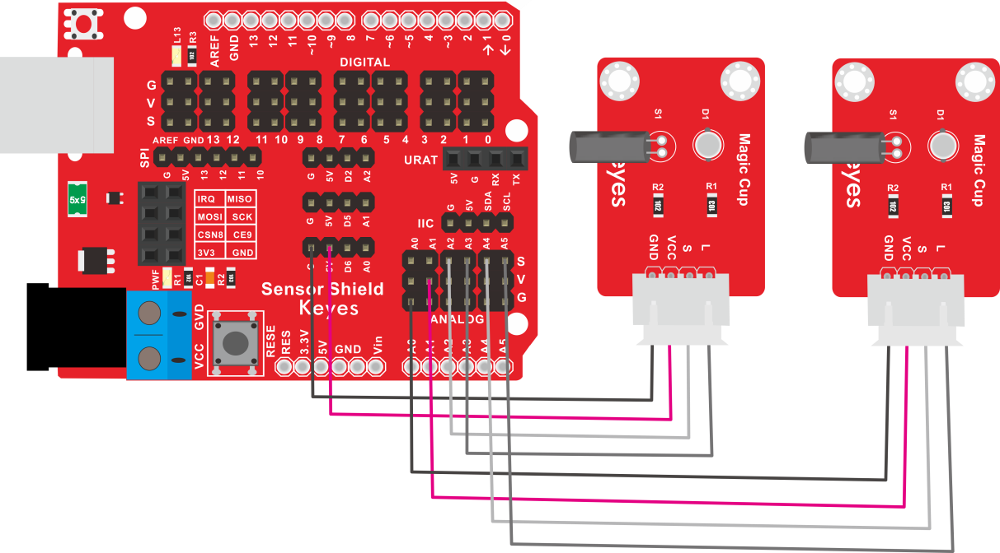
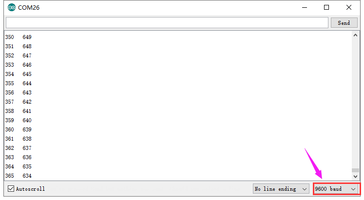

# KE2049 Keyes Brick 魔术光杯传感器综合指南



---

## 1. 概述
KE2049 Keyes Brick 魔术光杯传感器是一款常用的传感器，利用PWM调光原理，通过两个传感器的亮度变化来实现视觉效果。传感器内部的滚珠开关提供数字信号，触发PWM调节，从而模拟出两个装满光的杯子倒来倒去的效果。为方便接线，模块使用A3和A5作为数字口，利用PWM的基本原理将其信号端模拟成两个PWM口。

为了方便接线，模块配备了一根200mm长的4pin线，一端为白色防反插接口（与传感器上的防反插白色端子匹配），另一端为4pin杜邦线母头接口。该传感器兼容各种单片机控制板，如Arduino系列单片机，使用时可以在单片机上堆叠一个传感器扩展板，简单方便。同时，传感器自带2个直径为3mm的定位孔，方便将传感器固定在其他设备上。

---

## 2. 规格参数
- **导线长度**：200mm  
- **工作电压**：DC 3.3V - 5V  
- **控制信号**：数字信号（模拟PWM信号）  
- **接口**：间距为2.54mm 4pin防反插接口  
- **定位孔大小**：直径为3mm  
- **尺寸**：34mm x 27mm x 15mm  
- **重量**：3.2g x 2  

---

## 3. 连接图


### 连接示例
1. 将模块的 VCC 引脚连接到 Arduino 的 5V 引脚。
2. 将模块的 GND 引脚连接到 Arduino 的 GND 引脚。
3. 将模块的 DOUT 引脚连接到 Arduino 的数字引脚（例如 A2 和 A4）。

---

## 4. 测试代码
以下是用于测试魔术光杯传感器的示例代码：
```cpp
int LedPinA = A3;
int LedPinB = A5; 
int ButtonPinA = A2;
int ButtonPinB = A4;
int buttonStateA = 0;
int buttonStateB = 0;
int brightnessA = 0;
int brightnessB = 1000;

void setup() {
  Serial.begin(9600); // 设置波特率
  pinMode(LedPinA, OUTPUT);
  pinMode(LedPinB, OUTPUT);
  pinMode(ButtonPinA, INPUT);
  pinMode(ButtonPinB, INPUT);
}

void loop() {
  buttonStateA = digitalRead(ButtonPinA); // 读取数字口A2的数值
  if (buttonStateA == HIGH && brightnessA != 1000) {
    brightnessA++; // 增加亮度
  }
  if (buttonStateA == LOW && brightnessA != 0) {
    brightnessA--; // 减少亮度
  }
  Serial.print(brightnessA); // 显示brightnessA数值
  Serial.print("   ");
  
  buttonStateB = digitalRead(ButtonPinB); // 读取数字口A4的数值
  if (buttonStateB == HIGH && brightnessB != 0) {
    brightnessB--; // 减少亮度
  }
  if (buttonStateB == LOW && brightnessB != 1000) {
    brightnessB++; // 增加亮度
  }
  Serial.println(brightnessB); // 显示brightnessB数值，并自动换行

  // 控制PWM输出
  if ((brightnessA > 0) && (brightnessA < 1000)) {
    PWMA(brightnessA);
  }
  if (brightnessA == 0) {
    digitalWrite(A3, LOW);
  }
  if (brightnessA == 1000) {
    digitalWrite(A3, HIGH);
  }
  
  if ((brightnessB > 0) && (brightnessB < 1000)) {
    PWMB(brightnessB);
  }
  if (brightnessB == 0) {
    digitalWrite(A5, LOW);
  }
  if (brightnessB == 1000) {
    digitalWrite(A5, HIGH);
  }
}

void PWMA(int val) { // 定义一个脉冲函数
  for (int i = 0; i < 5; i++) {
    digitalWrite(A3, HIGH);
    delayMicroseconds(val); // 大约10%占空比 @ 1KHz
    digitalWrite(A3, LOW);
    delayMicroseconds(1000 - val); // 修改这里的1000可以调整频率
  }
}

void PWMB(int val1) { // 定义一个脉冲函数
  for (int i = 0; i < 5; i++) {
    digitalWrite(A5, HIGH);
    delayMicroseconds(val1); // 大约10%占空比 @ 1KHz
    digitalWrite(A5, LOW);
    delayMicroseconds(1000 - val1); // 修改这里的1000可以调整频率
  }
}
```

### 代码说明
- **digitalRead()**：用于读取按钮的状态。
- **Serial.print()**：用于在串口监视器上输出当前亮度值。
- **PWMA() 和 PWMB()**：用于控制PWM信号的输出。

---

## 5. 测试结果
烧录好测试代码后，按照接线图连接好线；利用USB接口上电后，进入串口监视器，设置波特率为9600。将两个魔术光杯传感器同时倾斜一边，一个魔术光杯上的LED逐渐变暗，同时另一个逐渐变亮，最终一个LED完全熄灭，另一个LED最亮。在串口监视器中可以看到对应具体数值变化。当倾斜另一边时，现象相同，但方向相反。



---

## 6. 注意事项
- 确保模块连接正确，避免短路。
- 在使用过程中，注意电源电压在 3.3V - 5V 范围内，避免过载。
- 避免将模块暴露在极端环境中，以免损坏。

