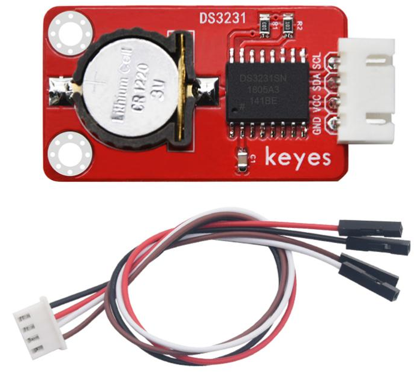
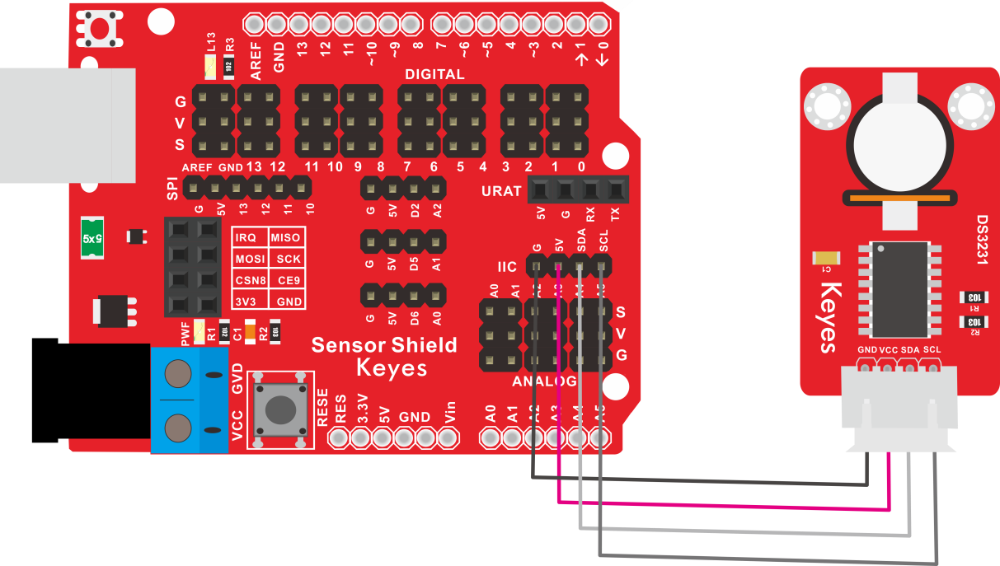
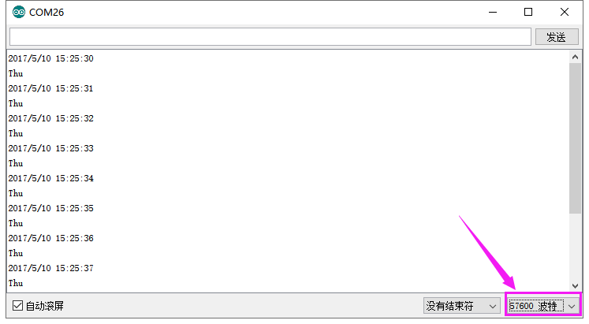

# KE2050 Keyes Brick 3231时钟模块综合指南



---

## 1. 概述
KE2050 Keyes Brick 3231时钟模块是一款高精度的实时时钟（RTC）模块，广泛应用于需要时间和日期记录的项目中。该模块基于DS3231芯片，具有低功耗、高精度和温度补偿功能，适合用于各种电子项目，如数据记录、定时器和时钟显示等。模块上自带焊盘孔设计，方便用户进行焊接和连接，确保连接的可靠性和安全性。

该模块可以通过I2C接口与单片机进行通信，用户可以方便地读取当前时间和日期。

---

## 2. 规格参数
- **工作电压**：DC 3.3V - 5V  
- **接口**：I2C接口（SDA和SCL）  
- **尺寸**：45mm x 26mm x 18mm  
- **重量**：8.3g  

---

## 3. 特点
- **高精度**：基于DS3231芯片，具有高精度和温度补偿功能。
- **低功耗**：在正常工作条件下，模块的功耗较低，适合长时间使用。
- **焊盘孔设计**：方便用户进行焊接和连接，适合DIY项目和快速原型开发。
- **兼容性强**：可与Arduino、树莓派等开发板兼容使用，适合各种项目，易于集成。

---

## 4. 工作原理
DS3231时钟模块通过I2C接口与单片机进行通信，用户可以通过发送命令读取当前的时间和日期。模块内部有一个电池供电的时钟芯片，即使在断电的情况下也能保持时间的准确性。

---

## 5. 接口
- **VCC**：连接到电源正极（3.3V - 5V）。
- **GND**：连接到电源负极（GND）。
- **SDA**：数据线，用于I2C通信。
- **SCL**：时钟线，用于I2C通信。

### 引脚定义
| 引脚名称 | 功能描述                     |
|----------|------------------------------|
| VCC      | 连接到 Arduino 的 3.3V - 5V 引脚 |
| GND      | 连接到 Arduino 的 GND 引脚  |
| SDA      | I2C数据线                   |
| SCL      | I2C时钟线                   |

---

## 6. 连接图


### 连接示例
1. 将模块的 VCC 引脚连接到 Arduino 的 5V 引脚。
2. 将模块的 GND 引脚连接到 Arduino 的 GND 引脚。
3. 将模块的 SDA 引脚连接到 Arduino 的 SDA 引脚。
4. 将模块的 SCL 引脚连接到 Arduino 的 SCL 引脚。

---

## 7. 示例代码
以下是一个简单的示例代码，用于读取3231时钟模块的时间和日期：
```cpp
#include <Wire.h>
#include "RTClib.h"

RTC_DS3231 rtc;

void setup() {
  Serial.begin(9600); // 初始化串口通信
  Wire.begin(); // 初始化I2C
  rtc.begin(); // 初始化RTC
}

void loop() {
  DateTime now = rtc.now(); // 获取当前时间

  Serial.print("Current Date: ");
  Serial.print(now.year(), DEC);
  Serial.print('/');
  Serial.print(now.month(), DEC);
  Serial.print('/');
  Serial.print(now.day(), DEC);
  Serial.print(" ");
  Serial.print(now.hour(), DEC);
  Serial.print(':');
  Serial.print(now.minute(), DEC);
  Serial.print(':');
  Serial.print(now.second(), DEC);
  Serial.println();

  delay(1000); // 延时 1 秒
}
```

### 代码说明
- **rtc.now()**：获取当前的日期和时间。
- **Serial.print()**：用于在串口监视器上输出读取的时间和日期。

---

## 8. 实验现象
上传程序后，串口监视器将每秒输出一次当前的日期和时间，用户可以通过观察值的变化来验证模块的功能。



---

## 9. 应用示例
- **数据记录**：用于记录传感器数据的时间戳，适合环境监测项目。
- **定时器**：用于定时控制设备的开关，适合智能家居项目。

---

## 10. 注意事项
- 确保模块连接正确，避免短路。
- 在使用过程中，注意电源电压在 3.3V - 5V 范围内，避免过载。
- 避免将模块暴露在极端环境中，以免损坏。

---

## 11. 参考链接
- [Keyes官网](http://www.keyes-robot.com/)
- [Arduino 官方网站](https://www.arduino.cc)  

如有更多疑问，请联系 Keyes 官方客服或加入相关创客社区交流。祝使用愉快！