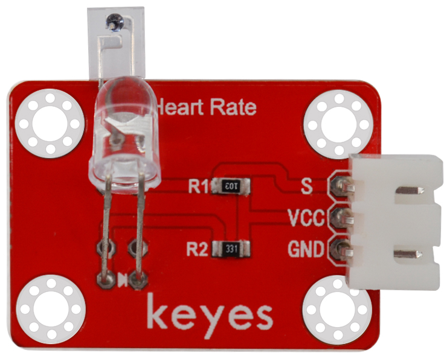
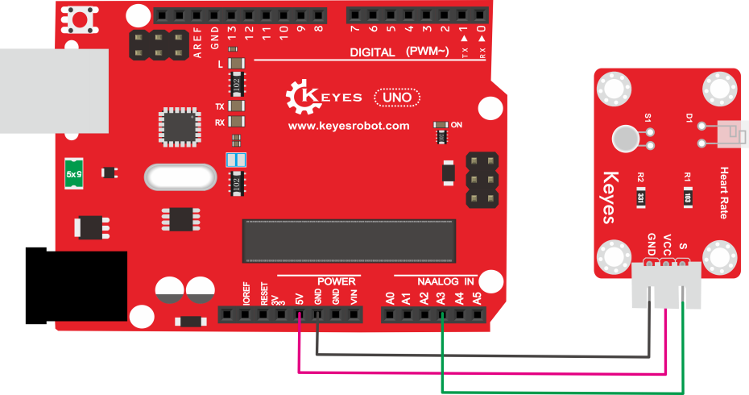
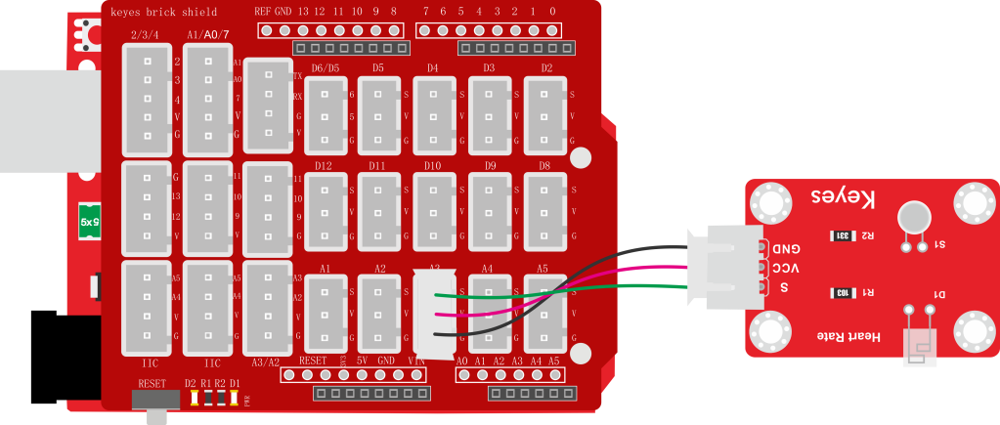
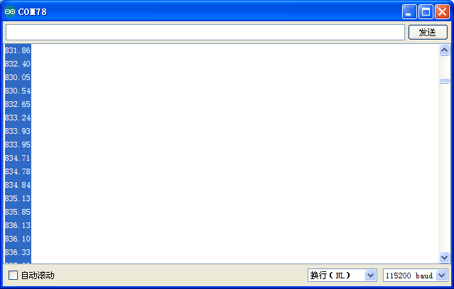

# KE2051 Keyes Brick 手指测心跳模块综合指南



---

## 1. 概述
KE2051 Keyes Brick 手指测心跳模块是一款常用的心率测量传感器，主要由一个光敏接收器和一个红外发射器组成。红外发射器位于手指的一侧，而光敏接收器则位于手指的另一侧。光敏接收器用于获取发射的光通量，当血液脉动通过手指时，光敏接收器的电阻会发生微小变化，从而实现心率的测量。

该模块兼容各种单片机控制板，如Arduino系列单片机。使用时，特别需要注意的是，测试时需要用黑布包裹模块和手指，以确保在无光环境中进行测试，否则测试结果可能不准确。

模块上自带一个间距为2.54mm的防反插白色端子，使用时可以利用杜邦线连接到单片机。为方便接线，我们还特别设计了一款完全兼容该模块和Arduino UNO R3单片机的扩展板。只需将扩展板堆叠到UNO R3单片机，利用一根3P双头XH2.54插头线（防反）即可连接，简单方便。同时，模块自带4个直径为3mm的定位孔，方便将模块固定在其他设备上。

---

## 2. 规格参数
- **工作电压**：DC 3.3V - 5V  
- **接口**：间距为2.54mm 3pin防反插接口  
- **定位孔大小**：直径为3mm  
- **控制信号**：模拟信号  
- **尺寸**：34mm x 28mm x 14mm  
- **重量**：2.8g  

---

## 3. 连接图
### 不带扩展板连接示例


### 带有扩展板连接示例


---

## 4. 测试代码
以下是用于测试手指测心跳模块的示例代码：
```cpp
int ledPin = 13; // LED引脚
int sensorPin = 3; // 传感器引脚
double alpha = 0.75; // 平滑因子
int period = 20; // 延时周期
double change = 0.0;

void setup() {
  pinMode(ledPin, OUTPUT); // 设置LED引脚为输出
  Serial.begin(115200); // 初始化串口通信
}

void loop() {
  static double oldValue = 0; // 上一个值
  int rawValue = analogRead(sensorPin); // 读取传感器的原始值
  double value = alpha * oldValue + (1 - alpha) * rawValue; // 平滑处理
  Serial.println(value); // 输出处理后的值
  oldValue = value; // 更新上一个值
  delay(period); // 延时
}
```

### 代码说明
- **analogRead()**：用于读取传感器的模拟值。
- **Serial.println()**：用于在串口监视器上输出处理后的心率值。

---

## 5. 测试结果
烧录好测试代码后，按照接线图连接好线，利用USB接口上电后，设置波特率为115200。串口监视器将显示相应的数值，用户可以将这些数据复制到Excel中生成对应的图表，以便于分析和观察心率变化。




---

## 6. 注意事项
- 确保模块连接正确，避免短路。
- 在使用过程中，注意电源电压在 3.3V - 5V 范围内，避免过载。
- 测试时务必用黑布包裹模块和手指，以确保在无光环境中进行测试。
- 避免将模块暴露在极端环境中，以免损坏。

