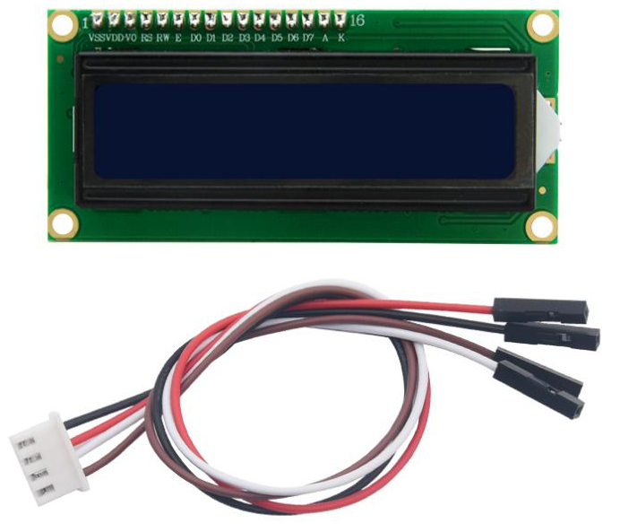
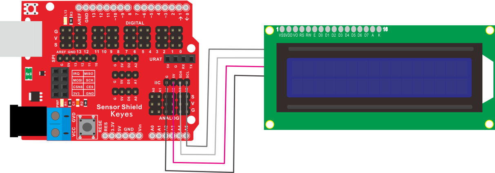
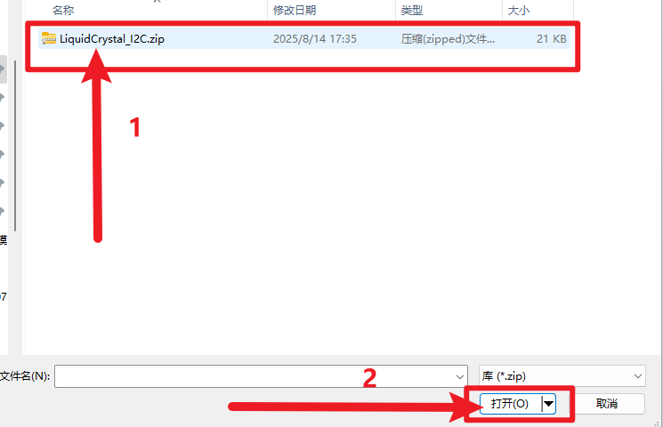
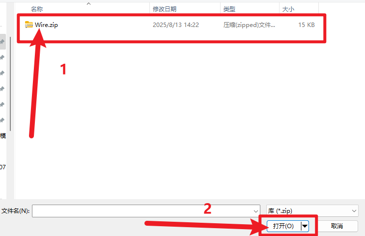
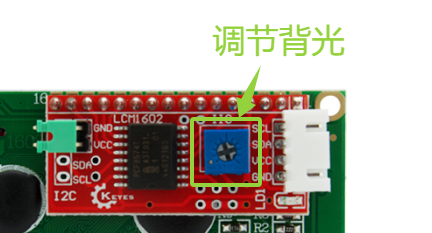
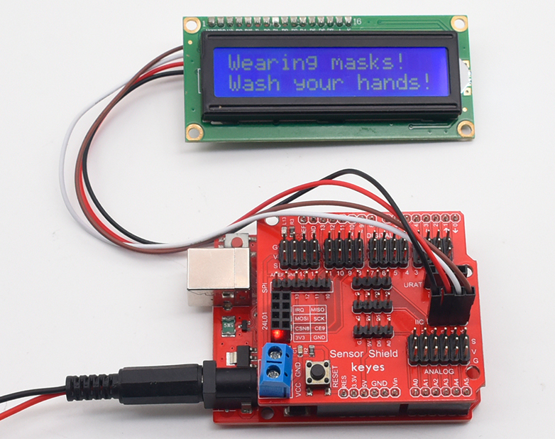

# KE2052 Keyes Brick IIC 1602 蓝屏（5V）综合指南



---

## 1. 概述
KE2052 Keyes Brick IIC 1602 蓝屏是一款常用的液晶显示模块，采用I2C接口，方便与各种单片机进行连接。该模块具有16列和2行的显示能力，适合用于显示文本、数字和简单图形。模块上自带焊盘孔设计，方便用户进行焊接和连接，确保连接的可靠性和安全性。

该模块可以通过I2C接口与单片机进行通信，用户可以方便地显示信息，适合用于各种项目，如温度监测、时间显示和用户交互界面等。

---

## 2. 规格参数
- **工作电压**：DC 5V  
- **显示类型**：16x2字符液晶显示  
- **接口**：I2C接口  
- **尺寸**：80mm x 36mm x 15mm  
- **重量**：20g  

---

## 3. 特点
- **易于使用**：通过I2C接口简化连接，减少引脚占用。
- **清晰显示**：16x2字符显示，适合各种信息展示。
- **焊盘孔设计**：方便用户进行焊接和连接，适合DIY项目和快速原型开发。
- **兼容性强**：可与Arduino、树莓派等开发板兼容使用，适合各种项目，易于集成。

---

## 4. 工作原理
IIC 1602 蓝屏通过I2C接口与单片机进行通信，用户可以通过发送命令和数据来控制显示内容。模块内部集成了控制器，能够将接收到的数据转换为可显示的字符。

---

## 5. 接口
- **VCC**：连接到电源正极（5V）。
- **GND**：连接到电源负极（GND）。
- **SDA**：数据线，用于I2C通信。
- **SCL**：时钟线，用于I2C通信。

### 引脚定义
| 引脚名称 | 功能描述                     |
|----------|------------------------------|
| VCC      | 连接到 Arduino 的 5V 引脚   |
| GND      | 连接到 Arduino 的 GND 引脚  |
| SDA      | I2C数据线                   |
| SCL      | I2C时钟线                   |

---

## 6. 连接图


### 连接示例
1. 将模块的 VCC 引脚连接到 Arduino 的 5V 引脚。
2. 将模块的 GND 引脚连接到 Arduino 的 GND 引脚。
3. 将模块的 SDA 引脚连接到 Arduino 的 SDA 引脚。
4. 将模块的 SCL 引脚连接到 Arduino 的 SCL 引脚。

---

## 7. 示例代码
### 安装库

- 下载库文件：[LiquidCrystal_I2C](./资料/KE2052.7z)

- 打开Arduino IDE，选择“项目”，选择“导入库”，再选择“添加.ZIP库”。

  

- 找到下载资料的存放位置，打开文件夹找到库文件，选择要导入的库，点击“打开”。

  

- 安装成功出现的界面。
  

以下是一个简单的示例代码，用于在IIC 1602 蓝屏上显示文本：

```cpp
#include <Wire.h>
#include <LiquidCrystal_I2C.h>

LiquidCrystal_I2C lcd(0x27, 16, 2); // I2C地址为0x27，16列2行

void setup() {
  lcd.init(); // 初始化液晶显示
  lcd.backlight(); // 打开背光
  lcd.setCursor(0, 0); // 设置光标位置
  lcd.print("Hello, World!"); // 显示文本
}

void loop() {
  // 可以在此处添加其他代码
}
```

**如果安装LiquidCrystal_I2C库，上传代码后报错(代码上传成功不用安装)，请按如下安装Wire库**。

- 下载库文件：[Wire](./资料/Wire.7z)

- 打开Arduino IDE，选择“项目”，选择“导入库”，再选择“添加.ZIP库”。

  

- 找到下载资料的存放位置，打开文件夹找到库文件，选择要导入的库，点击“打开”。

  

- 安装成功出现的界面。
  

### 代码说明

- **LiquidCrystal_I2C**：用于控制I2C液晶显示模块的库。
- **lcd.print()**：用于在液晶显示上输出文本。

## 8. 实验现象


上传程序后，IIC 1602 蓝屏将显示“Hello, World!”的文本，用户可以通过修改代码来显示其他信息。



---

## 9. 应用示例
- **温度监测**：用于显示温度传感器的读数。
- **时间显示**：用于显示实时时钟模块的时间。
- **用户交互界面**：用于各种项目的用户界面展示。

---

## 10. 注意事项
- 确保模块连接正确，避免短路。
- 在使用过程中，注意电源电压在 5V 范围内，避免过载。
- 避免将模块暴露在极端环境中，以免损坏。
