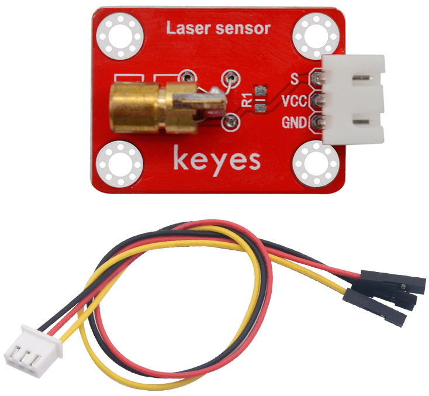
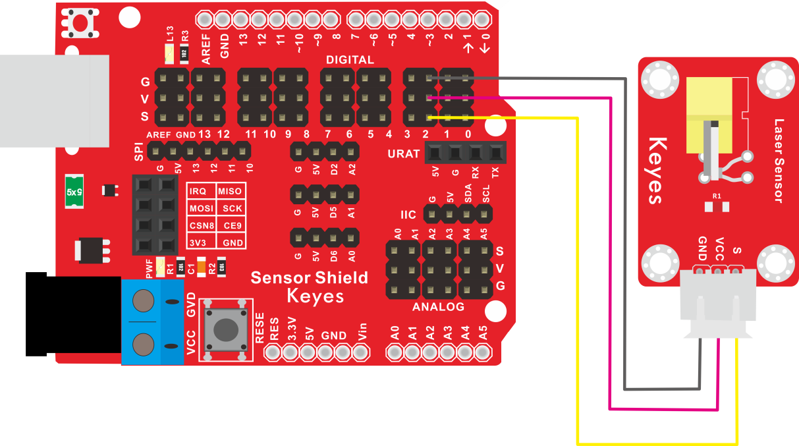
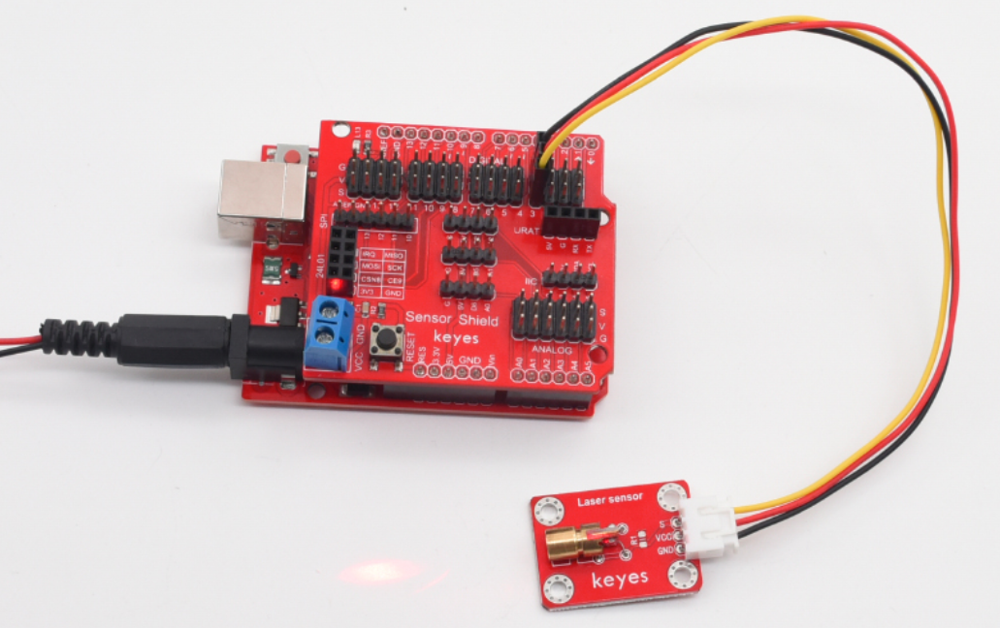

# KE2054 Keyes Brick 激光头传感器模块综合指南



---

## 1. 概述
KE2054 Keyes Brick 激光头传感器模块是一款常用的激光传感器，主要由一个铜材半导体激光管元件组成。该模块在控制时需要在模块的S端输入高电平信号，激光管便会发射出红色激光信号。为了方便接线，模块配备了一根200mm长的3pin线，一端为白色防反插接口（与传感器上的防反插白色端子匹配），另一端为3pin杜邦线母头接口。

该模块兼容各种单片机控制板，如Arduino系列单片机。使用时，可以在单片机上堆叠一个传感器扩展板，模块通过自带导线连接到扩展板上，简单方便。同时，模块自带4个直径为3mm的定位孔，方便将模块固定在其他设备上。

---

## 2. 规格参数
- **导线长度**：200mm  
- **工作电压**：DC 5V  
- **接口**：间距为2.54mm 3pin防反插接口  
- **定位孔大小**：直径为3mm  
- **控制信号**：数字信号  
- **尺寸**：34mm x 22mm x 9mm  
- **重量**：3.7g  

---

## 3. 连接图


### 连接示例
1. 将模块的 VCC 引脚连接到 Arduino 的 5V 引脚。
2. 将模块的 GND 引脚连接到 Arduino 的 GND 引脚。
3. 将模块的 S 引脚连接到 Arduino 的数字引脚（例如 D2）。

---

## 4. 测试代码
以下是用于测试激光头传感器的示例代码：
```cpp
void setup() {
  pinMode(2, OUTPUT); // 定义数字引脚2为输出接口
}

void loop() {
  digitalWrite(2, HIGH); // 打开激光头
  delay(1000); // 延时1秒
  digitalWrite(2, LOW); // 关闭激光头
  delay(1000); // 延时1秒
}
```

### 代码说明
- **pinMode(2, OUTPUT)**：将数字引脚2设置为输出模式。
- **digitalWrite(2, HIGH)**：将引脚2设置为高电平，激活激光头。
- **digitalWrite(2, LOW)**：将引脚2设置为低电平，关闭激光头。
- **delay(1000)**：延时1000毫秒（1秒）。

---

## 5. 测试结果
烧录好测试代码后，按照接线图连接好线；上电后，激光头将每隔1秒打开和关闭一次，循环交替。用户可以通过观察激光头的状态来验证模块的功能。



---

## 6. 注意事项
- 确保模块连接正确，避免短路。
- 在使用过程中，注意电源电压在 5V 范围内，避免过载。
- 激光头发射的激光光束可能对眼睛造成伤害，使用时请注意安全，避免直视激光光束。
- 避免将模块暴露在极端环境中，以免损坏。

---

## 7. 参考链接
- [Keyes官网](http://www.keyes-robot.com/)
- [Arduino 官方网站](https://www.arduino.cc)  

如有更多疑问，请联系 Keyes 官方客服或加入相关创客社区交流。祝使用愉快！