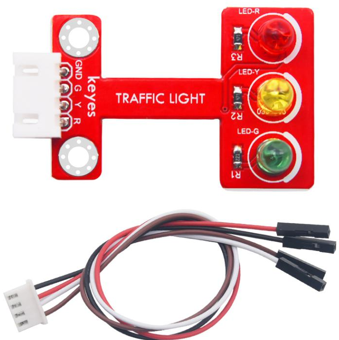
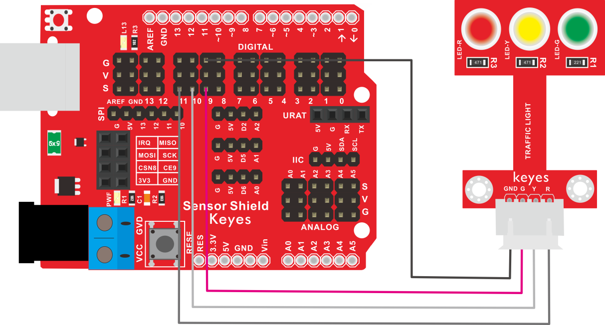
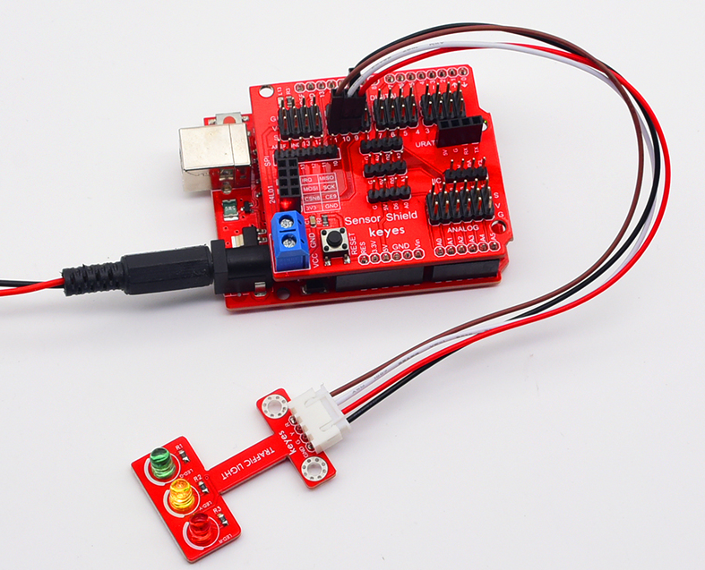

# KE2056 Keyes Brick 红绿灯模块综合指南



---

## 1. 概述
KE2056 Keyes Brick 红绿灯模块是一款用于模拟交通信号灯的模块，广泛应用于智能交通系统、机器人导航和教育项目中。该模块包含红色、绿色和黄色LED灯，能够通过控制信号实现不同的灯光组合，模拟真实的交通信号灯工作状态。模块上自带焊盘孔设计，方便用户进行焊接和连接，确保连接的可靠性和安全性。

该模块可以通过单片机控制LED灯的状态，用户可以根据需要进行编程和控制。模块兼容各种单片机控制板，如Arduino系列单片机，使用时可以方便地与其他设备连接。

---

## 2. 规格参数
- **工作电压**：DC 5V  
- **接口**：间距为2.54mm 3pin防反插接口  
- **LED数量**：3个（红、黄、绿）  
- **尺寸**：34mm x 22mm x 9mm  
- **重量**：3.5g  

---

## 3. 特点
- **多种灯光组合**：能够模拟红绿灯的不同状态，适合各种应用。
- **简单易用**：通过单片机控制，便于编程和调试。
- **焊盘孔设计**：方便用户进行焊接和连接，适合DIY项目和快速原型开发。
- **兼容性强**：可与Arduino、树莓派等开发板兼容使用，适合各种项目，易于集成。

---

## 4. 工作原理
红绿灯模块通过控制LED灯的开关状态来模拟交通信号灯的工作。当输入信号为高电平时，模块将点亮相应的LED灯，模拟交通信号灯的变化。

---

## 5. 接口
- **VCC**：连接到电源正极（5V）。
- **GND**：连接到电源负极（GND）。
- **R**：红灯控制引脚。
- **Y**：黄灯控制引脚。
- **G**：绿灯控制引脚。

### 引脚定义
| 引脚名称 | 功能描述                     |
|----------|------------------------------|
| VCC      | 连接到 Arduino 的 5V 引脚   |
| GND      | 连接到 Arduino 的 GND 引脚  |
| R        | 红灯控制引脚                |
| Y        | 黄灯控制引脚                |
| G        | 绿灯控制引脚                |

---

## 6. 连接图


### 连接示例
1. 将模块的 VCC 引脚连接到 Arduino 的 5V 引脚。
2. 将模块的 GND 引脚连接到 Arduino 的 GND 引脚。
3. 将模块的 R 引脚连接到 Arduino 的数字引脚（例如 D11）。
4. 将模块的 Y 引脚连接到 Arduino 的数字引脚（例如 D10）。
5. 将模块的 G 引脚连接到 Arduino 的数字引脚（例如 D9）。

---

## 7. 示例代码
以下是一个简单的示例代码，用于控制红绿灯模块的状态：
```cpp
const int redPin = 11; // 红灯引脚
const int yellowPin = 10; // 黄灯引脚
const int greenPin = 9; // 绿灯引脚

void setup() {
  pinMode(redPin, OUTPUT); // 设置红灯引脚为输出
  pinMode(yellowPin, OUTPUT); // 设置黄灯引脚为输出
  pinMode(greenPin, OUTPUT); // 设置绿灯引脚为输出
}

void loop() {
  digitalWrite(redPin, HIGH); // 点亮红灯
  delay(3000); // 红灯亮3秒
  digitalWrite(redPin, LOW); // 熄灭红灯

  digitalWrite(greenPin, HIGH); // 点亮绿灯
  delay(3000); // 绿灯亮3秒
  digitalWrite(greenPin, LOW); // 熄灭绿灯

  digitalWrite(yellowPin, HIGH); // 点亮黄灯
  delay(1000); // 黄灯亮1秒
  digitalWrite(yellowPin, LOW); // 熄灭黄灯
}
```

### 代码说明
- **pinMode()**：设置引脚模式为输出。
- **digitalWrite()**：控制LED灯的开关状态。
- **delay()**：设置延时，控制灯光的亮灭时间。

---

## 8. 实验现象
上传程序后，红绿灯模块将按照设定的时间顺序依次点亮红灯、绿灯和黄灯，模拟交通信号灯的工作状态。



---

## 9. 应用示例
- **智能交通系统**：用于模拟交通信号灯的控制。
- **机器人导航**：用于指示机器人行驶状态。
- **教育项目**：用于教学演示交通信号灯的工作原理。

---

## 10. 注意事项
- 确保模块连接正确，避免短路。
- 在使用过程中，注意电源电压在 5V 范围内，避免过载。
- 避免将模块暴露在极端环境中，以免损坏。

---

## 11. 参考链接
- [Keyes官网](http://www.keyes-robot.com/)
- [Arduino 官方网站](https://www.arduino.cc)  

如有更多疑问，请联系 Keyes 官方客服或加入相关创客社区交流。祝使用愉快！