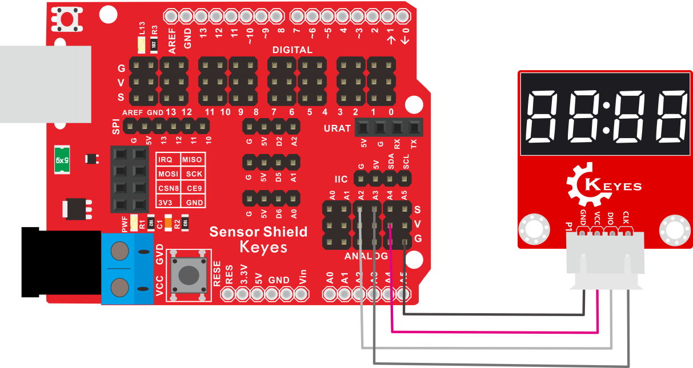
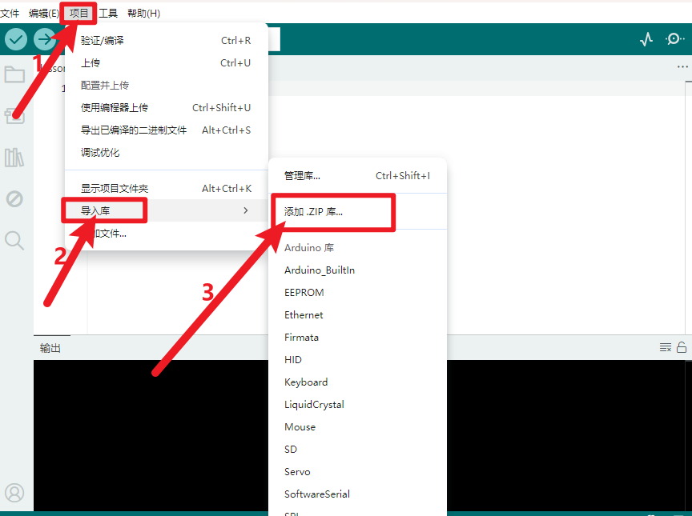
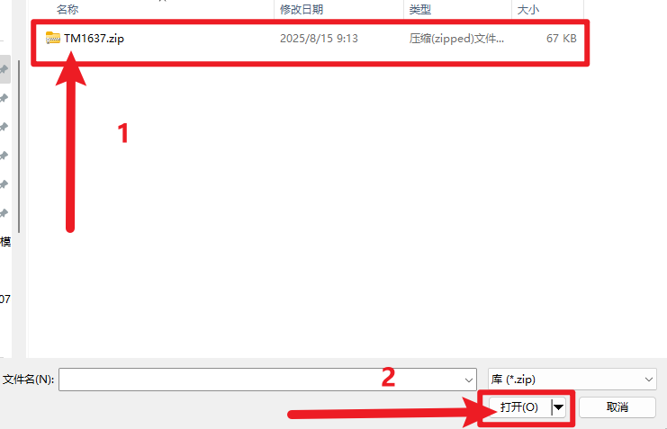
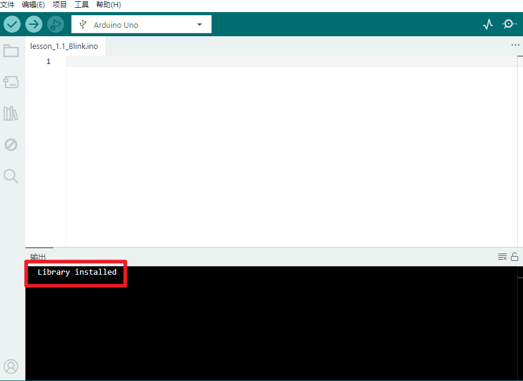
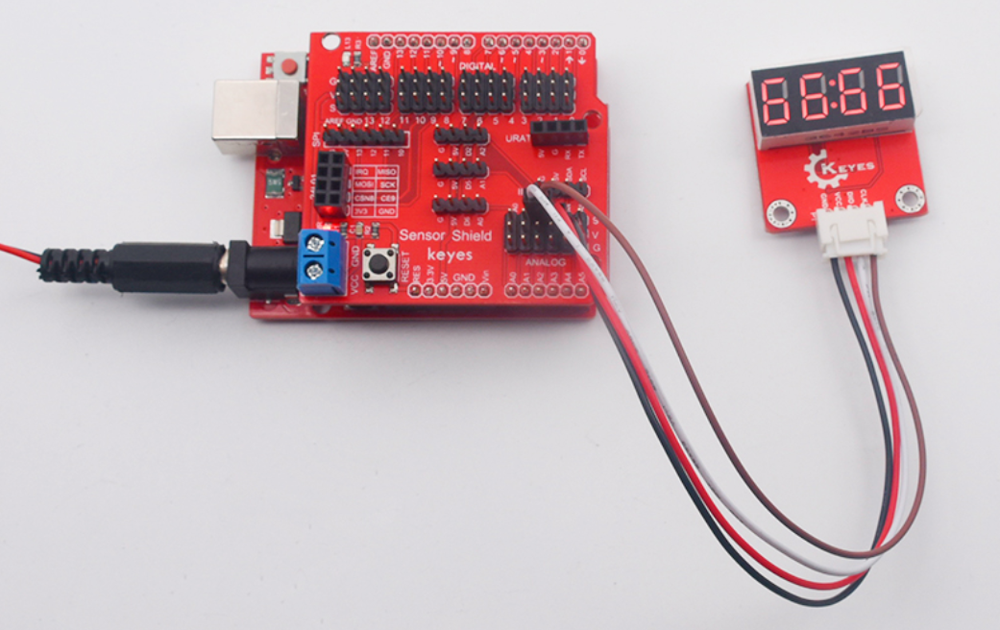

# KE2057 Keyes Brick I2C四位数码管模块综合指南


---

## 1. 概述
KE2057 Keyes Brick I2C四位数码管模块主要由一个0.36英寸红色共阳4位数码管组成，其驱动芯片为TM1637。使用该模块时，仅需通过2根信号线即可控制4位数码管，从而大大节约了单片机的IO口资源。为了方便接线，模块还配备了一根200mm长的4pin线，一端为白色防反插接口（与模块上的防反插白色端子匹配），另一端为4pin杜邦线母头接口。

该模块兼容各种单片机控制板，如Arduino系列单片机。使用时，可以在单片机上堆叠一个传感器扩展板，通过自带导线连接模块和扩展板，简单方便。同时，模块自带2个直径为3mm的定位孔，方便将模块固定在其他设备上。

---

## 2. 规格参数
- **导线长度**：200mm  
- **工作电压**：DC 5V  
- **接口**：间距为2.54mm 4pin防反插接口  
- **定位孔大小**：直径为3mm  
- **数码管显示颜色**：红色  
- **尺寸**：51mm x 34mm x 11mm  
- **重量**：13.6g  

---

## 3. 连接图


### 连接示例
1. 将模块的 VCC 引脚连接到 Arduino 的 5V 引脚。
2. 将模块的 GND 引脚连接到 Arduino 的 GND 引脚。
3. 将模块的 CLK 引脚连接到 Arduino 的数字引脚（例如 A3）。
4. 将模块的 DIO 引脚连接到 Arduino 的数字引脚（例如 A2）。

---

## 4. 测试代码
### 安装库

- 下载库文件：[TM1637](./资料/KE2057.7z)

- 打开Arduino IDE，选择“项目”，选择“导入库”，再选择“添加.ZIP库”。

  

- 找到下载资料的存放位置，打开文件夹找到库文件，选择要导入的库，点击“打开”。

  

- 安装成功出现的界面。
  

以下是用于测试4位数码管的示例代码：

```cpp
#include "TM1637.h"

#define CLK A3 // 定义时钟引脚
#define DIO A2 // 定义数据引脚

TM1637 tm1637(CLK, DIO); // 创建TM1637对象

void setup() {
  tm1637.init(); // 初始化数码管
  tm1637.set(BRIGHT_TYPICAL); // 设置亮度
}

void loop() {
  int8_t NumTab[] = {0, 1, 2, 3, 4, 5, 6, 7, 8, 9}; // 数码管显示的数字
  int8_t ListDisp[4];
  unsigned char i = 0;
  unsigned char count = 0;
  delay(150);

  while (1) {
    i = count;
    count++;
    if (count == sizeof(NumTab)) count = 0; // 循环计数

    for (unsigned char BitSelect = 0; BitSelect < 4; BitSelect++) {
      ListDisp[BitSelect] = NumTab[i]; // 指定显示的数字
      i++;
      if (i == sizeof(NumTab)) i = 0;
    }

    // 显示数字
    tm1637.display(0, ListDisp[0]);
    tm1637.display(1, ListDisp[1]); 
    tm1637.display(2, ListDisp[2]);
    tm1637.display(3, ListDisp[3]);
    tm1637.point(POINT_ON); // 点亮小数点
    delay(100); // 延时
  }
}
```

### 代码说明
- **#include "TM1637.h"**：包含TM1637库。
- **tm1637.init()**：初始化数码管。
- **tm1637.set(BRIGHT_TYPICAL)**：设置数码管亮度。
- **tm1637.display()**：显示对应位置的数字。
- **tm1637.point(POINT_ON)**：点亮小数点。

---

## 5. 测试结果
烧录好测试代码后，按照接线图连接好线，模块上电后，4位数码管将循环显示数字0到9，时钟点常亮。每次显示相同的4个数字，用户可以根据需要修改代码以改变显示效果。



