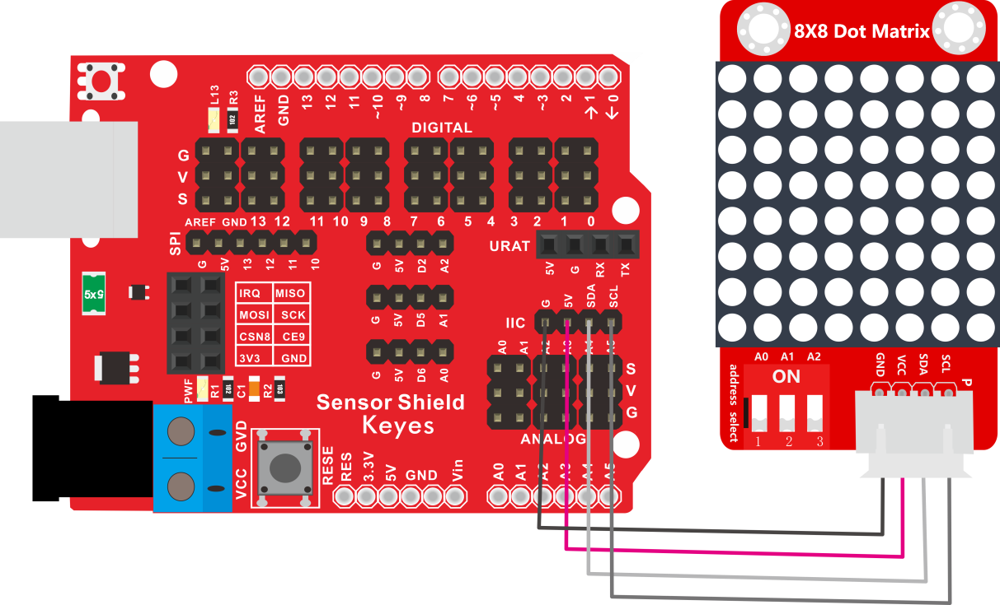
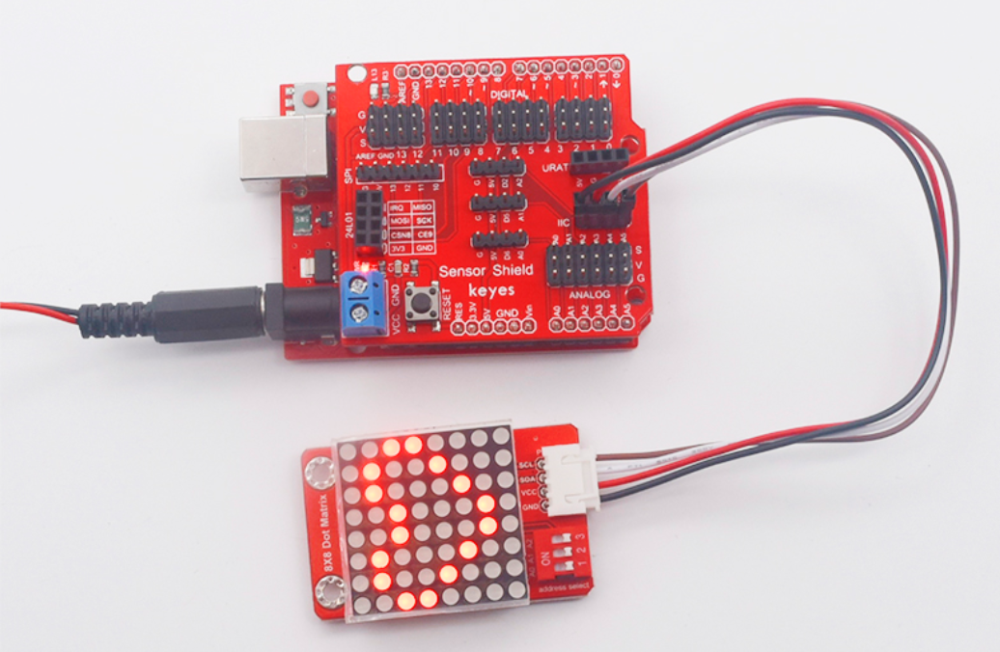
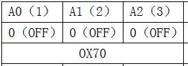
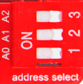
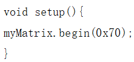
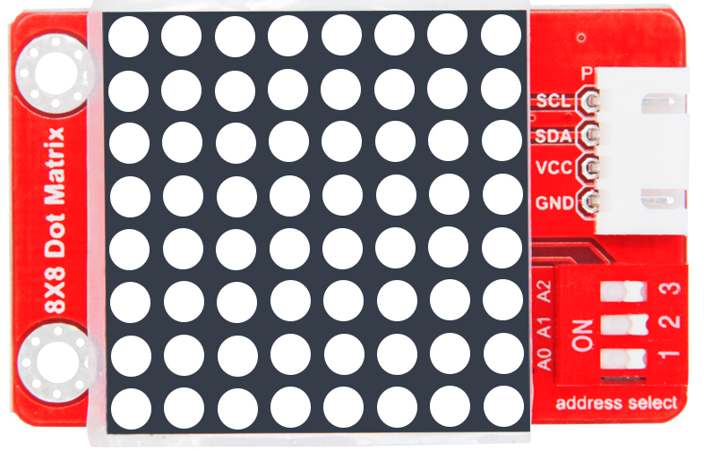
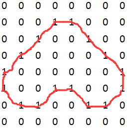

# KE2058 Keyes Brick 8x8点阵模块综合指南


---

## 1. 概述
KE2058 Keyes Brick 8x8点阵模块采用HT16K33驱动芯片，可以高效地控制1个8x8点阵显示屏。使用该模块时，仅需通过I2C通信端口控制点阵，从而大幅节省单片机的IO口资源。为了方便接线，模块附带一根200mm长的4pin线，一端为白色防反插接口（与模块上的端子匹配），另一端为4pin杜邦线母头接口。

该模块兼容各种单片机控制板，如Arduino系列单片机，用户可以在单片机上堆叠一个传感器扩展板，通过自带导线将模块连接到扩展板。同时，模块上自带3个拨码开关，可以用于设置I2C通信地址。

---

## 2. 规格参数
- **导线长度**：200mm  
- **工作电压**：DC 5V  
- **接口**：间距为2.54mm 4pin防反插接口  
- **定位孔大小**：直径为3mm  
- **通讯方式**：I2C通讯  
- **I2C通信地址**：通过拨码开关设置  
- **点阵屏显示颜色**：红色  
- **尺寸**：50mm x 31mm x 9mm  
- **重量**：13.6g  

### I2C通信地址设置
| A0（1） | A1（2） | A2（3） | 地址  |
|---------|---------|---------|-------|
| 0（OFF）| 0（OFF）| 0（OFF）| 0x70  |
| 0（OFF）| 0（OFF）| 1（ON） | 0x71  |
| 0（OFF）| 1（ON） | 0（OFF）| 0x72  |
| 0（OFF）| 1（ON） | 1（ON） | 0x73  |
| 1（ON） | 0（OFF）| 0（OFF）| 0x74  |
| 1（ON） | 0（OFF）| 1（ON） | 0x75  |
| 1（ON） | 1（ON） | 0（OFF）| 0x76  |
| 1（ON） | 1（ON） | 1（ON） | 0x77  |

---

## 3. 连接图


### 连接示例
1. 将模块的 VCC 引脚连接到 Arduino 的 5V 引脚。
2. 将模块的 GND 引脚连接到 Arduino 的 GND 引脚。
3. 将模块的 SDA 引脚连接到 Arduino  引脚。
4. 将模块的 SCL 引脚连接到 Arduino 引脚。

---

## 4. 测试代码
在使用该模块之前，请确保安装了所需的库文件。将Matrix库文件夹放入编译器安装目录下的 `\Arduino\libraries` 中，然后重启编译器。

以下是测试8x8点阵模块的示例代码：
```cpp
#include <Matrix.h>

Matrix myMatrix(A4, A5); // SDA和SCL引脚定义
uint8_t LedArray1[8] = {0x00, 0x18, 0x24, 0x42, 0x81, 0x99, 0x66, 0x00}; // 心形图案

void setup(){
    myMatrix.begin(0x70); // 初始化I2C地址
}

void loop(){
    myMatrix.clear(); // 清空显示
    for(int i = 0; i < 8; i++) {
        for(int j = 7; j >= 0; j--) {
            if((LedArray1[i] & 0x01) > 0) // 检查LED状态
                myMatrix.drawPixel(j, i, 1); // 点亮像素
            LedArray1[i] = LedArray1[i] >> 1; // 右移，处理下一个像素
        }
    }
    myMatrix.writeDisplay(); // 刷新显示
    delay(500); // 延时
}
```

### 代码说明
- **Matrix myMatrix(A4, A5)**：创建Matrix对象，并指定I2C的SDA和SCL引脚。
- **myMatrix.begin(0x70)**：初始化点阵显示，设置I2C地址。
- **myMatrix.drawPixel(j, i, 1)**：设置特定像素点亮。
- **myMatrix.writeDisplay()**：更新显示。

---

## 5. 测试结果
烧录好测试代码后，按照接线图连接好线，通电后，点阵模块将显示一个心形图案。用户可以根据需求修改 `LedArray1` 的值，来改变显示的图案。



---

## 6. 设置方法
1. **设置I2C通信地址**：参考上述地址表格，通过拨动相应的拨码开关设置地址。

	

	 

2. **自定义显示图像**：
   
   - 可以通过更改 `LedArray1` 中的值来定义不同的图案。
   - 每个值代表8列的LED点亮状态，例如 `0x18` 表示第三和第四列点亮。
   
   

### 示例二进制值说明
```plaintext
0x00 -> 00000000
0x18 -> 00011000
0x24 -> 00100100
0x42 -> 01000010
0x81 -> 10000001
0x99 -> 10011001
0x66 -> 01100110
```
每个十六进制值的八个二进制位对应着点阵的行，1表示点亮，0表示熄灭。



---

## 7. 库文件链接
- Matrix库文件下载链接：[Matrix库下载](https://pan.baidu.com/s/1SdLlU9eH67Leyh-SsTUizA)  
  提取码：pljn

如有更多疑问，请联系 Keyes 官方客服或加入相关创客社区交流。祝使用愉快！