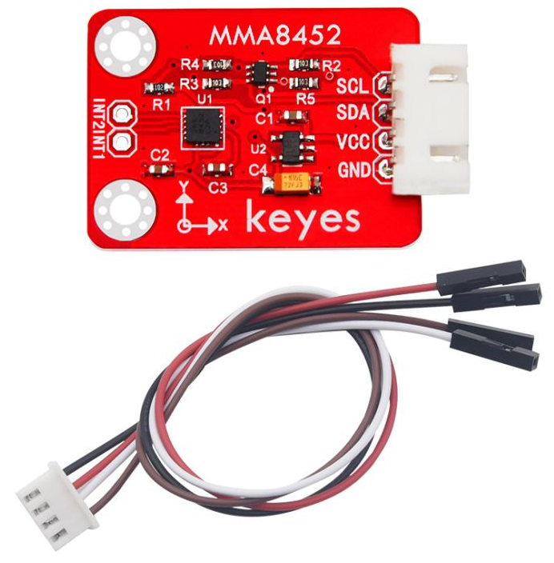
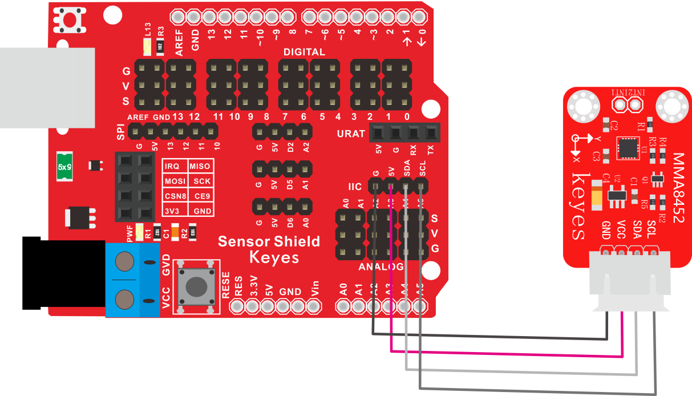
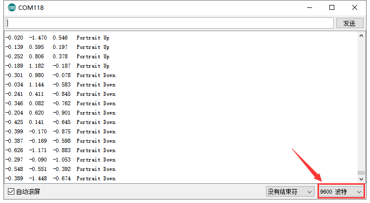

# KE2059 Keyes Brick MMA8452Q三轴数字加速度传感器综合指南



---

## 1. 介绍
KE2059 Keyes Brick MMA8452Q三轴数字加速度倾角传感器是一款高精度、低功耗的加速度传感器，能够测量物体在三个维度（X、Y、Z轴）上的加速度。传感器内部集成了MEMS技术，具有小型化、轻量化的特点，适用于需要实时监测运动状态和倾角变化的项目。该传感器通过I2C协议与Arduino等主控板连接，使用方便，是物联网、机器人、智能家居等领域的理想选择。

---

## 2. 特点
- **高精度测量**：可测量静态和动态加速度，适用于不同的应用场景。
- **多种加速度范围**：支持±2g、±4g和±8g的可调测量范围，满足不同用户需求。
- **便捷的I2C通信**：仅需2根信号线，简化了连接，提高开发效率。
- **集成阈值检测功能**：可以设置运动侦测阈值，适时响应运动状态变化，适合实现低功耗状态。
- **小巧设计**：模块便于集成到各种硬件项目中，适用于DIY与教育用途。
  
---

## 3. 规格参数
- **工作电压**：DC 3.3V - 5V  
- **接口类型**：间距为2.54mm 4pin防反插接口  
- **通讯方式**：I2C通讯  
- **加速度范围**：±2g、±4g、±8g可调  
- **集成电路**：MMA8452Q  
- **尺寸**：25mm x 20mm x 10mm  
- **重量**：4.5g  
- **灵敏度**：12位输出分辨率  

---

## 4. 工作原理
MMA8452Q三轴加速度传感器通过微机电系统（MEMS）技术来感知并测量施加在其运动感应元件上的加速度力。这些加速度力会影响传感器内部的惯性质量，进而改变传感器的电信号。传感器将这些电信号转换为数字信号，通过I2C通信发送给微控制器，用户可以实时获取设备的加速度和倾斜角度。

---

## 5. 接口
- **VCC**：连接到电源（3.3V或5V）。
- **GND**：接地引脚。
- **SDA**：I2C数据线，连接到主控板的SDA引脚。
- **SCL**：I2C时钟线，连接到主控板的SCL引脚。

---

## 6. 连接图
### 连接示例

1. 将模块的 VCC 引脚连接到 Arduino 的 3.3V 或 5V 引脚。
2. 将模块的 GND 引脚连接到 Arduino 的 GND 引脚。
3. 将模块的 SDA 引脚连接到 Arduino 的引脚（对于 UNO）。
4. 将模块的 SCL 引脚连接到 Arduino 的引脚（对于 UNO）。



---

## 7. 示例代码
以下是用于测试MMA8452Q三轴加速度传感器的示例代码，通过串口输出加速度值：
```cpp
#include <Wire.h>
#include <MMA8452Q.h>

MMA8452Q accelerometer;

void setup() {
  Serial.begin(9600);
  Wire.begin();
  accelerometer.begin();
}

void loop() {
  accelerometer.read();
  Serial.print("X: "); Serial.print(accelerometer.getX());
  Serial.print("\tY: "); Serial.print(accelerometer.getY());
  Serial.print("\tZ: "); Serial.print(accelerometer.getZ());
  Serial.println();
  delay(500);
}
```

### 代码说明
- **包含库**：通过`Wire.h`引入I2C库，并通过`MMA8452Q.h`引入加速度传感器库。
- **设备初始化**：在`setup()`函数中，启动串口和I2C通信，并初始化加速度传感器。
- **不断读取数据**：在`loop()`函数中，不断读取加速度值并通过串口输出。

---

## 8. 实验现象
上传代码后，使用串口监视器观察每500毫秒输出一次的X、Y和Z轴加速度值。当传感器发生倾斜或震动时，串口输出会实时反映这种变化，便于用户进行状态监测和调试。



---

## 9. 注意事项
- 在接线时，请确保模块连接正确，以避免短路。
- 请使用适当的电压范围（3.3V或5V），避免过载或烧毁传感器。
- 在实际应用中，确保模块处于稳定的环境中，以获得准确的测量数据。

---

## 10. 参考链接
- [Keyes官网](http://www.keyes-robot.com/)
- [Arduino 官方网站](https://www.arduino.cc)
- [MMA8452Q 数据手册](https://www.nxp.com/docs/en/data-sheet/MMA8452Q.pdf)
- [GitHub上的MMA8452库](https://github.com/Seeed-Studio/MMA8452Q)