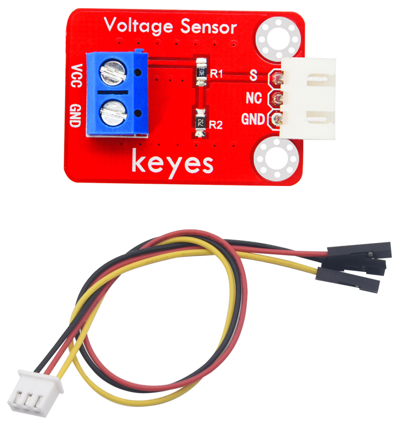
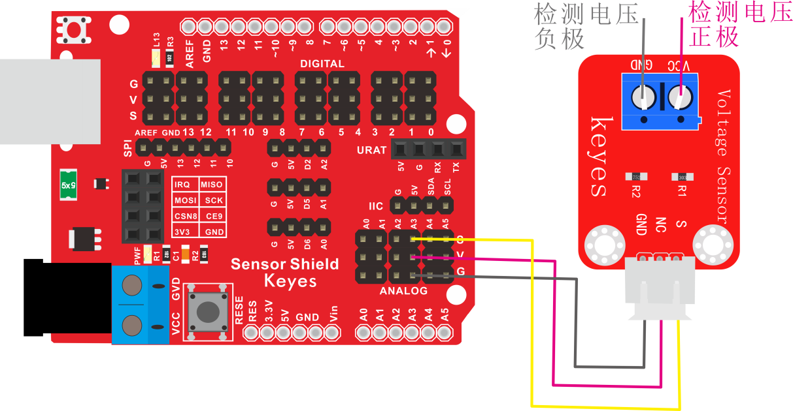
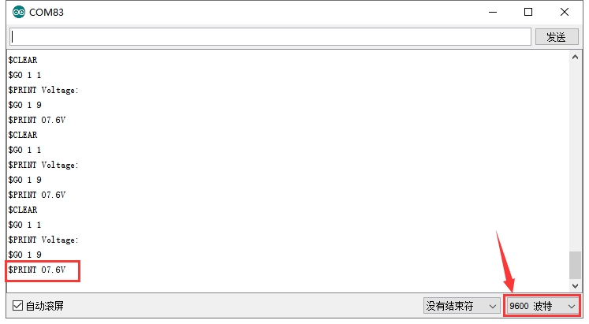

# KE2060 Keyes Brick Voltage Sensor电压检测传感器综合指南



---

## 1. 介绍
KE2060 Keyes Brick Voltage Sensor电压检测传感器是用于检测直流电压的模块，能够测量范围从0V到25V的电压。通过采用分压电路设计，将高电压降至适合Arduino等单片机ADC输入的范围。此传感器广泛应用于电源监测、可再生能源系统、电池管理及其他需要实时电压监控的项目。

---

## 2. 特点
- **大测量范围**：能够检测0V到25V的直流电压，满足多种应用场景。
- **高精度**：实现高达±1%的检测精度。
- **简单的接线**：通过3pin接口与Arduino等设备快速连接。
- **集成简洁**：小巧的设计便于嵌入各类电子项目。

---

## 3. 规格参数
- **工作电压**：DC 5V  
- **测量范围**：0V - 25V（通过分压电路）  
- **接口**：间距为2.54mm 3pin防反插接口  
- **分压比例**：通过电阻分压，将高电压降低至适合ADC输入的范围  
- **精度**：±1%  
- **尺寸**：21mm x 18mm x 10mm  
- **重量**：3.5g

---

## 4. 工作原理
电压传感器使用分压器电路将待测电压降低，以确保其输出在模拟输入的安全范围内。通过测量分压后的电压，主控单片机能够计算输入的原始电压值并进行后续处理。这种设计允许微控制器安全地处理较高的输入电压，而无需担心损坏自身的ADC输入。

---

## 5. 接口
- **VCC**：连接到板的电源引脚，通常为5V。
- **GND**：连接到地线引脚。
- **S**：模拟输出引脚，将变换后的电压输出，连接至Arduino的模拟引脚（如A3）。

---

## 6. 连接图
### 连接示例
1. 将模块的 VCC 引脚连接到 Arduino 的 5V 引脚。
2. 将模块的 GND 引脚连接到 Arduino 的 GND 引脚。
3. 将模块的S引脚连接到 Arduino 的模拟引脚（如 A3）。



---

## 7. 示例代码
以下是用于测试电压传感器的示例代码，实时获取和打印电压值：
```cpp
const int voltagePin = A3; // 连接到模拟输入引脚

void setup() {
  Serial.begin(9600);
}

void loop() {
  int sensorValue = analogRead(voltagePin); // 读取模拟值
  // 将传感器值转换为电压值，考虑到分压电阻比，例如此处比例为5/25
  float voltage = sensorValue * (5.0 / 1023.0) * (25.0 / 5.0); 
  Serial.print("Voltage: ");
  Serial.print(voltage);
  Serial.println(" V");
  delay(1000); // 每秒读取一次
}
```

---

## 8. 实验现象
上传程序后，串口监视器将每秒输出一次检测到的电压值。用户可以通过给传感器连接不同的电源电压，观察串口输出的电压值变化，以验证传感器的准确性和可靠性。



---

## 9. 注意事项
- 使用时请确保模块连接正确，以免发生短路。
- 请遵循最大输入电压限制（0V至25V），超出该范围可能导致传感器损坏。
- 保证电源电压保持在稳定范围内（5V），以确保传感器正常工作。
- 分压器部分应避免短路，确保使用正确阻值的电阻器。

---

## 10. 参考链接
- [电压传感器基础知识](https://www.electronics-tutorials.ws/io/io_1.html)
- [电压分压的原理及应用](https://www.electronics-tutorials.ws/wp-content/uploads/2019/09/voltage-divider.png)