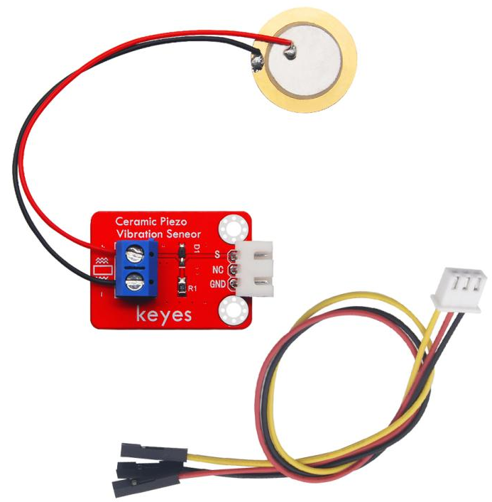
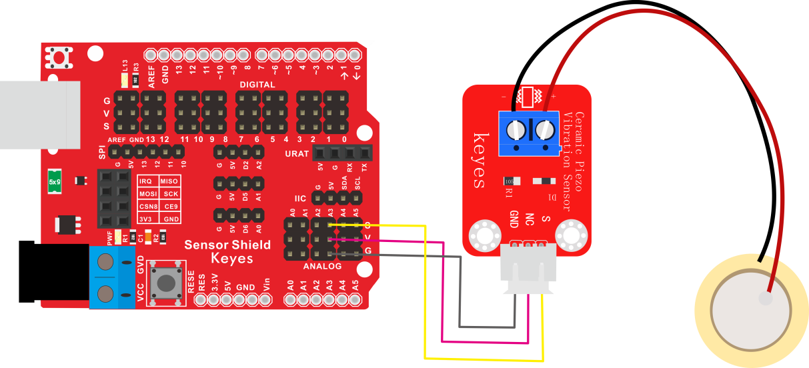
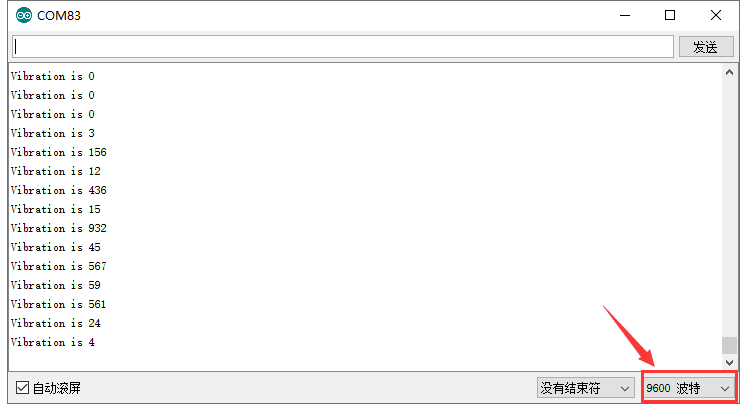

# KE2061 Keyes Brick 模拟压电陶瓷震动传感器综合指南



---

## 1. 介绍
KE2061 Keyes Brick 模拟压电陶瓷震动传感器是一款用于检测振动、碰撞或者声波的传感器模块。它使用压电陶瓷技术，能够在受到压力或震动时输出相应的模拟信号。该传感器非常适合用于安防技防、智能家居、机器人等领域，实现运动和震动的检测。

---

## 2. 特点
- **灵敏度高**：能够感知微小的震动和压力变化。
- **输出模拟信号**：提供连续的电压信号，便于与微控制器连接。
- **小巧设计**：便于集成到各种电子项目中。
- **防反插接口**：方便连接，减少误接的风险。

---

## 3. 规格参数
- **工作电压**：DC 5V  
- **接口类型**：间距为2.54mm的3pin防反插接口  
- **输出信号**：模拟电压信号  
- **传感器原理**：压电效应  
- **尺寸**：30mm x 25mm x 10mm  
- **重量**：5g  

---

## 4. 工作原理
该传感器利用压电材料的特性。当材料受到外界机械波动（如震动、敲击、声波等）时，压电材料内部会产生电压变化。此电压变化被转化为一个模拟电压信号输出，供微控制器或模拟电路采集和处理。通过调整采集的输入阈值，可以实现多种应用，比如基于震动的报警系统或运动监测。

---

## 5. 接口
- **VCC**：连接到电源（5V）。
- **GND**：连接到地。
- **S**：模拟输出引脚，将传感器输出的模拟电压连接到Arduino的模拟引脚（如A3）。

---

## 6. 连接图
### 连接示例
1. 将模块的 VCC 引脚连接到 Arduino 的 5V 引脚。
2. 将模块的 GND 引脚连接到 Arduino 的 GND 引脚。
3. 将模块的 S 引脚连接到 Arduino 的模拟引脚（如 A3）。



---

## 7. 示例代码
以下是用于读取压电震动传感器的示例代码：
```cpp
const int sensorPin = A3; // 连接到模拟输入引脚

void setup() {
  Serial.begin(9600);
}

void loop() {
  int sensorValue = analogRead(sensorPin); // 读取模拟值
  Serial.print("Vibration Level: ");
  Serial.println(sensorValue); // 输出震动强度
  delay(500);
}
```

---

## 8. 实验现象
将代码上传到Arduino后，通过串口监视器，可以观察到每500毫秒输出一次的震动值。用户可以轻轻敲击传感器或施加压力，观察值的变化，以验证传感器对震动的灵敏度。



---

## 9. 注意事项
- 配置电源电压为5V，避免使用超过电压额定范围。
- 确保连接正确，避免短路情况。
- 不要让传感器暴露于极端环境（如湿气或高温），以免影响其性能。

---

## 10. 参考链接
- [压电传感器基础知识](https://www.electronics-tutorials.ws/io/io_1.html)