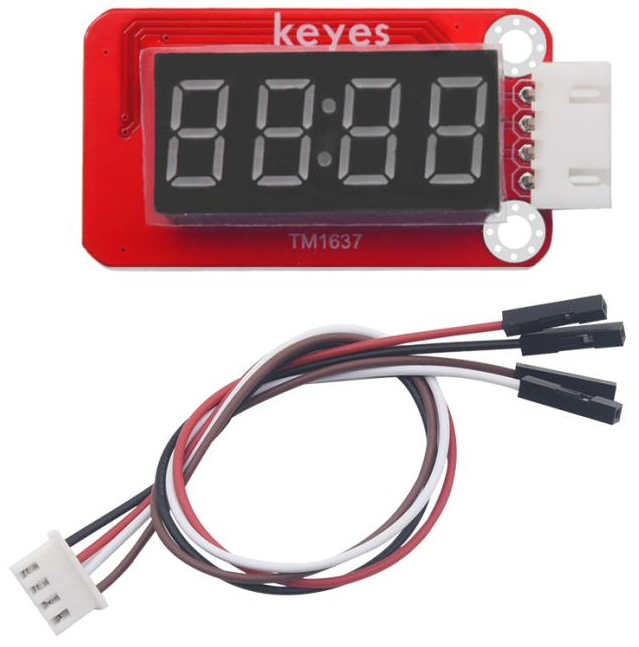
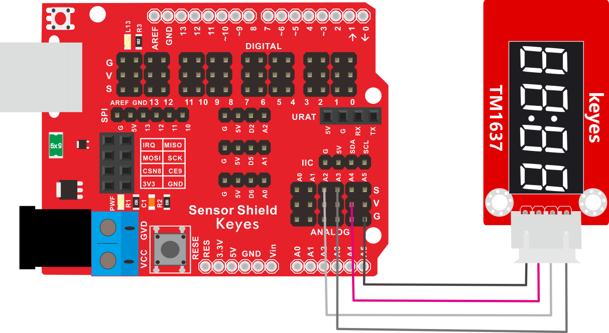

# KE2062 Keyes Brick TM1637 4位数码管模块综合指南



---

## 1. 概述

KE2062模块是一款配备0.36英寸红色共阳4位数码管的显示模块，其驱动芯片为TM1637。该模块的设计使得用户仅需使用2根信号线便可便捷地控制4位数码管，从而有效节省单片机的IO端口资源。模块附带一根200mm长的4pin导线，其中一端为白色防反插接口（与模块的接口匹配），另一端为4pin杜邦线母头接口，便于连接各种控制板。

该模块与多种单片机控制板（如Arduino系列）兼容，用户使用时可以在主控板上堆叠传感器扩展板，方便模块连接。模块自带两个直径为3mm的定位孔，使其能够方便地固定在其他设备上，增加了使用的灵活性。

---

## 2. 规格参数
- **导线长度**：200mm  
- **工作电压**：DC 5V  
- **接口类型**：间距为2.54mm 4pin防反插接口  
- **定位孔大小**：直径为3mm  
- **数码管显示颜色**：红色  
- **尺寸**：51mm x 34mm x 11mm  
- **重量**：13.6g  

---

## 3. 工作原理
TM1637模块通过I2C或串行协议与主控微控制器进行通信。驱动芯片TM1637负责接收来自微控制器的数字信号，并将其转换为显示格式。该模块可用于数字、字母以及简单符号的显示，能够灵活应用于计时器、倒计时器、温度计等多种场景。

---

## 4. 接口
- **VCC**：连接到电源（5V）。
- **GND**：连接到地线。
- **CLK**：时钟信号引脚，连接到Arduino的数字引脚。
- **DIO**：数据引脚，连接到Arduino的数字引脚。

---

## 5. 连接图
### 连接示例


1. 将模块的 VCC 引脚连接到 Arduino 的 5V 引脚。
2. 将模块的 GND 引脚连接到 Arduino 的 GND 引脚。
3. 将模块的 CLK 引脚连接到 Arduino 的A2。
4. 将模块的 DIO 引脚连接到 Arduino 的A3。

---

## 6. 示例代码
以下是用于测试TM1637数码管模块的示例代码：
```cpp
#include <TM1637Display.h>

#define CLK 2 // 连接到 A2
#define DIO 3 // 连接到 A3

TM1637Display display(CLK, DIO); // 创建数码管对象

void setup() {
  display.setBrightness(0x0f); // 设置亮度
  display.showNumberDec(1234); // 显示初始数字
}

void loop() {
  for (int i = 0; i <= 99; i++) {
    display.showNumberDec(i); // 显示数字
    delay(1000); // 每秒更新一次
  }
}
```

---

## 7. 实验现象
上传示例代码后，数码管将依次显示0到99的数字，每秒更新一次。用户可以根据需要修改显示的数字或符号，观察数码管的变化，体验模块的功能。

---

## 8. 注意事项
- 请确保连接线正确，避免在接线时出现短路。
- 确保所用电压为5V，因此可避免损坏模块。
- 在多个模块同时使用时，需考虑I2C地址配置，以避免地址冲突。

