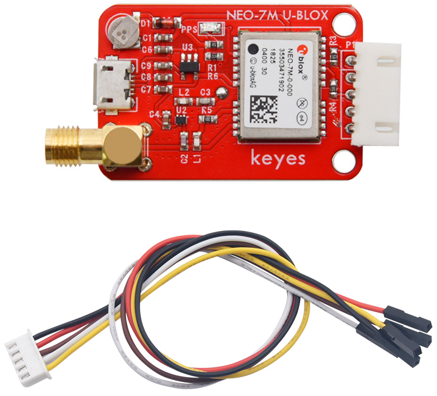
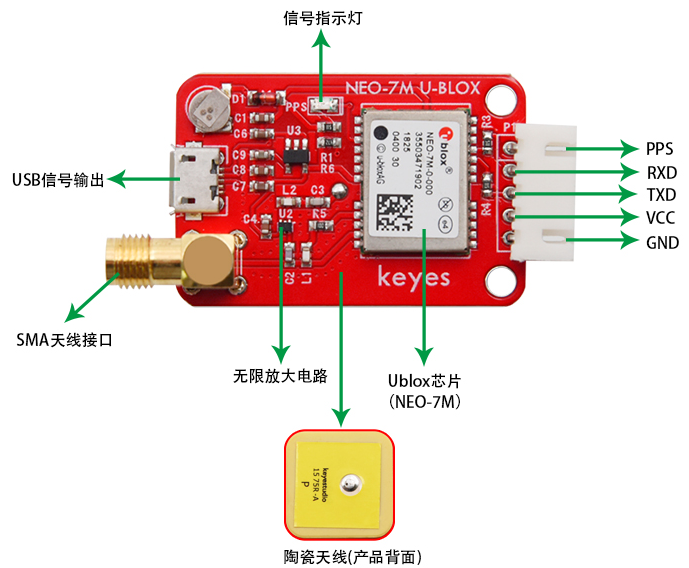
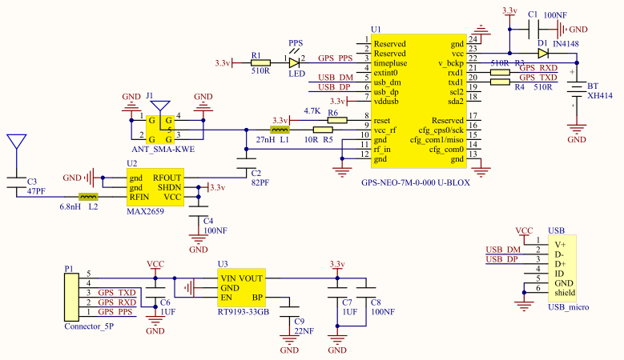
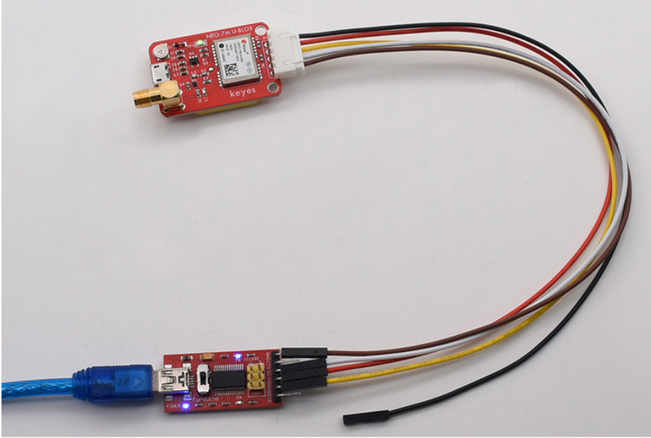
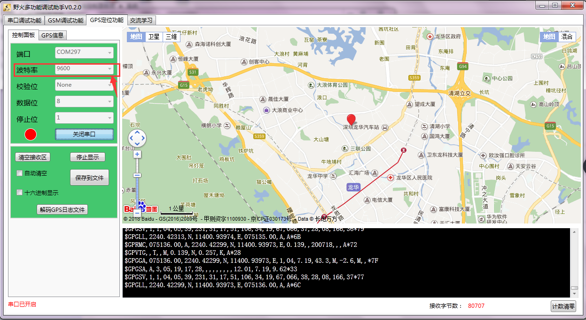

# KE2063 Keyes Brick NEO-7M U-BLOX GPS模块综合指南



---

## 1. 简介
KE2063是一个GPS模块，以NEO-7M为核心，可用于卫星定位。模块支持NMEA标准协议输出，内置FLASH，无需外置EEPROM即可掉电保存设置信息。该模块不仅板载陶瓷天线，在空旷的地方无需外接天线即可方便搜星定位；同时模块还焊接有SMA头，可用于外置天线，增强搜星定位能力。使用时可以通过模块带有的micro USB接口，使用手机数据线调试GPS模块，还可以通过模块预留的串口接口，使用USB转串口模块或外接单片机控制接收GPS信息。

为了方便接线，模块配送1根5pin线，线的一端为白色防反插接口（与模块上防反插白色端子匹配），另一端为5pin杜邦线母头接口。特别注意，如果接外置天线时，需要将模块上的C2电容去掉，以避免内置天线和外置天线同时使用造成冲突影响定位。由于室内没有卫星信号，模块只能在室外使用，不能在室内进行定位。

模块定位精度最高为2.5米。

---

## 2. 特点
- 板载陶瓷天线，在空旷的地方无需外接天线即可搜星定位。
- 焊接有SMA头，可用于外置天线，增强搜星定位能力。
- 带有micro USB接口，可以使用手机数据线调试GPS模块。
- 模块预留串口接口，可以使用USB转串口模块或外接单片机控制接收GPS信息。
- 模块自带信号指示灯，指示GPS是否接收信息。

---

## 3. 元件和接口介绍



| 序号 | 名称 | 说明 |
|------|------|------|
| 1    | VCC  | 电源（DC 3.3-5V） |
| 2    | GND  | 地线 |
| 3    | TXD  | 模块串口发送，可接单片机或USB转串口模块的RXD。 |
| 4    | RXD  | 模块串口接收，可接单片机或USB转串口模块的TXD。 |
| 5    | PPS  | 时钟脉冲输出脚（GPS秒脉冲信号，1秒1个，用来指示整秒的时刻，精度可达纳秒级，并且没有累积误差。） |

---

## 4. 技术参数
- **工作电压**：DC 3.3-5V  
- **电流**：40mA  
- **默认波特率**：9600（可通过U-CENTER修改）  
- **输出频率**：1Hz（可通过U-CENTER修改）  
- **尺寸**：52mm x 27mm x 15mm  
- **重量**：18g  

---

## 5. 产品原理图


---

## 6. 使用方法
1. 将FT232模块连接在电脑上，并安装好驱动，在设备管理器中找到对应的COM口（如COM297）。

2. 将模块连接在FT232模块上，连接方法如下：
   - GPS模块  |  FT232模块
   - VCC       |  VCC
   - GND       |  GND
   - TXD       |  RXD
   - RXD       |  TXD

   

3. 利用多功能调试助手调试，设置COM口和波特率（默认9600），打开串口，等待一会，模块就能定位到当前位置。特别注意，模块只能在室外使用，不能在室内进行定位。



---

## 7. 测试软件链接
- [测试软件下载链接](https://pan.baidu.com/s/17VFO3sUWwxN69iYw9yylrA)  
  提取码：fsuq

---

## 8. 示例代码
以下是用于读取NEO-7M GPS模块的示例代码：
```cpp
#include <SoftwareSerial.h>
#include <TinyGPS++.h>

SoftwareSerial gpsSerial(2, 3); // RX, TX
TinyGPSPlus gps;

void setup() {
  Serial.begin(9600);
  gpsSerial.begin(9600);
}

void loop() {
  while (gpsSerial.available()) {
    gps.encode(gpsSerial.read());
    if (gps.location.isUpdated()) {
      Serial.print("Latitude= ");
      Serial.print(gps.location.lat(), 6);
      Serial.print(" Longitude= ");
      Serial.print(gps.location.lng(), 6);
      Serial.println();
    }
  }
}
```

---

## 9. 实验现象
上传代码后，通过串口监视器可以看到GPS模块输出的经纬度数据。用户可以在户外开阔环境下观察GPS定位效果，确认模块正常工作。定位时间和精度可能会因环境而异。

---

## 10. 注意事项
- **信号接收**：确保在开阔地带进行测试，避免建筑物或树木遮挡信号。
- **电源电压**：确保连接电源电压在3.3V - 5V范围内，以避免损坏模块。
- **数据解析**：注意处理模块输出的数据格式，确保正确解析和使用位置信息。
- **温度范围**：在极端温度环境下使用时，确保模块在其工作温度范围内。
- **外置天线**：接外置天线时，需去掉模块上的C2电容，以避免冲突。

---

## 11. 参考链接
- [Keyes官网](http://www.keyes-robot.com/)
- [U-BLOX NEO-7M 数据手册](https://www.u-blox.com/en/product/neo-7-global-navigationsatellite-system-gps-module)
- [TinyGPS++库](https://github.com/mikalhart/TinyGPSPlus)
- [Arduino GPS模块教程](https://www.arduino.cc/en/Tutorial/LibraryExamples/TinyGPS)