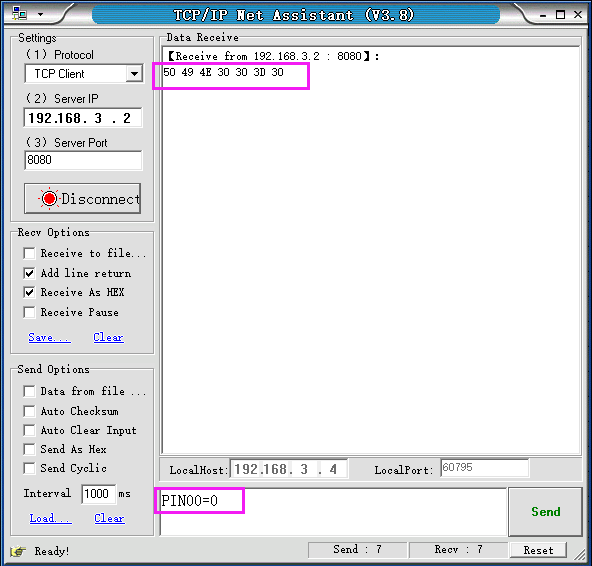
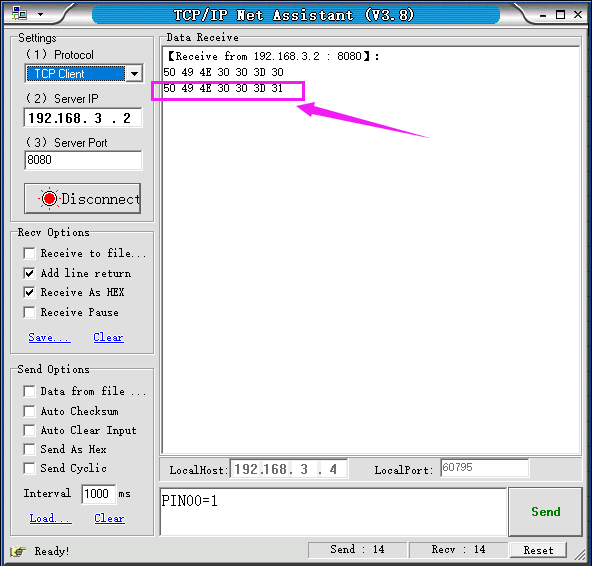

# KE2064 Keyes Brick ESP-01 3V继电器模块综合指南


---

## 1. 简介
KE2064是一个ESP-01 3V继电器模块，专为物联网和智能家居设计。该模块搭载ESP8266-01芯片，可以通过无线网络接收指令，从而控制继电器的闭合和断开。用户可以在远程或局域网内的上位机发送指令给模块，模块接收到指令后即可控制连接的电器设备。

模块工作模式包括SoftAP模式和Station模式，用户可以根据需要选择合适的模式进行操作。

---

## 2. 特点
- **无线控制**：通过ESP8266-01接入无线网络，实现远程控制。
- **双模式工作**：支持SoftAP模式和Station模式，灵活适应不同网络环境。
- **易于使用**：提供预编译固件，简化用户设置过程。
- **复位按键**：方便用户重置模块。

---

## 3. 规格参数
- **工作电压**：DC 3V - 3.3V  
- **工作电流**：>500mA  
- **主控芯片**：ESP8266-01  
- **继电器型号**：HK4100F-DC3V-SHG  
- **继电器规格**：3A 250V AC / 3A 30V DC  
- **输出端子**：128-3.5 3P  
- **按键功能**：复位按键 


---

## 4. 工作原理


KE2064模块通过ESP8266-01芯片连接到Wi-Fi网络，接收来自上位机的指令。当接收到控制信号时，模块会通过继电器控制连接的电器设备的开关状态。模块支持两种工作模式：

- **Station模式**：连接到家庭Wi-Fi网络，获取IP地址。
- **SoftAP模式**：创建自己的Wi-Fi热点，供设备连接。

---

## 5. 接口
| 序号 | 名称 | 说明 |
|------|------|------|
| 1    | VCC  | 电源（DC 3V - 3.3V） |
| 2    | GND  | 地线 |
| 3    | IN   | 控制引脚，接收来自ESP8266的控制信号 |
| 4    | RST  | 复位引脚 |

---

## 6. 连接图
### 连接示例
1. 将模块的 VCC 引脚连接到 3.3V 电源。
2. 将模块的 GND 引脚连接到地。
3. 将模块的 IN 引脚连接到 ESP8266 的控制引脚。

---

## 7. 使用方法
### 固件烧录
1. 将Keyes USB模块串口测试扩展板开关拨动到Uart Download，将ESP8266-01插入模块中，然后插入USB口。

	

2. 打开FLASH_DOWNLOAD_TOOL，配置并上传固件。

	

	

	

### Station模式操作
1. 将家庭Wi-Fi的SSID设定为：KeyesWifi_S，密码设定为：KeyesWifi。

2. 将Keyes USB模块串口测试扩展板接入电脑USB，模块开关拨动到Flash Boot。

3. 使用PUTTY软件连接ESP8266，读取IP地址。

	

	

4. 将ESP8266-01插回继电器模块，并接入3.3V电源。

5. 使用网络调试助手发送控制信号（如PIN00=0闭合继电器，PIN00=1断开继电器）。

	

	

	

### SoftAP模式操作
1. 将家庭Wi-Fi更改为其他名称，防止Wi-Fi模块自动连接。

2. 将电脑连接Wi-Fi，名称为KeyesWifi_A，密码为KeyesWifi。

3. 接入继电器模块并接入3.3V电源，等待20秒。

4. 使用网络调试助手发送控制信号。

	

	

	

---

## 8. 示例代码
以下是控制继电器的示例代码：
```cpp
#include <ESP8266WiFi.h>

const char* ssid = "KeyesWifi_S"; // Wi-Fi SSID
const char* password = "KeyesWifi"; // Wi-Fi 密码

void setup() {
  Serial.begin(115200);
  pinMode(0, OUTPUT); // 控制引脚
  WiFi.begin(ssid, password);
  
  while (WiFi.status() != WL_CONNECTED) {
    delay(1000);
    Serial.println("Connecting to WiFi...");
  }
  Serial.println("Connected to WiFi");
}

void loop() {
  // 控制继电器的逻辑
}
```

---

## 9. 实验现象
在成功连接Wi-Fi后，用户可以通过网络调试助手发送控制信号，继电器会根据指令闭合或断开，用户可以听到继电器的工作声，确认控制成功。

---

## 10. 注意事项
- **电源要求**：确保模块连接的电源电压在3V - 3.3V范围内，以避免损坏模块。
- **网络设置**：在Station模式下，确保ESP8266与电脑在同一局域网内。
- **信号干扰**：在使用SoftAP模式时，确保其他Wi-Fi网络不会干扰模块的连接。
- **复位操作**：如遇到问题，可以使用复位按键重置模块。

---

## 11. 参考链接
- [Keyes官网](http://www.keyes-robot.com/)
- [ESP8266-01 数据手册](https://www.electronicwings.com/nodemcu/esp8266-esp-01)
- [Arduino 继电器控制教程](https://www.arduino.cc/en/Tutorial/Relay)
- [ESP8266 Wi-Fi模块开发指南](https://www.esp8266.com/)