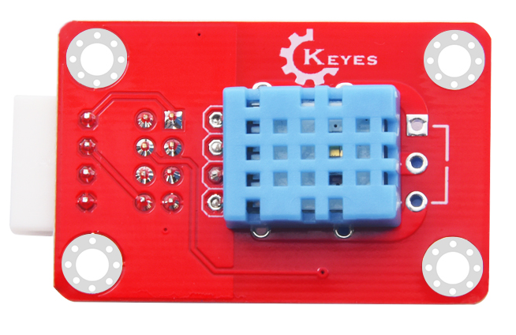
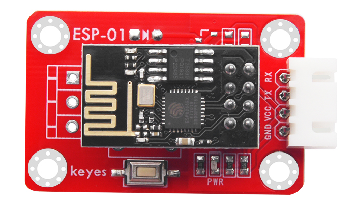
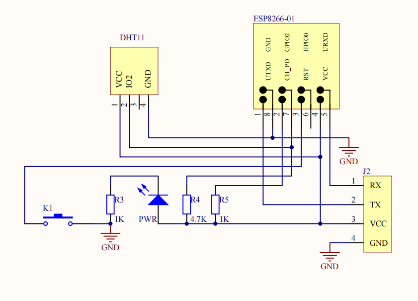
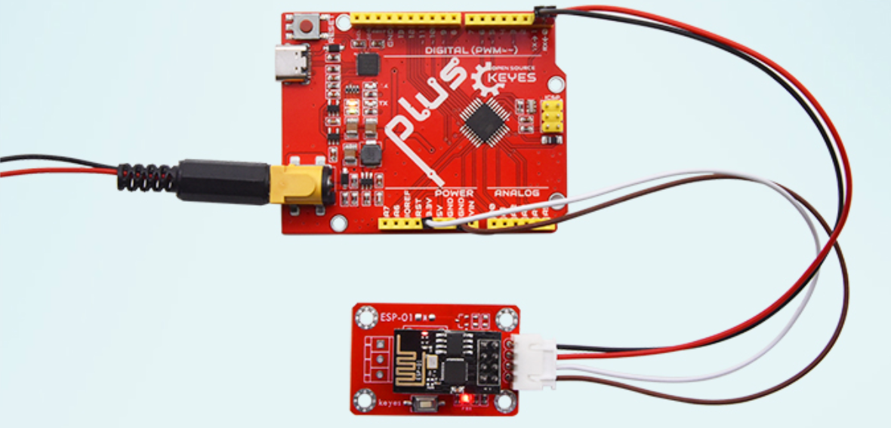
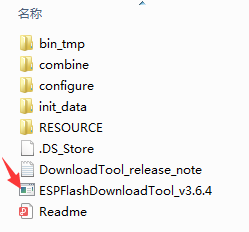
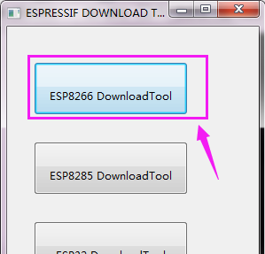
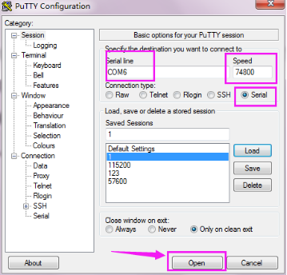
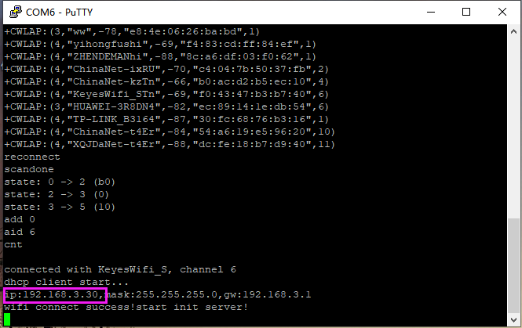
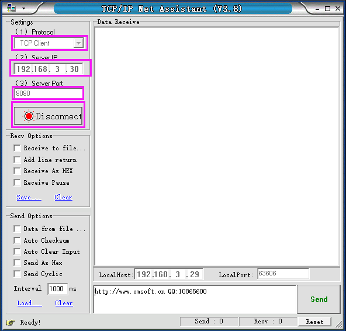
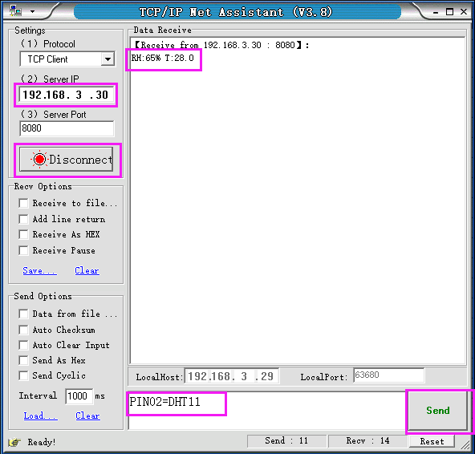

# KE2065 Keyes Brick ESP-01 DHT11温湿度模块综合指南



---

## 1. 简介
KE2065是一个ESP-01 DHT11温湿度模块，专为物联网和智能家居设计。该模块搭载ESP8266-01芯片，可以通过无线网络接入，远程监测环境的温湿度数据，并利用所测数据控制其他设备。模块提供了预编译的固件，支持SoftAP和Station两种工作模式，方便用户进行设置和操作。



---

## 2. 特点
- **无线控制**：通过ESP8266-01接入无线网络，实现远程温湿度监测。
- **双模式工作**：支持SoftAP模式和Station模式，灵活适应不同网络环境。
- **易于使用**：提供预编译固件，简化用户设置过程。
- **复位按键**：方便用户重置模块。

---

## 3. 规格参数
- **工作电压**：DC 3V - 3.3V  
- **主控芯片**：ESP8266-01  
- **按键功能**：复位按键  
- **温度范围**：0-50℃ ±2℃  
- **湿度范围**：20-90% RH ±5% RH  
- **尺寸**：42mm x 24mm x 22mm  
- **重量**：5.7g  



---

## 4. 工作原理
KE2065模块通过ESP8266-01芯片连接到Wi-Fi网络，实时监测环境的温湿度数据。用户可以通过网络调试助手发送指令，模块将返回当前的温湿度值。模块支持两种工作模式：
- **Station模式**：连接到家庭Wi-Fi网络，获取IP地址。
- **SoftAP模式**：创建自己的Wi-Fi热点，供设备连接。

---

## 5. 接口
| 序号 | 名称 | 说明 |
|------|------|------|
| 1    | VCC  | 电源（DC 3V - 3.3V） |
| 2    | GND  | 地线 |
| 3    | DHT  | DHT11温湿度传感器数据引脚 |
| 4    | RST  | 复位引脚 |

---

## 6. 连接图
### 连接示例
1. 将模块的 VCC 引脚连接到 3.3V 电源。
2. 将模块的 GND 引脚连接到地。
3. 将模块的 DHT 引脚连接到 ESP8266 的数据引脚。



---

## 7. 使用方法
### 固件烧录
1. 将Keyes USB模块串口测试扩展板开关拨动到Uart Download，将ESP8266-01插入模块中，然后插入USB口。

	

2. 打开FLASH_DOWNLOAD_TOOL，配置并上传固件。

	

	

	

### Station模式操作
1. 将家庭Wi-Fi的SSID设定为：KeyesWifi_S，密码设定为：KeyesWifi。

2. 将Keyes USB模块串口测试扩展板接入电脑USB，模块开关拨动到Flash Boot。

3. 使用PUTTY软件连接ESP8266，读取IP地址。

	

4. 将ESP8266-01插回DHT11温湿度模块，并接入3.3V电源。

	

5. 使用网络调试助手发送控制信号（如PIN02=DHT11，模块测试出所在环境中的温湿度数值）。

### SoftAP模式操作
1. 将家庭Wi-Fi更改为其他名称，防止Wi-Fi模块自动连接。

2. 将电脑连接Wi-Fi，名称为KeyesWifi_A，密码为KeyesWifi。

3. 接入DHT11模块并接入3.3V电源，等待20秒。

4. 使用网络调试助手发送控制信号（如PIN02=DHT11，模块测试出所在环境中的温湿度数值）。

	

	

---

## 8. 示例代码
以下是读取DHT11温湿度数据的示例代码：
```cpp
#include <DHT.h>
#include <ESP8266WiFi.h>

#define DHTPIN 2 // DHT11 数据引脚
#define DHTTYPE DHT11 // DHT 11

DHT dht(DHTPIN, DHTTYPE);

const char* ssid = "KeyesWifi_S"; // Wi-Fi SSID
const char* password = "KeyesWifi"; // Wi-Fi 密码

void setup() {
  Serial.begin(115200);
  dht.begin();
  WiFi.begin(ssid, password);
  
  while (WiFi.status() != WL_CONNECTED) {
    delay(1000);
    Serial.println("Connecting to WiFi...");
  }
  Serial.println("Connected to WiFi");
}

void loop() {
  float h = dht.readHumidity();
  float t = dht.readTemperature();
  
  if (isnan(h) || isnan(t)) {
    Serial.println("Failed to read from DHT sensor!");
    return;
  }
  
  Serial.print("Humidity: ");
  Serial.print(h);
  Serial.print(" %\t");
  Serial.print("Temperature: ");
  Serial.print(t);
  Serial.println(" *C");
  
  delay(2000);
}
```

---

## 9. 实验现象
在成功连接Wi-Fi后，用户可以通过网络调试助手发送控制信号，模块将返回当前的温湿度数据。用户可以在串口监视器中看到实时的温湿度值。

---

## 10. 注意事项
- **电源要求**：确保模块连接的电源电压在3V - 3.3V范围内，以避免损坏模块。
- **网络设置**：在Station模式下，确保ESP8266与电脑在同一局域网内。
- **信号干扰**：在使用SoftAP模式时，确保其他Wi-Fi网络不会干扰模块的连接。
- **复位操作**：如遇到问题，可以使用复位按键重置模块。

---

## 11. 参考链接
- [Keyes官网](http://www.keyes-robot.com/)
- [ESP8266-01 数据手册](https://www.electronicwings.com/nodemcu/esp8266-esp-01)
- [DHT11 温湿度传感器说明](https://www.adafruit.com/product/386)
- [Arduino DHT11 温湿度模块教程](https://www.arduino.cc/en/Tutorial/DHT)