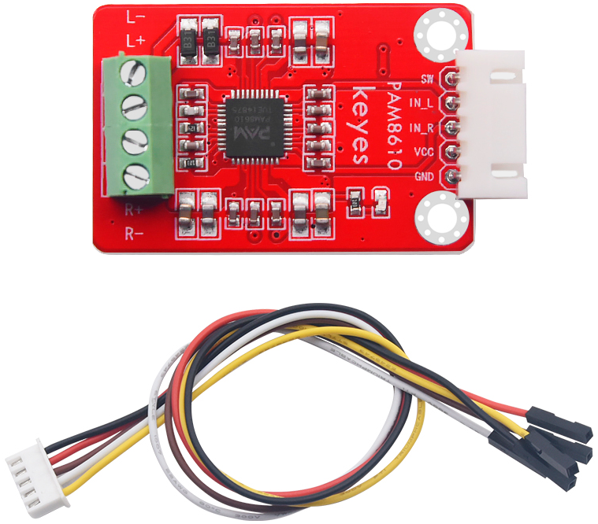
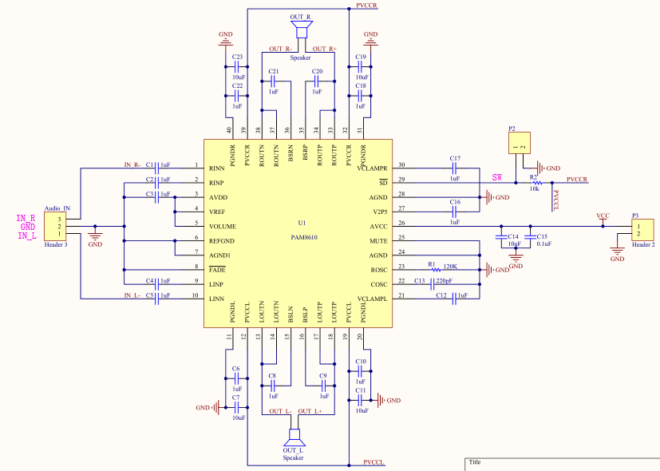
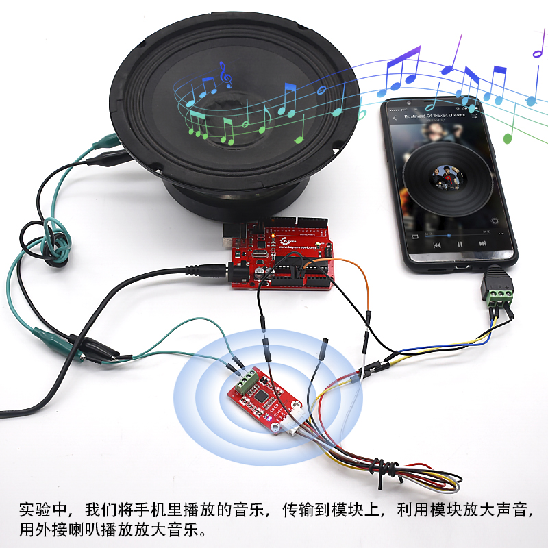

# KE2067 Keyes Brick PAM8610 数字功放模块综合指南



---

## 1. 简介
KE2067是一个基于PAM8610芯片的数字功放模块，专为DIY音响设计。该模块能够将音频信号放大，输出双通道立体声，功率可达到10W+10W，适合各种音响系统。模块具有高增益和高效率，能够提供清晰的音质和强劲的音量。

为方便接线，模块配送一根5pin线，线的一端为白色防反插接口（与模块上防反插白色端子匹配），另一端为5pin杜邦线母头接口。同时，模块自带一个直径为3mm的定位孔，方便固定在其他设备上。

---

## 2. 特点
- **高功率输出**：双通道立体声，功率可达10W+10W。
- **高增益**：增益为32dB，提供强劲的音量。
- **高效率**：效率大于90%，降低能耗。
- **多重保护**：具备过流、过热和短路保护功能。
- **低噪声**：噪声低至-90dB，确保音质清晰。
- **便捷接口**：配备防反插接口和接线端子，方便连接。

---

## 3. 技术参数
- **导线长度**：200mm  
- **输入电压**：DC 7-15V  
- **输出功率**：10W @ 10% THD 1 Channel Output into an 8Ω Load at 13V  
- **效率**：大于90%  
- **增益**：32dB  
- **噪声**：低噪声 -90dB  
- **接口**：5pin防反接口（间距2.54mm），4pin绿色接线端子（间距3.5mm）  
- **定位孔**：直径3mm  
- **功能**：具备关机/静音/渐变功能，低THD+N（0.1%），低静态电流，消除啸叫噪声  

---

## 4. 工作原理
KE2067模块通过PAM8610芯片将输入的音频信号进行放大，输出到扬声器。模块支持多种输入电压，能够适应不同的电源环境。其高增益和高效率设计使得音频信号在放大过程中保持良好的音质，适合用于各种音响系统。



---

## 5. 接口
| 序号 | 名称 | 说明 |
|------|------|------|
| 1    | VCC  | 电源输入（DC 7-15V） |
| 2    | GND  | 地线 |
| 3    | IN+  | 正相音频输入 |
| 4    | IN-  | 反相音频输入 |
| 5    | OUT+ | 正相音频输出 |
| 6    | OUT- | 反相音频输出 |

---

## 6. 连接图
### 连接示例
1. 将模块的 VCC 引脚连接到 7-15V 电源。
2. 将模块的 GND 引脚连接到地。
3. 将音频信号源的正相和反相信号分别连接到 IN+ 和 IN- 引脚。
4. 将扬声器的正相和反相连接到 OUT+ 和 OUT- 引脚。

---

## 7. 示例代码
以下是一个简单的Arduino示例代码，用于控制音频输入：
```cpp
void setup() {
  // 初始化音频输入
}

void loop() {
  // 处理音频信号
}
```
（具体的音频处理代码根据使用的音频源和控制方式而定）

---

## 8. 实验现象
在连接好电源和音频信号后，用户可以通过音频源播放音乐，观察模块的输出效果。模块应能清晰地放大音频信号，输出到连接的扬声器。



---

## 9. 注意事项
- **电源要求**：确保输入电压在7-15V范围内，以避免损坏模块。
- **连接方式**：确保音频信号源和扬声器正确连接，避免短路。
- **散热**：在高功率输出时，确保模块有良好的散热条件。
- **静音功能**：使用静音功能时，确保模块处于安全状态，避免损坏扬声器。

---

## 10. 参考链接
- [PAM8610 数据手册](https://www.pam8610.com)
- [Arduino 音频处理教程](https://www.arduino.cc/en/Tutorial/Audio)