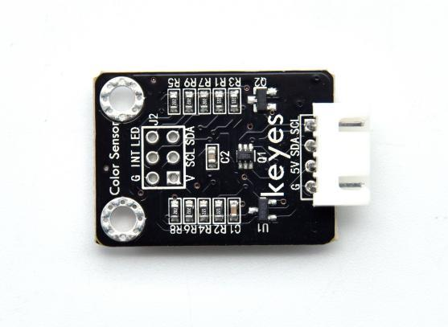
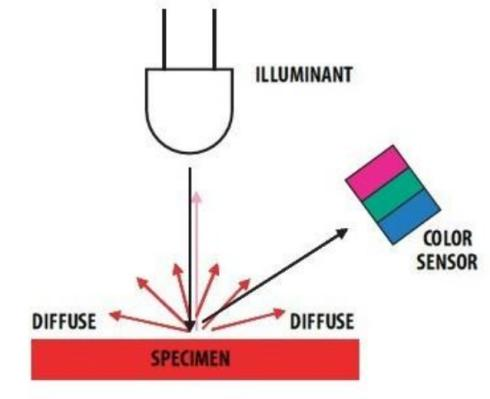
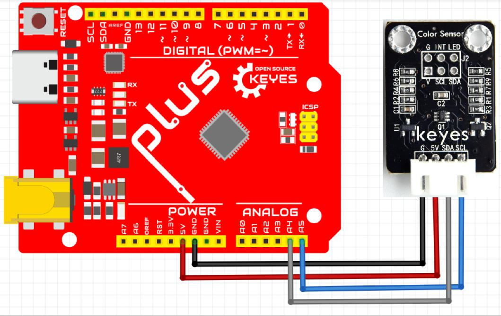
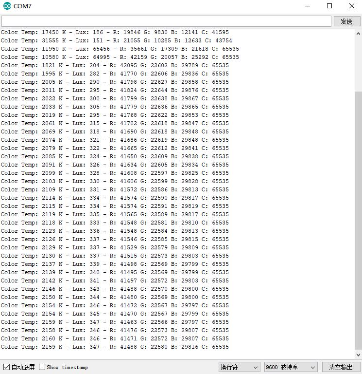

# KE2068 Keyes Brick TCS34725 颜色传感器综合指南



---

## 1. 简介
KE2068是一个基于TCS34725芯片的高精度颜色传感器模块，专为颜色识别和测量设计。该模块能够检测环境中的颜色，并输出相应的RGB（红、绿、蓝）值。它适用于各种应用，如颜色识别、光线检测、智能家居、机器人视觉系统等。通过I2C接口与微控制器连接，用户可以轻松获取颜色数据并进行处理。



---

## 2. 特点
- **高精度测量**：采用TCS34725芯片，能够提供准确的颜色测量，适合对颜色敏感的应用。
- **I2C接口**：通过I2C接口与微控制器通信，简化连接和数据传输。
- **防反插设计**：模块配备防反插白色端子，方便连接，避免接线错误。
- **小巧轻便**：模块尺寸小，适合嵌入式应用和DIY项目，便于集成到各种设备中。
- **内置光传感器**：除了颜色测量外，TCS34725还可以测量环境光强度，提供更多数据。
- **多种增益和集成时间设置**：用户可以根据环境光线条件调整增益和集成时间，以优化测量结果。

---

## 3. 规格参数
- **工作电压**：3.3V - 5V  
- **通信接口**：I2C（支持标准和快速模式）  
- **测量范围**：可测量RGB颜色值和光强度  
- **增益设置**：1x, 4x, 16x, 60x  
- **集成时间**：50ms, 100ms, 150ms, 200ms, 250ms, 300ms  
- **尺寸**：约 20mm x 20mm  
- **重量**：约 5g  

---

## 4. 工作原理
KE2068模块通过TCS34725芯片利用光电传感器检测环境中的颜色。传感器内部包含红、绿、蓝和清晰光传感器，能够同时测量不同波长的光。通过I2C接口，模块将测得的RGB值和光强度传输给微控制器，用户可以根据这些值进行颜色识别和处理。


### 工作流程：
1. **光线采集**：传感器通过内置的光学滤光片采集环境光线。
2. **信号转换**：光线信号被转换为电信号，分别对应红、绿、蓝三种颜色。
3. **数据处理**：通过I2C接口将RGB值传输给微控制器，用户可以进行进一步处理和应用。

---

## 5. 接口
| 序号 | 名称 | 说明 |
|------|------|------|
| 1    | VCC  | 电源输入（3.3V - 5V） |
| 2    | GND  | 地线 |
| 3    | SDA  | I2C 数据线（数据传输） |
| 4    | SCL  | I2C 时钟线（同步信号） |

---

## 6. 连接图
### 连接示例
1. 将模块的 VCC 引脚连接到 3.3V 或 5V 电源。
2. 将模块的 GND 引脚连接到地。
3. 将模块的 SDA 引脚连接到微控制器的 I2C 数据线（通常为A4引脚）。
4. 将模块的 SCL 引脚连接到微控制器的 I2C 时钟线（通常为A5引脚）。



---

## 7. 示例代码
以下是使用Arduino读取TCS34725颜色传感器数据的示例代码：
```cpp
#include <Wire.h>
#include "Adafruit_TCS34725.h"

// 创建TCS34725对象
Adafruit_TCS34725 tcs = Adafruit_TCS34725(TCS34725_INTEGRATIONTIME_50MS, TCS34725_GAIN_4X);

void setup() {
  Serial.begin(115200);
  // 初始化传感器
  if (tcs.begin()) {
    Serial.println("Found TCS34725 sensor");
  } else {
    Serial.println("No TCS34725 found ... check your connections");
    while (1);
  }
}

void loop() {
  uint16_t r, g, b, c;
  // 获取原始数据
  tcs.getRawData(&r, &g, &b, &c);
  
  // 输出RGB和清晰度值
  Serial.print("R: "); Serial.print(r);
  Serial.print(" G: "); Serial.print(g);
  Serial.print(" B: "); Serial.print(b);
  Serial.print(" C: "); Serial.print(c);
  Serial.println();
  
  delay(1000); // 每秒读取一次
}
```

---

## 8. 实验现象
在成功连接模块并上传代码后，用户可以通过串口监视器观察到实时的RGB值。当传感器对准不同颜色的物体时，RGB值会相应变化，验证模块的颜色检测功能。用户可以通过不同颜色的物体（如红色、绿色、蓝色等）进行测试，观察传感器输出的RGB值变化。



### 实验步骤：
1. 连接模块并上传代码。
2. 打开串口监视器，设置波特率为115200。
3. 将传感器对准不同颜色的物体，观察RGB值的变化。

---

## 9. 注意事项
- **电源要求**：确保模块连接的电源电压在3.3V - 5V范围内，以避免损坏模块。
- **I2C地址**：确保微控制器的I2C地址设置正确，以便与传感器通信。
- **光线条件**：在不同光线条件下测试传感器，以获得准确的颜色测量结果。避免强光直射传感器。
- **传感器清洁**：保持传感器的光学窗口清洁，以确保测量准确。

---

## 10. 参考链接
- [Keyes官网](http://www.keyes-robot.com/)
- [TCS34725 数据手册](https://www.adafruit.com/product/1334)
- [Arduino I2C 通信教程](https://www.arduino.cc/en/Tutorial/I2C)
- [Adafruit TCS34725 库文档](https://github.com/adafruit/Adafruit_TCS34725_Library)