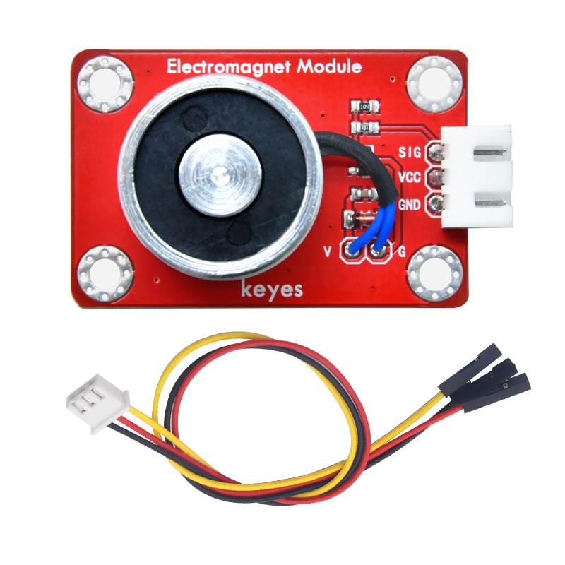
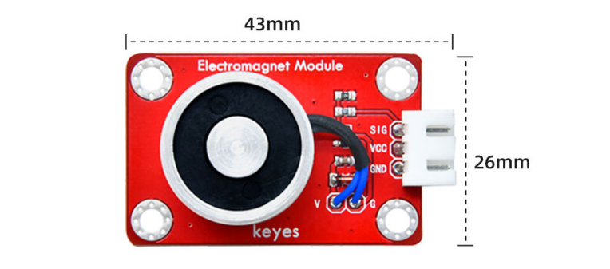
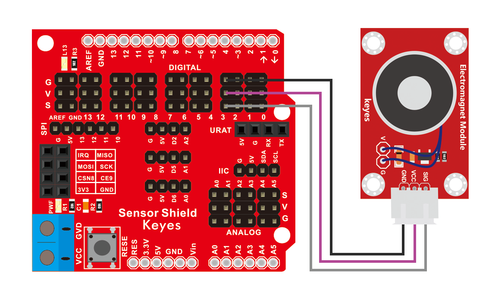
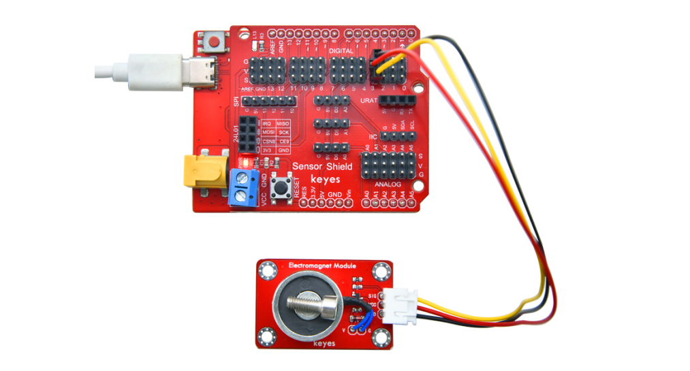

# KE2069 Keyes Brick ZYE1-P20/15 电磁铁模块综合指南



---

## 1. 简介
KE2069是一个基于ZYE1-P20/15电磁铁的模块，专为控制电磁铁的开关而设计。该模块可以通过微控制器控制电磁铁的通电与断电，从而实现吸合或释放的功能。它适用于各种应用，如自动门、机械手臂、智能家居等。

---

## 2. 特点
- **高效能**：电磁铁模块能够快速吸合和释放，适合需要快速响应的应用。
- **防反插设计**：模块配备防反插白色端子，方便连接，避免接线错误。
- **小巧轻便**：模块尺寸小，适合嵌入式应用和DIY项目，便于集成到各种设备中。
- **简单易用**：通过简单的控制信号即可实现电磁铁的开关控制。

---

## 3. 规格参数
- **工作电压**：DC 5V  
- **电流**：工作电流 0.3A  
- **吸力**：最大吸力约为20N（具体取决于供电电压和负载）  
- **尺寸**：约 40mm x 20mm  
- **重量**：约 15g  



---

## 4. 工作原理
KE2069模块通过电磁铁的电流控制其吸合和释放。当电流通过电磁铁时，电磁铁产生磁场，吸引金属物体；当电流断开时，电磁铁释放物体。模块内部集成了驱动电路，可以通过微控制器的数字输出引脚控制电磁铁的通电与断电。

### 工作流程：
1. **通电**：微控制器输出高电平信号，驱动电磁铁通电。
2. **吸合**：电磁铁产生磁场，吸引金属物体。
3. **断电**：微控制器输出低电平信号，切断电磁铁电源。
4. **释放**：电磁铁失去磁场，释放金属物体。

---

## 5. 接口
| 序号 | 名称 | 说明 |
|------|------|------|
| 1    | VCC  | 电源输入（DC 5V） |
| 2    | GND  | 地线 |
| 3    | IN   | 控制信号输入（高电平通电，低电平断电） |

---

## 6. 连接图



### 连接示例
1. 将模块的 VCC 引脚连接到 5V 电源。
2. 将模块的 GND 引脚连接到地。
3. 将微控制器的数字输出引脚连接到模块的 IN 引脚。

（此处可插入连接图，展示如何将模块连接到电源和微控制器）

---

## 7. 示例代码
以下是使用Arduino控制电磁铁的示例代码：
```cpp
#define electromagnetPin 9 // 定义电磁铁控制引脚

void setup() {
  pinMode(electromagnetPin, OUTPUT); // 设置引脚为输出模式
}

void loop() {
  digitalWrite(electromagnetPin, HIGH); // 通电，电磁铁吸合
  delay(1000); // 吸合1秒
  digitalWrite(electromagnetPin, LOW); // 断电，电磁铁释放
  delay(1000); // 释放1秒
}
```

---

## 8. 实验现象
在成功连接模块并上传代码后，用户可以观察到电磁铁的吸合和释放现象。当电磁铁通电时，它会吸引金属物体；当电源断开时，金属物体会被释放。用户可以通过调整延迟时间，观察电磁铁在不同时间间隔内的工作状态。



### 实验步骤：
1. 连接模块并上传代码。
2. 将电磁铁靠近金属物体。
3. 观察电磁铁的吸合和释放过程。

---

## 9. 注意事项
- **电源要求**：确保模块连接的电源电压为5V，以避免损坏模块。
- **电流限制**：工作电流 0.3A，确保电源能够提供足够的电流。
- **散热**：在长时间工作时，注意电磁铁的温度，避免过热。
- **连接方式**：确保电源和控制信号连接正确，避免短路。

---

## 10. 参考链接
- [Keyes官网](http://www.keyes-robot.com/)
- [电磁铁工作原理](https://www.electronics-tutorials.ws/io/io_5.html)
- [Arduino 控制电磁铁教程](https://www.arduino.cc/en/Tutorial/ArduinoToBreadboard)

