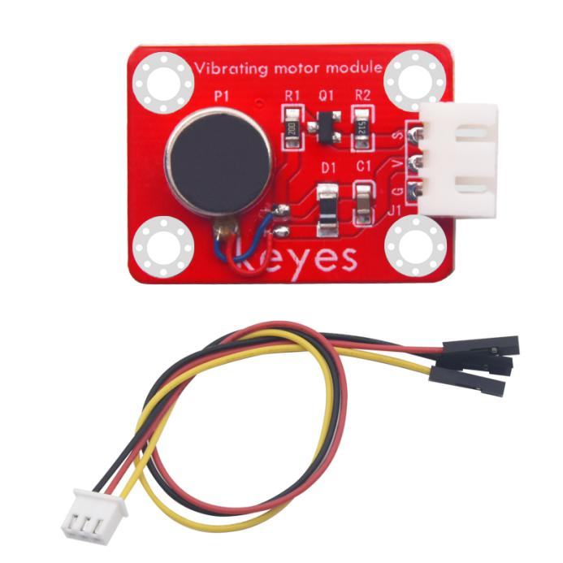
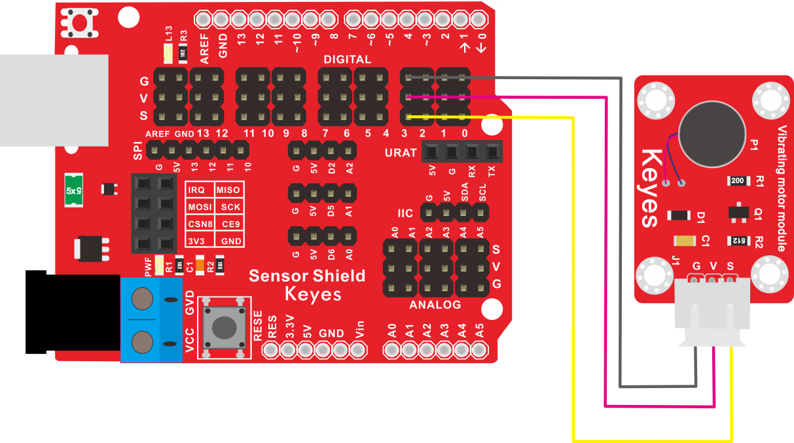
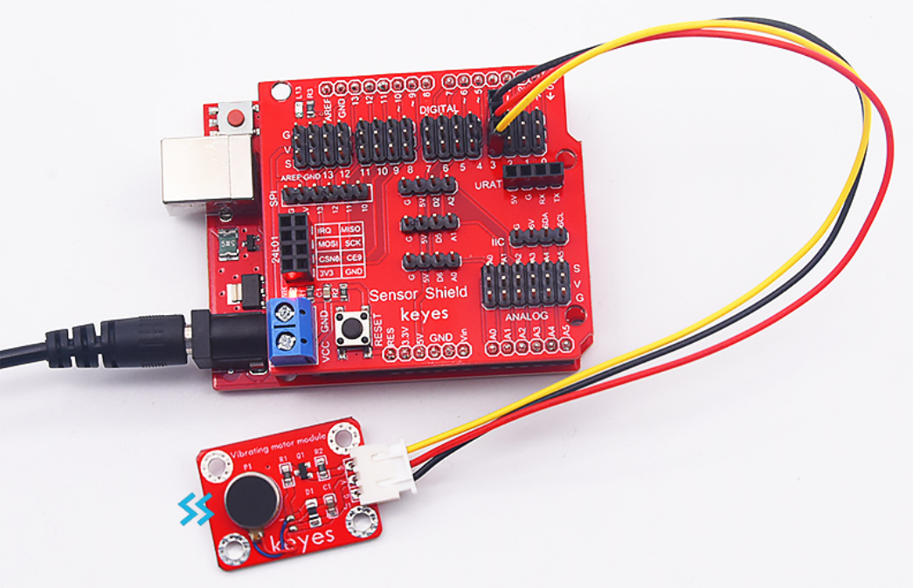

# KE2071 Keyes Brick 振动马达模块综合指南



---

## 1. 简介
KE2071是一个振动马达模块，专为需要振动反馈的应用设计。该模块可以通过微控制器控制振动马达的开关，适用于各种项目，如手机震动、机器人反馈、游戏控制器等。模块采用防反插设计，方便用户连接。

---

## 2. 特点
- **高效能**：模块能够快速启动和停止，提供即时的振动反馈。
- **防反插设计**：模块配备防反插白色端子，方便连接，避免接线错误。
- **小巧轻便**：模块尺寸小，适合嵌入式应用和DIY项目，便于集成到各种设备中。
- **简单易用**：通过简单的控制信号即可实现振动马达的开关控制。

---

## 3. 规格参数
- **工作电压**：DC 3V - 5V  
- **最大电流**：300mA  
- **振动频率**：约 200Hz  
- **尺寸**：约 30mm x 20mm  
- **重量**：约 10g  

---

## 4. 工作原理
KE2071模块通过控制振动马达的电源来实现振动效果。当微控制器输出高电平信号时，电流通过马达，马达开始振动；当微控制器输出低电平信号时，电流被切断，马达停止振动。模块的简单设计使得用户可以轻松集成到各种项目中。

### 工作流程：
1. **通电**：微控制器输出高电平信号，驱动振动马达通电。
2. **振动**：振动马达开始工作，产生振动效果。
3. **断电**：微控制器输出低电平信号，切断电源。
4. **停止**：振动马达停止工作，停止振动。

---

## 5. 接口
| 序号 | 名称 | 说明 |
|------|------|------|
| 1    | VCC  | 电源输入（DC 3V - 5V） |
| 2    | GND  | 地线 |
| 3    | S   | 控制信号输入（高电平通电，低电平断电） |

---

## 6. 连接图
### 连接示例
1. 将模块的 VCC 引脚连接到 3V 或 5V 电源。
2. 将模块的 GND 引脚连接到地。
3. 将微控制器的数字输出引脚连接到模块的 S 引脚。



---

## 7. 示例代码
以下是使用Arduino控制振动马达的示例代码：
```cpp
#define motorPin 3 // 定义振动马达控制引脚

void setup() {
  pinMode(motorPin, OUTPUT); // 设置引脚为输出模式
}

void loop() {
  digitalWrite(motorPin, HIGH); // 通电，振动马达启动
  delay(1000); // 振动1秒
  digitalWrite(motorPin, LOW); // 断电，振动马达停止
  delay(1000); // 停止1秒
}
```

---

## 8. 实验现象


在成功连接模块并上传代码后，用户可以观察到振动马达的启动和停止现象。当微控制器输出高电平信号时，振动马达会开始振动；当信号变为低电平时，振动马达会停止振动。用户可以通过调整延迟时间，观察振动马达在不同时间间隔内的工作状态。

### 实验步骤：
1. 连接模块并上传代码。
2. 观察振动马达的工作状态，确认其能够正常启动和停止。

---

## 9. 注意事项
- **电源要求**：确保模块连接的电源电压在3V - 5V范围内，以避免损坏模块。
- **电流限制**：最大电流为300mA，确保电源能够提供足够的电流。
- **散热**：在长时间工作时，注意振动马达的温度，避免过热。
- **连接方式**：确保电源和控制信号连接正确，避免短路。

---

## 10. 参考链接
- [振动马达工作原理](https://www.electronics-tutorials.ws/io/io_6.html)
- [Arduino 控制振动马达教程](https://www.arduino.cc/en/Tutorial/ArduinoToBreadboard)